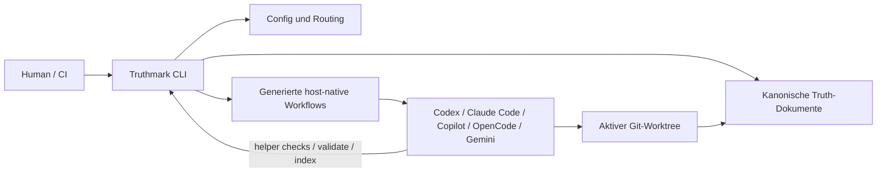

# Truthmark

**Deine Agenten schreiben Code. Truthmark hält menschenlesbare Dokumentation in Git überprüfbar.**

[🇺🇸 English](README.md) | [🇨🇳 简体中文](README.zh.md) | [🇯🇵 日本語](README.ja.md) | [🇰🇷 한국어](README.ko.md) | [🇩🇪 Deutsch](README.de.md) | [🇫🇷 Français](README.fr.md) | [🇪🇸 Español](README.es.md) | [🇧🇷 Português](README.pt-BR.md) | [🇷🇺 Русский](README.ru.md) | [🇸🇦 العربية](README.ar.md) | [🇮🇹 Italiano](README.it.md) | [🇵🇱 Polski](README.pl.md) | [🇹🇷 Türkçe](README.tr.md) | [🇻🇳 Tiếng Việt](README.vi.md) | [🇮🇩 Bahasa Indonesia](README.id.md) | [🇬🇷 Ελληνικά](README.el.md)


KI-Coding-Agenten können ein Repository schneller verändern, als Menschen die Dokumentation ausrichten können.

Truthmark repariert den Teil, der normalerweise nach dem Code-Schreiben bricht: die Repository-Truth.

Es installiert eine Git-native, branch-gebundene Workflow-Schicht, die KI-Coding-Agenten hilft, die richtigen Dokumente zu aktualisieren, Ownership-Grenzen zu respektieren und Menschen normale Diffs zur Prüfung zu hinterlassen.

Kein gehosteter Dienst.

Keine Datenbank.

Keine verborgene Memory-Schicht.

Kein zusätzlicher Server im Betrieb.

Nur Repository-Truth, die mit dem Branch mitwandert.

## Das Problem

KI-Coding-Agenten sind gut darin, Code zu erzeugen. Dadurch entsteht eine neue Fehlerart.

Die Implementierung ändert sich, aber die Repository-Erzählung driftet ab:

- Verhalten lebt im Chatverlauf
- Architekturdokumente fallen zurück
- Produktentscheidungen verschwinden nach der Übergabe
- Reviewer sehen Code-Diffs ohne die zugehörigen Truth-Diffs
- Branches entwickeln unbemerkt unterschiedliche Versionen davon, „was wahr ist“
- jede Agentensitzung muss Repository-Truth neu entdecken

Truthmark verwandelt diese fragile Repository-Truth in versionierte Repository-Infrastruktur.

Statt darauf zu vertrauen, dass jeder Mensch und jeder Agent die richtige Dokumentationsgewohnheit beibehält, installiert Truthmark diese Gewohnheit im Repository.

## Das Versprechen

Wenn ein Agent funktionalen Code ändert, sollte die Arbeit nicht mit einem reinen Code-Diff enden.

Der normale Truthmark-Pfad ist:

```text
agent ändert funktionalen Code
relevante Tests laufen
Truth Sync prüft zugeordnete Truth-Dokumente
Truth-Dokumente werden bei Bedarf aktualisiert
Mensch prüft Code-Diff + Truth-Diff
committen oder übergeben
```

Das ist der Kernwert: **KI-Arbeit wird leichter vertrauenswürdig, weil das Repository lesbar bleibt.**

## Zwei Schnittstellen, ein Truth-System

Truthmark ist nicht nur eine CLI.

Es hat zwei unterschiedliche Schnittstellen, und diese Unterscheidung ist wichtig.

### 1. CLI für Menschen

Die CLI ist für Maintainer, Reviewer und Automatisierung.

Nutze sie, um ein Repository zu konfigurieren, Workflow-Dateien zu installieren oder zu aktualisieren, Truth-Artefakte zu validieren und optionales Review-Material zu erzeugen.

```bash
truthmark config
truthmark init
truthmark check
```

Die CLI bereitet die Repository-Umgebung vor und validiert sie.

Sie ist nicht die Runtime für den KI-Workflow.

### 2. KI-seitige Workflow-Schnittstellen

Die KI-seitigen Schnittstellen sind für Coding-Agenten.

Truthmark installiert host-native Skills, Prompts, Commands, verwaltete Instruktionsblöcke und unterstützte Subagent-Schnittstellen, damit KI-Agenten repository-spezifische Truth-Workflows in ihren normalen Coding-Tools befolgen können.

Beispiele:

```text
/truthmark-sync
/truthmark-document
/truthmark-structure
/truthmark-realize
/truthmark-check
```

Sie sehen wie Befehle aus, weil Agenten-Hosts Workflows über Slash-Commands, Prompts, Skills oder Projektbefehle bereitstellen.

Es sind keine Shell-Befehle.

Es sind KI-seitige Workflow-Einstiegspunkte.

Die Trennung ist das Produkt:

```text
Menschen besitzen den Repository-Vertrag
Truthmark installiert den Vertrag ins Repo
Agenten arbeiten innerhalb dieses Vertrags
Truth-Updates erscheinen als Git-Diffs
Menschen prüfen das Ergebnis
```

## Quick Start

### Voraussetzungen

- Node.js `>=20`
- npm
- ein Git-Repository

### Truthmark installieren

Führe dies in dem Repository aus, das du initialisieren möchtest:

```bash
cd /path/to/your-repo
npm install -g truthmark
```

### Den Repository-Truth-Vertrag erstellen

```bash
truthmark config
```

Das erzeugt:

```text
.truthmark/config.yml
```

Prüfe diese Datei, bevor du fortfährst. Sie definiert den versionierten Hierarchievertrag für das Repository.

### Die Workflow-Schnittstellen installieren

```bash
truthmark init
```

Das installiert oder aktualisiert:

- Routendateien
- Truth-Doc-Scaffolding
- verwaltete Instruktionsblöcke
- KI-seitige Workflow-Schnittstellen für konfigurierte Plattformen

Die Standardvorlagen für Truth-Dokumente werden in [Template Standards](docs/standards/template-standards.md) begründet. Dort werden sie anerkannten Software-Engineering-Referenzen wie ISO/IEC/IEEE 42010, ISO/IEC/IEEE 29148, ISO/IEC/IEEE 12207, ISO/IEC 25010, C4, arc42, OpenAPI, SemVer, Google SRE und Diátaxis zugeordnet.

### Das Setup validieren

```bash
truthmark check
```

Prüfe danach die generierten Dateien, bevor du committest.

Die konkreten Dateien hängen von `.truthmark/config.yml` ab, aber die Installation hat immer dieselbe Form: Routing, Truth-Scaffolding, kompakte verwaltete Instruktionen und host-native Workflow-Schnittstellen für die aktivierten Plattformen.

## Erste echte Nutzung

Die meisten Repositories brauchen nach der Initialisierung einen Aufräumschritt.

Das Standard-Scaffold beginnt mit einem vorläufigen breiten Bootstrap-Bereich `repository`. Bevor echter Code normal synchronisiert wird, teile diese Bootstrap-Route in präzises Routing auf.

Bitte deinen Agenten, die breite Route in tatsächliche Produkt-, Service-, Domänen- oder Ownership-Bereiche aufzuteilen:

```text
/truthmark-structure die breite repository-area in auth, billing und notifications aufteilen
```

Wenn das Projekt bereits implementierte Features hat, aber Truth-Dokumente fehlen oder schwach sind, bitte den installierten Truth-Document-Workflow, einen fokussierten Bereich zu dokumentieren:

```text
/truthmark-document dokumentiere das implementierte payment-retry-verhalten in src/billing/retry.ts und den zugehörigen tests
```

Truth Document ist der häufigste erste Workflow für bestehende Projekte. Er inspiziert Implementierung, Tests, Routen und vorhandene Dokumentation und erstellt oder repariert danach Truth-Dokumente und Routing, ohne funktionalen Code zu ändern.

Danach nutzt du deinen KI-Coding-Agenten normal.

Wenn der Agent funktionalen Code ändert, wirkt Truth Sync als Abschlusskontrolle und prüft vor der Übergabe, ob zugeordnete Truth-Dokumente geändert werden müssen.

## Was du bekommst

| Fähigkeit | Was sie tut |
| --- | --- |
| Git-native Repository-Truth | Hält Repository-Truth in versioniertem Markdown und Config. |
| Branch-gebundene Dokumentation | Repository-Truth wandert mit dem Branch statt in einer privaten Sitzung zu leben. |
| CLI für Menschen | Gibt Maintainern Befehle für Setup, Aktualisierung, Validierung und Inspektion. |
| KI-seitige Workflows | Gibt Agenten host-native Workflows für Sync, Dokumentation, Struktur, Preview, Realisierung und Audit. |
| Explizites Routing | Ordnet Codebereiche kanonischen Truth-Dokumenten zu. |
| Prüffähige Übergaben | Erzeugt normale Git-Diffs für Code und Truth-Dokumente. |
| Local-first-Betrieb | Benötigt keinen gehosteten Dienst, keinen Daemon, keine Datenbank und keinen MCP-Server. |
| Sicherere Schreibgrenzen | Trennt code-first, doc-first, read-only und doc-only Workflows. |
| Validierung | Meldet Probleme bei Routing, Autorität, Frontmatter, Links, generierten Schnittstellen, Branch-Scope, Freshness und Coverage. |
| Optionales Portal | Erzeugt eine versionierte statische HTML-Präsentationssite aus Markdown-Truth-Dokumenten, wenn es ausdrücklich aktiviert und angefragt wird. |

## Visueller Überblick


**Funktionen:** was Truthmark installiert und wie die Workflow-Oberfläche aufgeteilt ist.


**Positionierung:** wo Truthmark im Verhältnis zu Prompts, Memory und Spec-Workflows steht.


**Sync-Ablauf:** wie Truth Sync normale Codeänderungen vor der Übergabe abschließt.

## Warum Teams es nutzen

Truthmark ist für Teams, die bereits wissen, dass KI-Agenten Code erzeugen können.

Das nächste Problem ist Governance.

Nicht Governance als Zeremonie. Governance als einfache Frage:

> Erzählt das Repository nach dieser KI-gestützten Änderung noch den aktuellen Stand?

Truthmark hilft Teams, diese Frage mit versionierten Dateien, explizitem Routing und prüffähigen Diffs zu beantworten.

Es ist nützlich, wenn du Folgendes brauchst:

- weniger Dokumentationsdrift
- bessere Übergaben
- branch-spezifische Produktwahrheit
- dauerhafte Architektur- und API-Dokumentation
- explizite Ownership zwischen Dokumentation und Code
- sicherere Schreibgrenzen für Agenten
- prüffähige Dokumentation statt verborgener Memory
- KI-Workflows, die weiterhin aus versionierten Repo-Dateien funktionieren

## Wo Truthmark hineinpasst

Truthmark ersetzt keine Prompts, Memory, Specs, Tests oder Code Review.

Es gibt diesen Workflows einen dauerhaften Ort in Git.

| Bedarf | Besser passend |
| --- | --- |
| Bessere Ausgabe aus einer Agentensitzung | Besserer Prompt |
| Persönliche oder sitzungsbezogene Kontinuität | Memory-Tool |
| Plan-first Feature-Arbeit | Spec-Workflow |
| Branch-bezogene Repository-Truth, die mit dem Code mitwandert | Truthmark |
| Korrektheit von Verhalten validieren | Tests und Review |
| KI-gestützte Dokumentationsänderungen prüfen | Truthmark plus Git-Review |

Truthmarks Spur ist absichtlich eng:

```text
Repository-Truth explizit machen
sie zu Code routen
Agenten-Workflows darum installieren
das Ergebnis in Git prüffähig halten
```

## Wie Truthmark läuft

Truthmark läuft lokal gegen den aktiven Git-Worktree.

Die CLI für Menschen liest und schreibt Repository-Dateien und beendet sich danach.

Die KI-seitigen Workflow-Schnittstellen sind versionierte Dateien, die Agenten-Hosts später laden können. Dadurch können Agenten dem installierten Workflow aus dem Repository-Zustand folgen, statt von einem Hintergrundprozess von Truthmark abzuhängen.

Die Schichten greifen so ineinander:



Agents sprechen nicht mit einem Truthmark-Daemon, können aber die installierte Truthmark CLI ausführen, wenn ein Workflow Validierung, Indexing oder Helper-Checks verlangt.

Truthmark besitzt die generierten Workflow-Schnittstellen, aber der wichtige Vertrag ist architektonisch: repo-lokale Config und Routing zeigen Agents auf kanonische Truth-Dokumente, während host-native Workflows jedem unterstützten Agent einen eigenen Weg geben, dieselben Truthmark-Prozeduren auszuführen.

Generierte Workflow-Schnittstellen enthalten Truthmark-Versionsmarker. Nach einem Upgrade von Truthmark erneut ausführen:

```bash
truthmark init
```

Prüfe danach die generierten Diffs.

## Unterstützte Agentenplattformen

Die Standardkonfiguration enthält jede unterstützte Plattform.

Entferne Plattformen, die du nicht nutzt, aus `.truthmark/config.yml`, und führe danach erneut aus:

```bash
truthmark init
```

| Plattform-Configname | Generierte Oberfläche | Aufrufform |
| --- | --- | --- |
| `codex` | `.agents/skills/truthmark-*/`, `.codex/agents/` | `/truthmark-*` oder `$truthmark-*` |
| `claude-code` | `.claude/skills/truthmark-*/`, `.claude/agents/`, `CLAUDE.md` | `/truthmark-*` |
| `github-copilot` | `.github/skills/truthmark-*/`, `.github/prompts/`, `.github/agents/`, `.github/copilot-instructions.md` | `/truthmark-*` in unterstützten Copilot-IDEs; `@truth-*` Custom Agents in Copilot CLI |
| `opencode` | `.opencode/skills/truthmark-*/`, `.opencode/agents/` | `/skill truthmark-*` |
| `gemini-cli` | `.gemini/skills/truthmark-*/`, `.gemini/commands/truthmark/`, `.gemini/agents/`, `GEMINI.md` | `/truthmark:*` |

Unbekannte Plattformnamen sind Config-Fehler.

Das Entfernen einer Plattform stoppt künftige Aktualisierungen für diese Plattform. Es löscht zuvor generierte Dateien nicht.

## KI-seitige Workflows

Diese Workflows werden in unterstützte KI-Coding-Hosts installiert.

Sie werden von Agenten oder Agenten-Hosts während der Repository-Arbeit genutzt. Sie sind keine Top-Level-Shell-Befehle.

| Workflow | Richtung | Nutze ihn, wenn | Schreibgrenze |
| --- | --- | --- | --- |
| Truth Structure | topology-first | Die Standardroute zu breit ist, Ownership mehrere Bereiche umfasst oder Routendateien noch auf Platzhalter zeigen. | Erstellt oder repariert Routing und Starter-Truth-Dokumente. |
| Truth Document | implementation-first | Verhalten bereits im Code existiert, aber kanonische Truth-Dokumente fehlen oder schwach sind. | Schreibt nur Truth-Dokumente und Routing. Funktionaler Code darf nicht geändert werden. |
| Truth Sync | code-first | Funktionaler Code geändert wurde und zugeordnete Truth-Dokumente vor der Übergabe aktualisiert werden müssen könnten. | Aktualisiert Truth-Dokumente. Funktionaler Code darf von Truth Sync nicht umgeschrieben werden. |
| Truth Realize | doc-first | Produkt- oder Architektur-Truth-Dokumente führen und Code daran angepasst werden soll. | Aktualisiert nur Code. Der Agent darf die Truth-Dokumente, die er realisiert, nicht bearbeiten. |
| Truth Check | audit-first | Ein Reviewer oder Agent die Gesundheit der Repository-Truth auditieren muss. | Auditiert und berichtet. |
| Truthmark Portal | presentation-only | Ein Mensch ausdrücklich eine durchsuchbare statische HTML-Portalansicht über Repository-Truth-Dokumente anfordert. | Schreibt generierte nicht-kanonische statische Dateien nur unter dem konfigurierten Portal-Ausgabeverzeichnis. |

### Wichtige Unterscheidung

Verwechsle diese zwei Schnittstellen nicht:

| Schnittstelle | Genutzt von | Beispiel | Bedeutung |
| --- | --- | --- | --- |
| CLI für Menschen | Menschen, Skripte, CI-ähnliche Checks | `truthmark check` | Truth-Artefakte des Repositorys im Terminal validieren. |
| KI-seitiger Workflow | Coding-Agenten und Agenten-Hosts | `/truthmark-check` | Einen Agenten bitten, den installierten Audit-Workflow auszuführen. |

Die Namen sind absichtlich verwandt, aber die Schnittstellen sind unterschiedlich.

## Normale KI-gestützte Codeänderung

Die meisten Nutzer sollten Truth Sync nicht jedes Mal manuell aufrufen müssen.

Truth Sync ist die installierte Abschlusskontrolle für funktionale Codeänderungen.

```text
agent ändert funktionalen Code
agent führt relevante Tests aus oder fordert sie an
installierter Workflow erkennt, dass funktionaler Code geändert wurde
Truth Sync prüft zugeordnete Truth-Dokumente
agent aktualisiert Truth-Dokumente bei Bedarf
Mensch prüft Code-Diff + Truth-Diff
```

Der direkte Aufruf ist trotzdem nützlich für Fehlersuche, frühes Synchronisieren oder eine explizite Übergabe:

```text
/truthmark-sync die Repository-Truth jetzt vor der Übergabe synchronisieren
```

## Bestehendes Verhalten ohne Doku

Nutze Truth Document, wenn die Implementierung bereits existiert, aber die Repository-Truth unvollständig ist. Das ist der normale Weg für etablierte Repositories, die Truthmark übernehmen, nachdem die Codebasis bereits existiert.

```text
/truthmark-document dokumentiere das implementierte session-timeout-verhalten über src/auth/session.ts, src/auth/middleware.ts und tests/auth/session.test.ts
```

Gib den Feature-Namen, Codepfade, Testpfade oder den gewünschten Truth-Doc-Bereich an. In OpenCode-ähnlichen Hosts rufst du denselben Workflow als `/skill truthmark-document ...` auf; in Gemini CLI nutzt du `/truthmark:doc ...`.

Bei einem großen Repo, das noch eine breite Platzhalterroute hat, führe zuerst Truth Structure aus und rufe danach Truth Document für jeweils ein abgegrenztes Feature oder einen Bereich auf.

Truth Document prüft Implementierung, Tests, Routendateien und vorhandene Dokumente als Evidenz.

Es schreibt nur Truth-Dokumente und Routing.

Es darf keinen funktionalen Code ändern.

## Doc-first-Änderungen

Nutze Truth Realize, wenn eine Produkt- oder Architekturentscheidung in Dokumenten beginnt und Code daran angepasst werden soll.

```text
/truthmark-realize docs/truthmark/product/capabilities/session-timeout.md in Code realisieren
```

Truth Realize ist doc-first.

Die Truth-Dokumente führen. Der Code folgt.

Der Agent darf die Truth-Dokumente, die er realisiert, nicht bearbeiten.

## Read-only-Routing-Preview

Nutze Truth Preview vor einer Änderung, wenn der Agent wahrscheinliches Routing verstehen muss.

```text
/truthmark-preview das wahrscheinliche Truth-Routing für Änderungen an der Billing-API prüfen (GitHub Copilot)
/truthmark:preview das wahrscheinliche Truth-Routing für Änderungen an der Billing-API prüfen (Gemini CLI)
```

Truth Preview ist read-only.

Es ist Auswahl- und Planungshilfe, keine Schreibautorisierung und kein Ersatz für Truth Check.

## Repository-Truth-Audit

Nutze Truth Check, wenn du einen agentenorientierten Audit-Workflow möchtest.

```text
/truthmark-check Routing und Truth-Coverage vor dem Review auditieren
```

Nutze die CLI für Menschen, wenn du Terminalvalidierung möchtest:

```bash
truthmark check
```

Beides ist nützlich. Es ist nicht dieselbe Oberfläche.

## CLI-Befehle für Menschen

Die meisten Maintainer beginnen mit drei Befehlen.

| Befehl | Zweck |
| --- | --- |
| `truthmark config` | Erstellt `.truthmark/config.yml`. Schreibt nur diese Datei, außer `--stdout` wird verwendet. |
| `truthmark init` | Installiert oder aktualisiert konfigurierte Workflow-Schnittstellen aus der geprüften Config. |
| `truthmark check` | Validiert Config, Autorität, Routing, entscheidungstragende Dokumente, Frontmatter, interne Links, Branch-Scope, generierte Oberflächen, Freshness und Coverage-Diagnostik. |

Optionale Repository-Intelligence-Helfer erzeugen abgeleitetes Review-Material für den aktiven Checkout, etwa RepoIndex-, RouteMap-, ImpactSet- und kompaktes WorkflowState/action-context-JSON. Generierte Workflow-Skill-Pakete können außerdem Helper-Manifeste und Helper-Policies bereitstellen, die installierte `truthmark validate ... --json` CLI-Validatoren aufrufen; diese Helpers sind Beschleuniger, keine im Repository gebündelten lokalen Skripte und keine Quellen der Wahrheit. Eigenständige Copilot-Prompts und Gemini-Commands verwenden denselben CLI-Validator-Vertrag, wenn der installierte Runner verfügbar ist; andernfalls melden sie einen sichtbaren übersprungenen Helper-Status und führen eine manuelle Validierung durch.

Sie sind keine Quellen der Wahrheit.

| Befehl | Zweck |
| --- | --- |
| `truthmark index` | Baut RepoIndex- und RouteMap-JSON für den aktiven Checkout. |
| `truthmark impact --base <ref>` | Ordnet geänderte Dateien gerouteten Truth-Dokumenten, besitzenden Routen, nahen Tests und öffentlichen Symbolen zu. |
| `truthmark workflow status --workflow <workflow> [--base <ref>] --json` | Liefert Workflow-Anwendbarkeit, Schreibgrenzen, Ziel-Truth-Dokumente, Checks, Helper-Commands und kompakte Hinweise zu betroffenen Tests. |

Strukturierte Ausgabe ist mit `--json` verfügbar, wo sie unterstützt wird.

## Truthmark Portal

Truthmark Portal ist ein optionaler Präsentations-Workflow für Teams, die eine menschenlesbare Site über ihren versionierten Truth-Dokumenten möchten.

Er ist bewusst vom Kern-Truth-Workflow getrennt:

- Markdown-Truth-Dokumente bleiben kanonisch.
- Generiertes Portal-HTML dient nur der Präsentation.
- Portal wird nur manuell ausgeführt; es läuft nicht als Completion-Gate, Truth-Sync-Schritt, `truthmark check`-Schritt oder automatischer Post-Change-Hook.
- Portal-Schreibzugriffe bleiben im konfigurierten Ausgabeverzeichnis, sofern der Nutzer den Scope nicht ausdrücklich ändert.
- Generierte Seiten sollten lokale Assets, Quellen-Provenance und einen sichtbaren Markdown-ist-kanonisch-Hinweis verwenden.

Aktiviere es mit dem namespaced Config-Block:

```yaml
truthmark:
  generated:
    portal:
      enabled: true
```

Dann erneut ausführen:

```bash
truthmark init
```

Wenn aktiviert, installiert Truthmark host-native Portal-Workflow-Schnittstellen für die konfigurierten Plattformen, etwa `/truthmark-portal` oder `/truthmark:portal` je nach Agenten-Host.

## Konfiguration

Truthmark ist config-first.

Die wichtigste Config-Datei ist:

```text
.truthmark/config.yml
```

Neue Repositories sollten ausführen:

```bash
truthmark config
```

Prüfe danach die generierte Config, bevor du ausführst:

```bash
truthmark init
```

Wichtige Config-Bereiche sind:

| Config-Bereich | Zweck |
| --- | --- |
| `version` | Version des Config-Vertrags. |
| `platforms` | Agenten-Hosts, die plattformspezifische generierte Oberflächen erhalten sollen. |
| `truthmark.workspace` | Truthmark-eigener Workspace für Routen, Truth-Dokumente, Vorlagen und generierte Präsentationsausgabe. |
| Feste Routen | Routen liegen unter `routes/areas.md` und `routes/areas/` innerhalb von `truthmark.workspace`; die Standard-Area ist `repository`, die Delegationstiefe ist `1`. |
| Feste Truth-Lanes | Product-Truth liegt unter `product/` und Engineering-Truth unter `engineering/` innerhalb von `truthmark.workspace`. |
| Feste Vorlagen | Truth-Dokumentvorlagen liegen unter `templates/` innerhalb von `truthmark.workspace`. |
| `truthmark.generated.portal` | Optionale manuelle Präsentations-Workflow-Aktivierung: `enabled`. |
| `instruction_targets` | Dateien, die gemeinsam verwaltete Instruktionsblöcke erhalten, etwa `AGENTS.md`. |
| `frontmatter.required` | Metadatenfelder, die bei Fehlen Error-Diagnostik erzeugen. |
| `frontmatter.recommended` | Metadatenfelder, die bei Fehlen Review-Diagnostik erzeugen. |
| `ignore` | Glob-Muster, die von relevanten Checks und Routing-Logik ausgeschlossen sind. |

## Repository-Truth-Routing

Truthmark ordnet Codeoberflächen Truth-Dokumenten zu.

Die wichtigsten Routendateien sind:

```text
docs/truthmark/routes/areas.md
docs/truthmark/routes/areas/**/*.md
```

Eine Route sagt dem Agenten:

- welche Codeoberfläche zu einem Bereich gehört
- welche Truth-Dokumente diesen Bereich besitzen
- wann Truth aktualisiert werden sollte
- welche Art von Truth-Dokument beteiligt ist

Das Standard-Scaffold beginnt mit einer vorläufigen breiten Bootstrap-Route, damit ein neues Repository routbar ist. Wenn echter Code berührt wird, teile diese Bootstrap-Route vor normalem Truth Sync in echte Produkt-, Service-, Domänen- oder Ownership-Bereiche auf; mache den Bootstrap-Handoff nicht zu einem Catch-all-Verhaltensdokument.

Beispiel:

```text
/truthmark-structure die breite repository-area in frontend, backend, billing und deployment aufteilen
```

Gutes Routing gibt Truth Sync präzise Ziele.

Schlechtes Routing zwingt Agenten zum Raten.

## Was Truthmark installiert

Truthmark installiert eine kompakte, repository-native Truth-Schicht.

Das geschieht in vier Schichten:

- Config und Routing für Ownership-Grenzen
- kanonische Truth-Dokumente und Starter-Templates
- kompakte verwaltete Instruction-Blöcke für repositoryweite Agent-Instruktionen
- host-native Workflow-Pakete, Commands, Prompts und Verifier-Agents für die in der Config aktivierten Plattformen

Truthmark bewahrt manuellen Inhalt außerhalb verwalteter Instruktionsblöcke.

Generierte Workflow-Schnittstellen werden von Truthmark verwaltet und können durch erneutes Ausführen aktualisiert werden:

```bash
truthmark init
```

## Subagents und begrenzte Evidenzprüfungen

Wo der Host es unterstützt, kann Truthmark projektbezogene Prüf-Agenten und einen geleasten `truth-doc-writer` installieren.

Diese helfen, große Truth-Aufgaben begrenzt zu halten:

- Route Auditors prüfen Route-Ownership
- Claim Verifiers prüfen, ob Dokumentclaims durch Evidenz gestützt sind
- Doc Reviewers prüfen Truth-Doc-Qualität
- geleaste Doc Writers bearbeiten begrenzte Truth-Doc-Schreib-Shards

Der Parent-Workflow besitzt weiterhin finale Interpretation, Schreibgrenzen, Diff-Validierung und Abnahme.

Das ist wichtig: Subagents helfen bei begrenzter Evidenzarbeit. Sie ersetzen den Haupt-Workflow-Vertrag nicht.

## Review-Schleife

Truthmark ist für normalen Git-Review entworfen.

Eine gute KI-gestützte Übergabe sollte Folgendes zeigen:

```text
Code-Diff
Test-Evidenz
Truth-Doc-Diff, falls nötig
Routing-Änderungen, falls nötig
Agentenbericht
```

Der Reviewer sollte beantworten können:

- Welcher Code hat sich geändert?
- Welche Truth-Dokumente besitzen diesen Code?
- Mussten diese Dokumente aktualisiert werden?
- Falls nicht, warum nicht?
- Ist der Agent innerhalb der Workflow-Schreibgrenze geblieben?
- Sind Test- oder Verifikationsevidenz enthalten?

## Beispiele

### Ein Repository initialisieren

```bash
npm install -g truthmark
truthmark config
truthmark init
truthmark check
```

### Unbenutzte Agentenplattformen entfernen

Bearbeiten:

```text
.truthmark/config.yml
```

Danach erneut ausführen:

```bash
truthmark init
truthmark check
```

### Breites Routing aufteilen

```text
/truthmark-structure die breite repository-area in auth, billing, notifications und deployment aufteilen
```

### Implementiertes Verhalten dokumentieren

```text
/truthmark-document den implementierten Password-Reset-Flow unter docs/truthmark/engineering/behaviors/authentication dokumentieren
```

### Nach Codeänderungen synchronisieren

```text
/truthmark-sync die Repository-Truth jetzt vor der Übergabe synchronisieren
```

### Eine doc-first Entscheidung realisieren

```text
/truthmark-realize docs/truthmark/product/capabilities/invoice-retry-policy.md in Code realisieren
```

### Truth-Gesundheit im Terminal auditieren

```bash
truthmark check
```

### Branch-Impact-Zusammenfassung erzeugen

```bash
truthmark impact --base main
```

### Workflow-Status prüfen

```bash
truthmark workflow status --workflow truthmark-sync --base main --json
```

### Optionalen Portal-Workflow aktivieren

```yaml
truthmark:
  generated:
    portal:
      enabled: true
```

```bash
truthmark init
```

Bitte den Agenten-Host anschließend ausdrücklich, den installierten Portal-Workflow auszuführen, wenn die statische Präsentationssite erzeugt oder aktualisiert werden soll.

## Projektstatus

Truthmark V1 bietet derzeit:

- `truthmark config`
- `truthmark init`
- `truthmark check`
- `truthmark index`
- `truthmark impact`
- `truthmark workflow status`
- Branch-Scope-Metadaten
- verwaltete Instruktionsblöcke
- generierte Truth-Structure-Workflow-Schnittstellen
- generierte Truth-Document-Workflow-Schnittstellen
- generierte Truth-Sync-Workflow-Schnittstellen
- generierte Truth-Preview-Workflow-Schnittstellen
- generierte Truth-Realize-Workflow-Schnittstellen
- generierte Truth-Check-Workflow-Schnittstellen
- optionale generierte Truthmark-Portal-Workflow-Schnittstellen
- Diagnostik für Route, Autorität, Entscheidungsstruktur, Frontmatter, Links, Freshness, generierte Schnittstellen und Coverage
- abgeleitete RepoIndex-, RouteMap-, ImpactSet- und WorkflowState-Artefakte
- host-spezifische Schnittstellen für Codex, Claude Code, GitHub Copilot, OpenCode und Gemini CLI

## Entwicklung

Abhängigkeiten installieren:

```bash
npm install
```

Die lokale Entwicklungs-CLI ausführen:

```bash
npm run dev -- init
npm run dev -- check
```

Den vollständigen Projektcheck ausführen:

```bash
npm run check
```

Nützliche Skripte:

| Skript | Zweck |
| --- | --- |
| `npm run dev` | Führt den TypeScript-CLI-Einstiegspunkt mit `tsx` aus. |
| `npm run build` | Baut das Paket. |
| `npm run lint` | Führt ESLint aus. |
| `npm run typecheck` | Führt TypeScript-Checks aus. |
| `npm run test` | Führt Tests aus. |
| `npm run check` | Führt Lint, Typecheck, Tests und Build aus. |
| `npm run release:check` | Führt release-orientierte Validierung aus. |

Wenn du Truthmark selbst änderst, siehe [CONTRIBUTING.md](CONTRIBUTING.md).

## Dokumentation

Die README ist der schnelle Pfad für Evaluation und Setup.

Aktuelles Verhalten im Detail lebt unter `docs/`:

- [Dokumentationsindex](docs/README.md)
- [Architekturüberblick](docs/truthmark/engineering/architecture/overview.md)
- [API- und CLI-Verträge](docs/truthmark/engineering/contracts/config-route-and-check-contracts.md)
- [Init- und Scaffold-Verhalten](docs/truthmark/engineering/behaviors/init-and-scaffold.md)
- [Check-Diagnostik](docs/truthmark/engineering/behaviors/check-diagnostics.md)
- [Installierte Workflows](docs/truthmark/engineering/workflows/installed-workflow-runtime.md)
- [Leitfaden zur Pflege von Repository-Truth](docs/standards/maintaining-repository-truth.md)

## Designgrenzen

Truthmark ist absichtlich klein.

Es ist nicht:

- ein gehosteter Dienst
- ein MCP-Server
- eine Vektordatenbank
- ein kanonischer Dokumentations-Website-Generator oder eine gehostete Docs-Plattform
- ein CI- oder PR-Enforcement-Produkt
- ein Ersatz für Tests, Code Review oder technische Führung
- eine autonome Code-Rewrite-Engine
- ein Framework für Modelltraining oder Fine-Tuning
- eine verborgene Memory-Schicht

Diese Grenzen sind Teil des Produkts.

Truthmark hält den Workflow lokal, versioniert, branch-gebunden und prüffähig.

## Sicherheit und Review-Disziplin

Truthmark hilft dem Repository, ehrlich zu bleiben. Es beweist nicht, dass der Code korrekt ist.

Teams sollten weiterhin:

- relevante Tests ausführen
- funktionale Codeänderungen prüfen
- Truth-Doc-Änderungen prüfen
- Secrets aus der Dokumentation heraushalten
- repository-spezifische Instruktionen außerhalb verwalteter Blöcke halten
- Diffs generierter Workflow-Schnittstellen nach Upgrades prüfen
- menschliche Ownership über Produkt- und Architekturentscheidungen behalten

Truthmark macht agentenseitige Repository-Truth sichtbar. Es ersetzt menschliches Urteil nicht.

## Roadmap-Richtung

Die aktuelle Zukunftsrichtung betont:

- stärkere Evidenzberichte in `truthmark check`
- klarere Adoptionsbeispiele
- Beispiel-Repositories mit echten Truth-Sync-Zyklen
- Migrationsleitfäden für Teams, die bereits Agenten-Instruktionsdateien nutzen
- Konformitätstests für generierte Host-Schnittstellen
- route-aware Hinweise auf stale truth
- begrenzte Implementierungschecklisten für doc-first Arbeit

Der Schwerpunkt bleibt gleich:

```text
Repository-Truth
agent-native Workflows
Git-Review
branch-gebundene Dokumentation
```

## Lizenz

MIT. Siehe [LICENSE](LICENSE).
