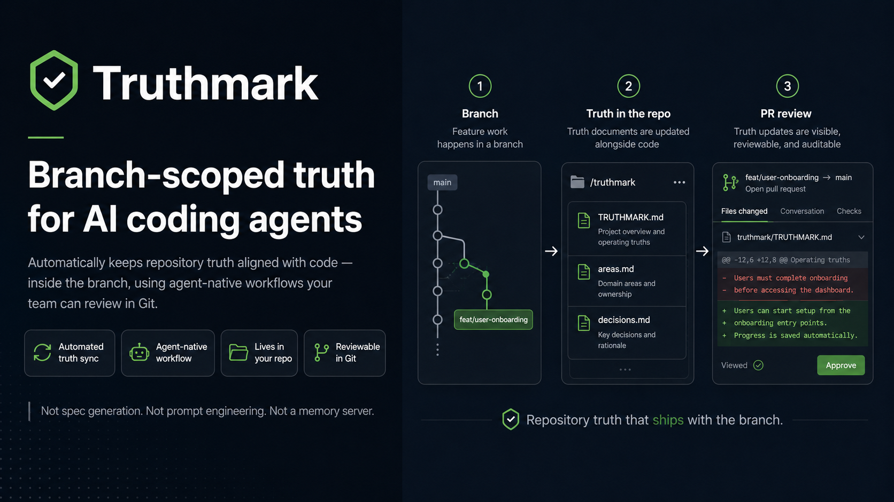
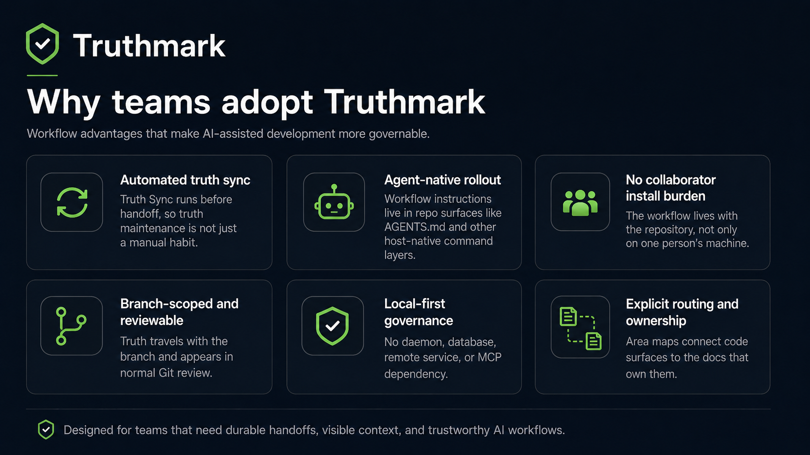
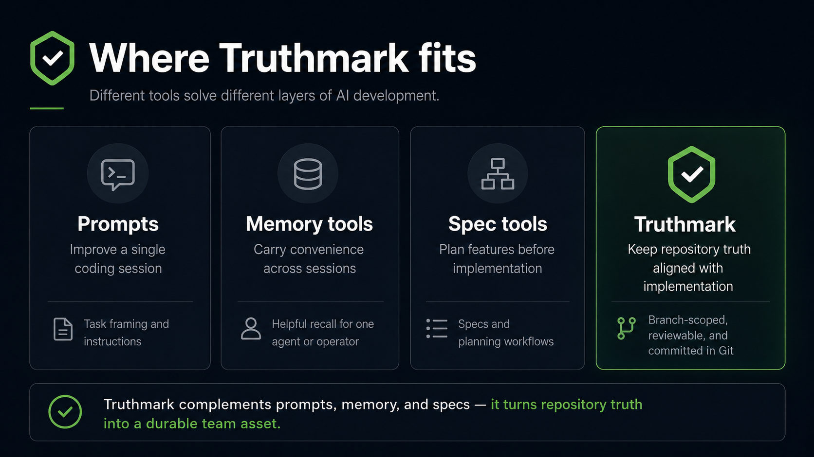
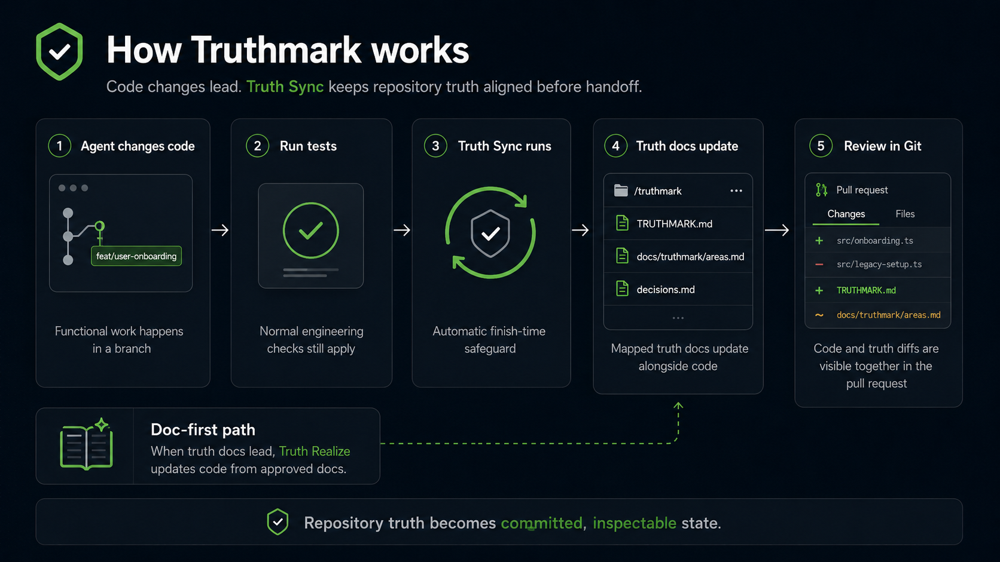

# Truthmark

**Truthmark installs repository truth workflows for AI software development.**

English | [Deutsch](README.de.md) | [中文](README.zh.md) | [Español](README.es.md) | [Русский](README.ru.md)



AI coding agents already write code fast. The expensive part is keeping repository truth aligned with what changed.

Truthmark adds a finish-time workflow guard to that workflow. The normal path is simple:

- agent changes functional code
- run relevant tests
- the installed Truth Sync workflow updates mapped truth docs before the agent finishes
- review the truth-doc diff if one was produced

Most tools ask teams to adopt a habit. Truthmark turns the habit into repository workflow infrastructure.

Truthmark turns an AI workflow into repo infrastructure, not personal tooling. It installs a Git-native, branch-scoped truth layer inside the repository, gives agents explicit routing and bounded workflow surfaces, and keeps that truth reviewable in Git instead of scattering it across prompt history, stale docs, or private tool memory.

That matters because the workflow lives with the branch. Once a repository is initialized, the rules, routing, and installed workflow surfaces travel in-repo, so collaboration and handoffs are less dependent on one person's machine setup.

For teams who already know agents can generate code, Truthmark answers the next problem: how to keep the repository itself legible, reviewable, and governable as AI-assisted work scales.

## Visual overview

<table>
  <tr>
    <td align="center" width="50%">
      
      <br><strong>Features</strong><br>
      What Truthmark installs and how the workflow surface is split.
    </td>
    <td align="center" width="50%">
      
      <br><strong>Position</strong><br>
      Where Truthmark fits relative to prompts, memory, and spec workflows.
    </td>
  </tr>
  <tr>
    <td align="center" colspan="2">
      
      <br><strong>Sync flow</strong><br>
      How Truth Sync closes out normal code changes before handoff.
    </td>
  </tr>
</table>

## Why teams adopt it

Truthmark is not trying to make agents sound smarter. It is trying to make AI-assisted repository change easier to trust.

- Installed Truth Sync after code changes turns documentation maintenance into a workflow safeguard instead of a team habit.
- Branch-scoped truth moves with the code, so reviewers can inspect current truth in ordinary Git diffs.
- Repository-native workflow surfaces make rollout lighter and handoffs more resilient than per-user setup alone.
- Explicit routing in `docs/truthmark/areas.md` and delegated child route files gives agents ownership boundaries and safer write paths.
- Local-first operation avoids a daemon, database, remote service, or MCP dependency.
- The routing model is language-agnostic, with coverage diagnostics for common JavaScript, TypeScript, Go, Python, C#, and Java code surfaces.

For tech leads, the value is governance without extra infrastructure: tests, code review, and ownership still do the real work; Truthmark makes the agent's context durable, inspectable, and branch-scoped.

## Where Truthmark fits

Truthmark is not a general AI productivity suite. It occupies a specific layer of the stack: branch-scoped, reviewable repository truth that stays aligned with implementation.

| If you need                                                           | Best fit                                |
| --------------------------------------------------------------------- | --------------------------------------- |
| Better results from a single coding session                           | Better prompts and tighter task framing |
| Convenience across sessions for one agent or one operator             | Memory tools                            |
| Spec-first planning for new features                                  | Spec tools such as Spec Kit             |
| Branch-scoped, reviewable repository truth that travels with the code | Truthmark                               |

The point is not that prompts, memory, or specs are useless. The point is that none of them, by themselves, turn repository truth into a committed, inspectable asset that survives handoffs, review, and branch divergence.

## Table of Contents

- [Why teams adopt it](#why-teams-adopt-it)
- [What Truthmark solves](#what-truthmark-solves)
- [Where Truthmark fits](#where-truthmark-fits)
- [Get started](#get-started)
- [How it runs](#how-it-runs)
- [What it installs](#what-it-installs)
- [Commands](#commands)
- [Why it exists](#why-it-exists)
- [Project status](#project-status)
- [Documentation](#documentation)
- [Non-goals](#non-goals)
- [License](#license)

## What Truthmark solves

Truthmark turns repository truth into an explicit workflow surface for agents:

- `.truthmark/config.yml` defines the committed hierarchy contract.
- `docs/truthmark/areas.md` and delegated child route files map code areas to the docs that own them.
- Truth Document generates or repairs canonical truth docs for existing implemented behavior when no code change is needed.
- Truth Sync keeps mapped truth docs aligned with functional changes.
- Truth Realize gives doc-first changes a bounded code-update path.
- `truthmark check` validates the resulting truth artifacts.
- The whole model stays local-first and Git-native.

This is the core promise: agent context becomes committed repository state instead of a private session artifact.

## Get started

Install Truthmark in the repository you want to initialize:

```bash
cd /path/to/your-repo
npm install -g truthmark
truthmark config
truthmark init
truthmark check
```

If you want to try unreleased changes from a source checkout instead:

```bash
cd /path/to/truthmark
npm install
npm run build

cd /path/to/your-repo
node /path/to/truthmark/dist/main.js config
node /path/to/truthmark/dist/main.js init
node /path/to/truthmark/dist/main.js check
```

Review `.truthmark/config.yml` before `init`; it is the committed hierarchy contract. After `init`, review the generated workflow surface and route files so the routed docs match the docs that actually own your code:

```text
.truthmark/config.yml
docs/truthmark/areas.md
docs/truthmark/areas/repository.md
docs/templates/behavior-doc.md
docs/truth/README.md
docs/truth/repository/README.md
docs/truth/repository/overview.md
AGENTS.md
CLAUDE.md
GEMINI.md
```

Supported platforms are `codex`, `opencode`, `claude-code`, `github-copilot`, and `gemini-cli`. The default config includes all of them; remove platforms you do not use from `.truthmark/config.yml` before rerunning `truthmark init`.

The default scaffold keeps truth `README.md` files as indexes and starts current behavior truth in bounded leaf docs such as `docs/truth/repository/overview.md`.

Existing repositories usually need one cleanup pass after `init`: run the installed Truth Structure workflow when the generated `repository` route is too broad, ownership spans multiple products or services, or route files still point at placeholder docs. Truth Structure splits broad routing, creates or repairs starter canonical truth docs, and gives Truth Sync precise destinations before functional-code work begins. Codex, Claude Code, and supported Copilot IDEs can invoke it with `/truthmark-structure`; OpenCode-style hosts can invoke `/skill truthmark-structure`.

```text
/truthmark-structure split the broad repository area into auth, billing, and notifications
```

## How it runs

Truthmark is strongest on the default path, not as a pile of manual commands. The acting agent and host environment decide whether to delegate or run the installed workflow inline.

### Existing behavior without docs

Use this when implementation already exists but the canonical truth docs are missing or weak:

```text
user identifies an implemented behavior or API endpoint
user explicitly invokes Truth Document
agent reads implementation, tests, routing, and existing docs
agent writes truth docs and routing only
review the truth-doc diff
```

Truth Document is manual and implementation-first: code is inspected as evidence, truth docs are created or repaired, and functional code must not be changed. Codex, Claude Code, and supported Copilot IDEs can invoke it with `/truthmark-document`. OpenCode-style hosts can invoke `/skill truthmark-document`.

```text
/truthmark-document document the implemented session timeout behavior under docs/truth/authentication
```

### Normal code changes

Most users should not need to invoke Truth Sync directly. The important behavior is that the installed agent workflow treats Truth Sync as a finish-time guard when functional code changed. The normal path is:

```text
agent changes functional code
run relevant tests
the installed Truth Sync workflow runs before the agent finishes
review the truth-doc diff if one was produced
commit or hand off the work
```

Truth Sync is code-first: code leads, truth docs follow, and Truth Sync must not rewrite functional code. Its main job is to run through the installed agent workflow as a finish-time guard when functional code changed. Direct invocation is mainly for troubleshooting, forcing an early sync before handoff, or running the workflow intentionally.

Codex, Claude Code, and supported Copilot IDEs can invoke it with `/truthmark-sync`. OpenCode-style hosts can invoke `/skill truthmark-sync`.

```text
/truthmark-sync sync the repository truth now before handoff
```

### Doc-first changes

Use this when a product or architecture decision starts in docs:

```text
user edits truth docs
user explicitly invokes Truth Realize
agent reads truth docs and relevant code
agent updates code only
run relevant tests
commit or hand off the work
```

Truth Realize is manual and doc-first: truth docs lead, code follows, and the agent must not edit the truth docs it is realizing.

Codex, Claude Code, and supported Copilot IDEs can invoke it with `/truthmark-realize`. OpenCode-style hosts can invoke `/skill truthmark-realize`.

```text
/truthmark-realize realize docs/truth/authentication/session-timeout.md into code
```

## What it installs

Truthmark keeps the durable workflow surface small and repository-native. After `truthmark init`, the repo itself carries the routing, rules, and installed workflow surfaces, so teams are not relying only on one operator's local setup.

- `.truthmark/config.yml` for the machine-readable committed hierarchy contract
- `docs/truthmark/areas.md` for the root route index
- `docs/truthmark/areas/**/*.md` for delegated child route files
- `docs/templates/behavior-doc.md` plus the other kind-specific templates under `docs/templates/` for the editable truth-doc standards used by generated workflows
- managed instruction blocks for configured platforms such as `AGENTS.md`, `CLAUDE.md`, Copilot instructions, and `GEMINI.md`
- host-native skills, prompts, or commands for Truth Structure, Truth Document, Truth Sync, Truth Realize, and Truth Check
- Codex, Claude Code, GitHub Copilot, and OpenCode project-scoped verifier agents plus leased `truth-doc-writer` agents under `.codex/agents/`, `.claude/agents/`, `.github/agents/`, and `.opencode/agents/` for workflow-owned subagent audits and parent-leased doc shards

The installed workflow surfaces are the runtime:

- Truth Structure creates or repairs area routing and starter truth docs.
- Truth Document creates or repairs truth docs for existing implemented behavior.
- Truth Sync keeps mapped truth docs aligned with functional changes.
- Truth Realize updates code to match truth docs.
- Truth Check audits repository truth health.

Truth `README.md` files are indexes. Truth Sync is expected to read and update bounded leaf docs for current behavior. Generated workflow surfaces preserve repository-rule authority while treating implementation code and canonical truth docs as evidence for current behavior.

Generated surfaces are managed by Truthmark, include a version marker, and may be refreshed by `truthmark init`.

## Commands

Truthmark V1 keeps the CLI focused because the ongoing workflow is meant to live in the installed agent surfaces, not in a long list of daily manual commands. In downstream repositories, `truthmark config` creates the committed hierarchy contract, `truthmark init` installs and refreshes workflow surfaces from that reviewed config, `truthmark check` validates truth artifacts for manual audits, CI, or troubleshooting, and the repository-intelligence commands generate derived review artifacts when local tooling is available.

```bash
truthmark config
truthmark init
truthmark check
truthmark index
truthmark impact --base main
truthmark context --workflow truth-sync --base main
truthmark config --json
truthmark check --json
truthmark index --json
truthmark impact --base main --json
truthmark context --workflow truth-sync --base main --json
```

`config` writes only `.truthmark/config.yml` unless `--stdout` is used.

`init` requires `.truthmark/config.yml`, then installs or refreshes the local workflow files.

`check` validates configuration, authority, routing, decision-bearing docs, frontmatter, internal links, branch scope, and coverage diagnostics.

`index` builds RepoIndex and RouteMap JSON for the active checkout.

`impact --base <ref>` maps changed files to routed truth docs, owning routes, nearby tests, and public symbols.

`context --workflow <workflow> [--base <ref>]` generates a bounded ContextPack for Truth Sync, Truth Document, or Truth Realize. `--format markdown` renders a human-readable pack.

Truth Structure, Truth Document, Truth Sync, Truth Realize, and Truth Check are installed agent workflows, not top-level daily CLI commands.

They run through the configured agent host surfaces, for example Codex/Claude/Copilot `/truthmark-*`, OpenCode `/skill truthmark-*`, or Gemini `/truthmark:*`.

```text
/truthmark-check audit routing and truth coverage before review
```

## Why it exists

Most AI coding workflows optimize for the next answer. Truthmark optimizes for the next handoff.

It assumes serious teams need:

- branch-specific product truth
- durable architecture and API decisions
- explicit ownership between docs and code
- safe write boundaries for agents
- ordinary Git diffs that humans can review
- readable Markdown that teammates can inspect without special tooling
- truth that travels with the branch instead of living in hidden session state
- workflows that still work when the package is not installed globally

Truthmark is not a memory server and it is not an MCP server. It is a repository practice packaged as a small CLI installer plus agent-native workflow surfaces that turn AI workflow rules into repo infrastructure.

## Project status

V1 currently provides:

- `truthmark config`
- `truthmark init`
- `truthmark check`
- `truthmark index`
- `truthmark impact`
- `truthmark context`
- managed `AGENTS.md` workflow instructions
- generated Truth Structure, Truth Document, Truth Sync, Truth Realize, and Truth Check skill surfaces for configured agent hosts
- branch-scope metadata
- config, authority, routing, decision-structure, frontmatter, link, freshness, and polyglot coverage diagnostics
- derived RepoIndex, RouteMap, ImpactSet, and ContextPack artifacts for faster local review when the CLI is available

## Documentation

The root README is for people evaluating and trying the package. Detailed functional and business specifications live under `docs/`:

- [Docs index](docs/README.md)
- [Architecture overview](docs/architecture/overview.md)
- [API and CLI contracts](docs/truth/contracts.md)
- [Init and scaffold behavior](docs/truth/init-and-scaffold.md)
- [Check diagnostics](docs/truth/check-diagnostics.md)
- [Installed workflows](docs/truth/workflows/overview.md)
- [Repository truth maintenance guide](docs/standards/maintaining-repository-truth.md)

Current behavior belongs in the canonical docs tree above.

## Non-goals

Truthmark V1 is not:

- a hosted service
- an MCP server
- a vector database
- a documentation website generator
- a CI or PR enforcement product
- a replacement for tests, code review, or technical leadership
- an autonomous code rewrite engine

It is a lightweight way to make local AI coding agents respect the truth your team keeps in Git.

## License

MIT. See [LICENSE](LICENSE).
