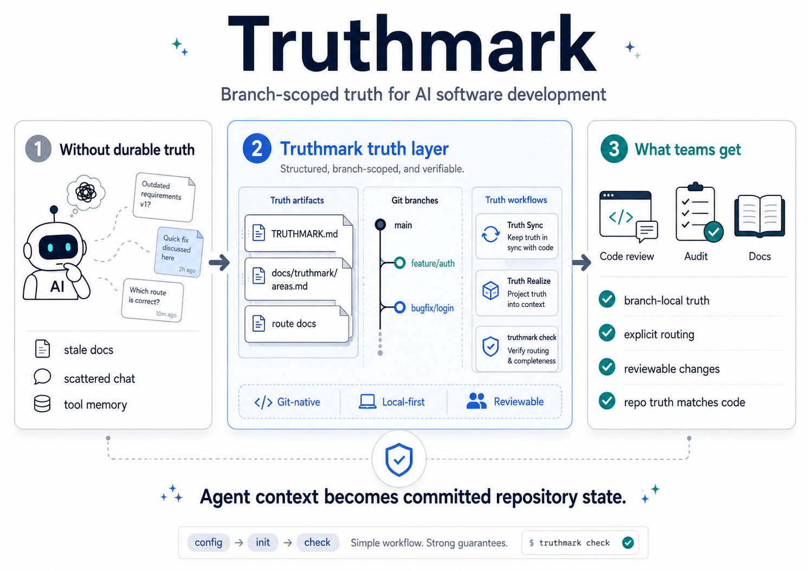

# Truthmark

**Truthmark is the truth layer for AI software development.**

English | [Deutsch](README.de.md) | [中文](README.zh.md) | [Español](README.es.md) | [Русский](README.ru.md)



AI coding agents are already good at writing code. They are still bad at reliably reconstructing product intent, architecture boundaries, and repository ownership from stale docs, scattered chats, and ephemeral tool memory.

Truthmark fixes that by turning branch-local repository truth into a first-class runtime surface for agents. It installs a Git-native, branch-scoped truth layer directly inside the repo, gives agents explicit routing and workflow boundaries, and makes that truth move with the code that actually ships.

This is not better prompt engineering. It is a more governable way to use AI in a real codebase: fewer repeated decisions, fewer stale docs, cleaner handoffs, and AI coding sessions that leave behind reviewable engineering records instead of disappearing into prompt history or opaque tool state.

For teams who already know agents can generate code, and now need the repository itself to stay legible, reviewable, and governable.

## Why teams try it

AI coding is now easy to start and expensive to govern. Once agents can write code quickly, repository truth becomes the control surface.

That failure mode shows up in predictable ways: requirements live in chat, architecture decisions get repeated, agents touch the wrong surfaces, and branches inherit context that reviewers cannot reliably inspect. The code may move fast, but the repository gets harder to trust.

Truthmark changes the working model:

- Branch-local truth travels with the branch instead of living in a private tool store.
- Git makes that truth reviewable, diffable, and shareable across the team.
- Docs follow code instead of drifting quietly into fiction.
- Routing stays explicit in `docs/truthmark/areas.md` and delegated child route files so agents know which docs own which code.
- Active product and architecture decisions live in the canonical docs they govern instead of in timestamped planning logs.
- Local-first workflows avoid a daemon, database, remote service, or MCP dependency.
- The model works across JavaScript, TypeScript, Go, Python, C#, and Java codebases.

For tech leads, the value is governance without theater: tests, code review, and ownership still do the real work; Truthmark makes the agent's context durable, inspectable, and branch-scoped.

## Where Truthmark fits

Truthmark is not trying to replace every other AI workflow tool. It sits in a specific layer of the stack:

| If you need                                                           | Best fit                                |
| --------------------------------------------------------------------- | --------------------------------------- |
| Better results from a single coding session                           | Better prompts and tighter task framing |
| Convenience across sessions for one agent or one operator             | Memory tools                            |
| Spec-first planning for new features                                  | Spec tools such as Spec Kit             |
| Branch-scoped, reviewable repository truth that travels with the code | Truthmark                               |

The point is not that prompts, memory, or specs are useless. The point is that none of them, by themselves, turn repository truth into a committed, inspectable asset that survives handoffs, review, and branch divergence.

## Table of Contents

- [What Truthmark solves](#what-truthmark-solves)
- [Where Truthmark fits](#where-truthmark-fits)
- [Get started](#get-started)
- [How it runs](#how-it-runs)
- [What it installs](#what-it-installs)
- [Commands](#commands)
- [Why it exists](#why-it-exists)
- [Project status](#project-status)
- [Documentation](#documentation)
- [Non-goals](#non-goals)
- [License](#license)

## What Truthmark solves

Truthmark turns repository truth into an explicit workflow surface for agents:

- `TRUTHMARK.md` defines the branch-local workflow contract.
- `docs/truthmark/areas.md` and delegated child route files map code areas to the docs that own them.
- Truth Sync keeps mapped truth docs aligned with functional changes.
- Truth Realize gives doc-first changes a bounded code-update path.
- `truthmark check` validates the resulting truth artifacts.
- The whole model stays local-first and Git-native.

This is the core promise: agent context becomes committed repository state instead of a private session artifact.

## Get started

Install Truthmark in the repository you want to initialize:

```bash
cd /path/to/your-repo
npm install -g truthmark
truthmark config
truthmark init
truthmark check
```

If you want to try unreleased changes from a source checkout instead:

```bash
cd /path/to/truthmark
npm install
npm run build

cd /path/to/your-repo
node /path/to/truthmark/dist/main.js config
node /path/to/truthmark/dist/main.js init
node /path/to/truthmark/dist/main.js check
```

Review `.truthmark/config.yml` before `init`; it is the committed hierarchy contract. After `init`, review the generated workflow surface and route files so the routed docs match the docs that actually own your code:

```text
.truthmark/config.yml
TRUTHMARK.md
docs/truthmark/areas.md
docs/truthmark/areas/repository.md
docs/features/README.md
docs/features/repository/README.md
docs/features/repository/overview.md
AGENTS.md
CLAUDE.md
```

Supported platforms are `codex`, `opencode`, `claude-code`, `github-copilot`, and `gemini-cli`. The default config includes all of them; remove platforms you do not use from `.truthmark/config.yml` before rerunning `truthmark init`.

The default scaffold keeps feature `README.md` files as indexes and starts current behavior truth in bounded leaf docs such as `docs/features/repository/overview.md`.

Existing repositories usually need one cleanup pass after `init`: run the installed Truth Structure workflow when the generated `repository` route is too broad, ownership spans multiple products or services, or route files still point at placeholder docs. Truth Structure splits broad routing, creates or repairs starter canonical truth docs, and gives Truth Sync precise destinations before functional-code work begins. Codex, Claude Code, and supported Copilot IDEs can invoke it with `/truthmark-structure`; OpenCode-style hosts can invoke `/skill truthmark-structure`.

## How it runs

Truthmark does not specify which subagent should run Truth Sync. The acting agent and host environment decide whether to delegate or run the workflow inline.

### Normal code changes

Most users should not need to invoke Truth Sync directly. The normal path is:

```text
agent changes functional code
run relevant tests
Truth Sync triggers before the agent finishes
review the truth-doc diff if one was produced
commit or hand off the work
```

Truth Sync is code-first: code leads, truth docs follow, and Truth Sync must not rewrite functional code. Its main job is to act as an automatic finish-time safeguard when functional code changed. Direct invocation is mainly for troubleshooting, forcing an early sync before handoff, or running the workflow intentionally.

Codex, Claude Code, and supported Copilot IDEs can invoke it with `/truthmark-sync`. OpenCode-style hosts can invoke `/skill truthmark-sync`.

### Doc-first changes

Use this when a product or architecture decision starts in docs:

```text
user edits truth docs
user explicitly invokes Truth Realize
agent reads truth docs and relevant code
agent updates code only
run relevant tests
commit or hand off the work
```

Truth Realize is manual and doc-first: truth docs lead, code follows, and the agent must not edit the truth docs it is realizing.

Codex, Claude Code, and supported Copilot IDEs can invoke it with `/truthmark-realize`. OpenCode-style hosts can invoke `/skill truthmark-realize`.

## What it installs

Truthmark keeps the durable workflow surface small:

- `.truthmark/config.yml` for machine-readable configuration
- `TRUTHMARK.md` for the branch-local workflow contract
- `docs/truthmark/areas.md` for the root route index
- `docs/truthmark/areas/**/*.md` for delegated child route files
- managed instruction blocks for configured platforms such as `AGENTS.md`, `CLAUDE.md`, Copilot instructions, and `GEMINI.md`
- host-native skills, prompts, or commands for Truth Structure, Truth Sync, Truth Realize, and Truth Check

The installed workflow surfaces are the runtime:

- Truth Structure creates or repairs area routing and starter truth docs.
- Truth Sync keeps mapped truth docs aligned with functional changes.
- Truth Realize updates code to match truth docs.
- Truth Check audits repository truth health.

Feature `README.md` files are indexes. Truth Sync is expected to read and update bounded leaf docs for current behavior.

Generated surfaces are managed by Truthmark, include a version marker, and may be refreshed by `truthmark init`.

## Commands

Truthmark V1 intentionally keeps the CLI small. In downstream repositories, `truthmark config` creates the committed hierarchy contract, `truthmark init` installs and refreshes workflow surfaces from that reviewed config, and `truthmark check` validates truth artifacts for manual audits, CI, or troubleshooting.

```bash
truthmark config
truthmark init
truthmark check
truthmark config --json
truthmark check --json
```

`config` writes only `.truthmark/config.yml` unless `--stdout` is used.

`init` requires `.truthmark/config.yml`, then installs or refreshes the local workflow files.

`check` validates configuration, authority, routing, decision-bearing docs, frontmatter, internal links, branch scope, and coverage diagnostics.

Truth Structure, Truth Sync, Truth Realize, and Truth Check are installed agent workflows, not top-level daily CLI commands.

They run through the configured agent host surfaces, for example Codex/Claude/Copilot `/truthmark-*`, OpenCode `/skill truthmark-*`, or Gemini `/truthmark:*`.

## Why it exists

Most AI coding workflows optimize for the next answer. Truthmark optimizes for the next handoff.

It assumes serious teams need:

- branch-specific product truth
- durable architecture and API decisions
- explicit ownership between docs and code
- safe write boundaries for agents
- ordinary Git diffs that humans can review
- readable Markdown that teammates can inspect without special tooling
- truth that travels with the branch instead of living in hidden session state
- workflows that still work when the package is not installed globally

Truthmark is not a memory server and it is not an MCP server. It is a repository practice packaged as a small CLI installer plus agent-native workflow surfaces.

## Project status

V1 currently provides:

- `truthmark config`
- `truthmark init`
- `truthmark check`
- managed `AGENTS.md` workflow instructions
- generated Truth Structure, Truth Sync, Truth Realize, and Truth Check skill surfaces for configured agent hosts
- branch-scope metadata
- config, authority, routing, decision-structure, frontmatter, link, and polyglot coverage diagnostics

## Documentation

The root README is for people evaluating and trying the package. Detailed functional and business specifications live under `docs/`:

- [Docs index](docs/README.md)
- [Architecture overview](docs/architecture/overview.md)
- [API and CLI contracts](docs/features/contracts.md)
- [Init and scaffold behavior](docs/features/init-and-scaffold.md)
- [Check diagnostics](docs/features/check-diagnostics.md)
- [Installed workflows](docs/features/installed-workflows.md)
- [Repository truth maintenance guide](docs/standards/maintaining-repository-truth.md)

Current behavior belongs in the canonical docs tree above.

## Non-goals

Truthmark V1 is not:

- a hosted service
- an MCP server
- a vector database
- a documentation website generator
- a CI or PR enforcement product
- a replacement for tests, code review, or technical leadership
- an autonomous code rewrite engine

It is a lightweight way to make local AI coding agents respect the truth your team keeps in Git.

## License

MIT. See [LICENSE](LICENSE).
