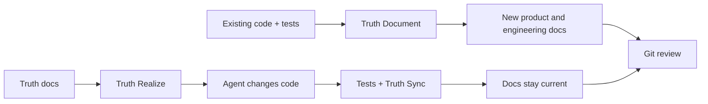

# Truthmark

**Your agents write code. Truthmark maintains the human-facing, Git-reviewable documentation.**

Truthmark installs Git-native workflows that let AI coding agents create new product and engineering documentation from existing code and tests, keep it current after every code change, and hand you ordinary Markdown diffs for review.

[](https://www.npmjs.com/package/truthmark)
[](https://github.com/merlinhu1/truthmark/actions/workflows/ci.yml)
[](LICENSE)
[](package.json)

[Get started](#quick-start-create-your-first-truth-document) · [Website](https://merlinhu1.github.io/truthmark/) · [User Guide](https://github.com/merlinhu1/truthmark/blob/main/docs/user-guide.md) · [GitHub](https://github.com/merlinhu1/truthmark)

<details>
<summary>Read this README in 16 languages</summary>

[🇺🇸 English](README.md) | [🇨🇳 简体中文](docs/readmes/README.zh.md) | [🇯🇵 日本語](docs/readmes/README.ja.md) | [🇰🇷 한국어](docs/readmes/README.ko.md) | [🇩🇪 Deutsch](docs/readmes/README.de.md) | [🇫🇷 Français](docs/readmes/README.fr.md) | [🇪🇸 Español](docs/readmes/README.es.md) | [🇧🇷 Português](docs/readmes/README.pt.md) | [🇷🇺 Русский](docs/readmes/README.ru.md) | [🇸🇦 العربية](docs/readmes/README.ar.md) | [🇮🇹 Italiano](docs/readmes/README.it.md) | [🇵🇱 Polski](docs/readmes/README.pl.md) | [🇹🇷 Türkçe](docs/readmes/README.tr.md) | [🇻🇳 Tiếng Việt](docs/readmes/README.vi.md) | [🇮🇩 Bahasa Indonesia](docs/readmes/README.id.md) | [🇬🇷 Ελληνικά](docs/readmes/README.el.md)

</details>

## Create the first docs. Keep them true.

Most documentation tools stop after generation. Truthmark gives agents a complete documentation lifecycle inside your repository:

- **Create new docs from working software.** Truth Document reads code and tests, then creates bounded product or engineering documentation.
- **Keep docs aligned automatically.** Truth Sync runs at agent handoff after functional code changes and updates repository truth before the work is finished.
- **Turn docs back into code.** Truth Realize implements approved truth docs while preserving a clean doc-first workflow.
- **Repair ownership as the codebase grows.** Truth Structure creates bounded routes and starter docs for new or overloaded areas.
- **Review everything in Git.** Code, decisions, contracts, architecture, operations, and behavior travel together with the branch.

No hosted knowledge base. No private agent memory. No documentation trapped in chat history.

## Quick Start: create your first truth document

**Requirements:** Node.js 24 or newer, a Git repository, and a supported AI coding host for agent workflows.

Run this inside the repository you want Truthmark to manage:

```bash
cd /path/to/your-repo
npm install -g truthmark
truthmark init
```

`truthmark init` lets you select Codex, Claude Code, GitHub Copilot, OpenCode, Antigravity, Cursor, or a host-neutral command-line interface setup.

Now ask your configured agent to document one real behavior:

```text
/truthmark-document document the implemented session timeout behavior across src/auth/session.ts and tests/auth/session.test.ts
```

Truth Document creates a new bounded truth doc when one does not exist, updates an existing owner when it does, and updates routing when needed. It does not change functional code.

Review the result:

```bash
truthmark check
git status --short --untracked-files=all
git diff
```

You should now have:

```text
docs/truthmark/engineering/behaviors/session-timeout.md
docs/truthmark/routes/areas/authentication.md
```

The exact paths follow your repository’s ownership structure. New files appear in `git status`; changes to tracked files appear in `git diff`.

Invocation varies by host. OpenCode uses `/skill truthmark-document`, Antigravity uses `@truthmark-document`, and other supported hosts use their native skill or slash-command surface. See the [platform table](https://github.com/merlinhu1/truthmark/blob/main/docs/user-guide.md#supported-agent-platforms) for exact commands.

For scripts and continuous integration, pass the selected platforms explicitly:

```bash
truthmark init --platform codex --platform cursor
truthmark init --json
```

Choose `none` interactively or run `truthmark init --clear-platforms` for a host-neutral repository. You can add agent platforms later by rerunning `truthmark init`.

For branch-relative freshness diagnostics, pass a Git base:

```bash
truthmark check --base <base-ref>
```

## How Truthmark works


```mermaid
flowchart LR
  A["Existing code + tests"] --> B["Truth Document"]
  B --> C["New product and engineering docs"]
  D["Agent changes code"] --> E["Tests + Truth Sync"]
  E --> F["Docs stay current"]
  C --> G["Git review"]
  F --> G
  H["Truth docs"] --> I["Truth Realize"]
  I --> D
```

The Truthmark command-line interface installs and validates the repository contract. Your coding agent performs the evidence review and documentation work through the installed host-native workflows.

A normal code change follows one simple loop:

1. The agent changes functional code.
2. Relevant tests run.
3. Truth Sync checks the mapped documentation.
4. The agent creates or updates docs and routing when repository truth changed.
5. You review the code diff and truth diff together.

## Workflows

| Workflow             | Use it when                                               | Result                                                                  |
| -------------------- | --------------------------------------------------------- | ----------------------------------------------------------------------- |
| **Truth Document**   | Existing code needs documentation                         | Creates or updates evidence-backed product and engineering docs         |
| **Truth Sync**       | Functional code changed                                   | Keeps mapped docs and routing aligned before handoff                    |
| **Truth Structure**  | A new area needs ownership or existing docs are too broad | Creates bounded routes and skeletal starter docs                        |
| **Truth Realize**    | An approved truth doc should become working software      | Updates functional code from documentation                              |
| **Truth Check**      | Repository truth needs an audit                           | Reports routing, ownership, evidence, and documentation issues          |
| **Truthmark Portal** | The team wants a browsable documentation site             | Generates a committed static HTML presentation from Markdown truth docs |

Truthmark installs these workflows as native repository surfaces for Codex, Claude Code, GitHub Copilot, OpenCode, Antigravity, and Cursor.

## What you get

### Documentation that starts from reality

Truthmark can create documentation for product capabilities, implementation behavior, application programming interfaces, architecture, workflows, operations, and tests. Code and tests provide the evidence; bounded Markdown docs preserve the result.

### Documentation that survives the next change

Routes connect code areas to canonical docs. When agents change behavior, Truth Sync knows where the corresponding truth belongs and keeps the handoff reviewable.

### Product and engineering truth in separate lanes

Product truth captures user-facing promises, boundaries, decisions, and acceptance criteria. Engineering truth captures current behavior, contracts, architecture, workflows, operations, and test behavior.

### Git-native collaboration

Everything important lives in committed repository files. Truth follows the branch, works with ordinary pull requests, and remains visible to every maintainer and coding agent.

### Local-first operation

Truthmark needs no hosted service, daemon, database, vector store, or Model Context Protocol server. The repository carries its own documentation workflow.

## Where Truthmark fits

| Need                                               | Best fit                   |
| -------------------------------------------------- | -------------------------- |
| Better output from one agent session               | Better prompt              |
| Personal or session-level continuity               | Memory tool                |
| Plan-first feature work                            | Specification workflow     |
| Branch-scoped documentation that travels with code | **Truthmark**              |
| Behavior correctness                               | Tests and code review      |
| Reviewable AI-assisted documentation               | **Truthmark + Git review** |

Truthmark is built for maintainers and engineering teams that already use AI coding agents and want the repository to keep telling the truth as fast as the code changes.

## Supported hosts and command line

Supported agent hosts:

- Codex
- Claude Code
- GitHub Copilot
- OpenCode
- Antigravity
- Cursor

<details>
<summary>Command-line reference</summary>

| Command                                                           | Purpose                                                                          |
| ----------------------------------------------------------------- | -------------------------------------------------------------------------------- |
| `truthmark init`                                                  | Create or refresh configuration, routing, templates, and selected host workflows |
| `truthmark check [--base <ref>]`                                  | Validate repository truth and optionally run branch-freshness diagnostics        |
| `truthmark index --json`                                          | Inspect derived repository and routing metadata                                  |
| `truthmark impact --base <ref> --json`                            | Map changed files to docs, owners, and nearby tests                              |
| `truthmark workflow status --workflow <id> [--base <ref>] --json` | Inspect workflow applicability and targets                                       |
| `truthmark validate ...`                                          | Validate workflow reports and write leases                                       |
| `truthmark uninstall --dry-run` / `truthmark uninstall --apply`   | Preview or remove generated host surfaces while preserving authored truth        |

Structured JSON output is available throughout the command-line interface for scripts and continuous integration.

</details>

## Learn more

- [Truthmark User Guide](https://github.com/merlinhu1/truthmark/blob/main/docs/user-guide.md)
- [Documentation index](https://github.com/merlinhu1/truthmark/blob/main/docs/README.md)
- [Architecture overview](https://github.com/merlinhu1/truthmark/blob/main/docs/truthmark/engineering/architecture/overview.md)
- [Configuration, routing, and command contracts](https://github.com/merlinhu1/truthmark/blob/main/docs/truthmark/engineering/contracts/config-route-and-check-contracts.md)
- [Maintaining repository truth](https://github.com/merlinhu1/truthmark/blob/main/docs/standards/maintaining-repository-truth.md)
- [Contributing](https://github.com/merlinhu1/truthmark/blob/main/CONTRIBUTING.md)

**Install Truthmark, select your coding host, and turn one real behavior into documentation today.**

## License

MIT. See [LICENSE](LICENSE).
