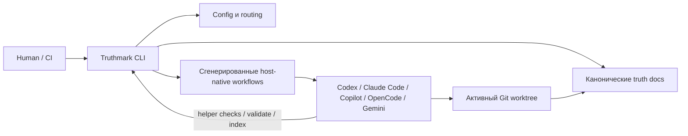

# Truthmark

**Ваши агенты пишут код. Truthmark поддерживает документацию для людей, версионируемую и проверяемую в Git.**

[English](README.md) | [Deutsch](README.de.md) | [中文](README.zh.md) | [Español](README.es.md) | Русский


ИИ-агенты разработки могут менять репозиторий быстрее, чем люди успевают поддерживать его документацию в актуальном состоянии.

Truthmark чинит ту часть, которая обычно ломается после написания кода: актуальное описание репозитория.

Он устанавливает Git-native, ограниченный веткой слой рабочего процесса, который помогает ИИ-агентам обновлять правильные документы, соблюдать границы владения и оставлять людям обычные diff для ревью.

Без размещенного сервиса.

Без базы данных.

Без скрытого слоя памяти.

Без дополнительного сервера в эксплуатации.

Только актуальное описание репозитория, которое движется вместе с веткой.

## Проблема

ИИ-агенты разработки хорошо создают код. Это порождает новый режим отказа.

Реализация меняется, но история репозитория начинает расходиться:

- поведение живет в истории чата
- архитектурные документы отстают
- продуктовые решения исчезают после передачи работы
- ревьюеры видят diff кода без связанных diff истины
- ветки незаметно развивают разные версии того, «что является правдой»
- каждой сессии агента приходится заново понимать актуальное состояние репозитория

Truthmark превращает это хрупкое описание текущего состояния в зафиксированную инфраструктуру репозитория.

Вместо надежды на то, что каждый человек и каждый агент вспомнят нужную дисциплину документирования, Truthmark устанавливает эту привычку в репозиторий.

## Обещание

Когда агент меняет функциональный код, работа не должна заканчиваться только diff кода.

Обычный путь Truthmark:

```text
агент меняет функциональный код
запускаются релевантные тесты
Truth Sync проверяет сопоставленные документы истины
документы истины обновляются при необходимости
человек проверяет diff кода + diff истины
коммит или передача работы
```

Главная ценность такова: **ИИ-работе легче доверять, потому что репозиторий остается понятным.**

## Два интерфейса, одна система истины

Truthmark — это не только CLI.

У него два разных интерфейса, и это различие важно.

### 1. CLI для людей

CLI предназначен для мейнтейнеров, ревьюеров и автоматизации.

Используйте его, чтобы настроить репозиторий, установить или обновить файлы рабочих процессов, проверить артефакты истины и создать дополнительные материалы для ревью.

```bash
truthmark config
truthmark init
truthmark check
```

CLI подготавливает и валидирует среду репозитория.

Он не является runtime для ИИ-рабочего процесса.

### 2. Интерфейсы рабочих процессов для ИИ

Интерфейсы для ИИ предназначены для coding agents.

Truthmark устанавливает host-native skills, prompts, commands, управляемые блоки инструкций и поддерживаемые интерфейсы subagents, чтобы ИИ-агенты могли следовать специфичным для репозитория truth-workflows внутри своих обычных инструментов разработки.

Примеры:

```text
/truthmark-sync
/truthmark-document
/truthmark-structure
/truthmark-realize
/truthmark-preview
/truthmark-check
```

Они выглядят как команды, потому что agent hosts раскрывают workflows через slash commands, prompts, skills или project commands.

Это не shell-команды.

Это точки входа workflow для ИИ.

Разделение и есть продукт:

```text
люди владеют контрактом репозитория
Truthmark устанавливает контракт в репозиторий
агенты работают внутри этого контракта
обновления истины появляются как Git diff
люди проверяют результат
```

## Быстрый старт

### Требования

- Node.js `>=20`
- npm
- Git-репозиторий

### Установить Truthmark

Выполните это внутри репозитория, который хотите инициализировать:

```bash
cd /path/to/your-repo
npm install -g truthmark
```

### Создать контракт истины репозитория

```bash
truthmark config
```

Это создает:

```text
.truthmark/config.yml
```

Проверьте этот файл перед продолжением. Он определяет зафиксированный контракт иерархии для репозитория.

### Установить интерфейсы рабочих процессов

```bash
truthmark init
```

Это устанавливает или обновляет:

- файлы маршрутов
- scaffolding документов истины
- управляемые блоки инструкций
- интерфейсы рабочих процессов для ИИ для настроенных платформ

Обоснование стандартных шаблонов документов истины находится в [Template Standards](docs/standards/template-standards.md). В документе показано, как они соотносятся с признанными источниками по инженерии ПО, включая ISO/IEC/IEEE 42010, ISO/IEC/IEEE 29148, ISO/IEC/IEEE 12207, ISO/IEC 25010, C4, arc42, OpenAPI, SemVer, Google SRE и Diátaxis.

### Проверить настройку

```bash
truthmark check
```

Затем проверьте сгенерированные файлы перед коммитом.

Точный набор файлов зависит от `.truthmark/config.yml`, но форма установки всегда одна: routing, truth scaffolding, компактные managed instructions и host-native интерфейсы workflow для включённых платформ.

## Первое реальное использование

Большинству репозиториев после инициализации нужен один этап очистки.

Стандартный scaffold начинается с широкого area `repo`. Реальным репозиториям обычно нужна более точная маршрутизация.

Попросите агента разделить широкий маршрут на реальные области продукта, сервиса, домена или владения:

```text
/truthmark-structure раздели широкий repo area на auth, billing и notifications
```

Если в проекте уже есть реализованные функции, но документы истины отсутствуют или слабы, попросите установленный workflow Truth Document задокументировать сфокусированный scope:

```text
/truthmark-document задокументируй реализованное поведение payment retry в src/billing/retry.ts и связанных тестах
```

Truth Document — самый частый первый workflow для существующих проектов. Он инспектирует реализацию, тесты, маршруты и существующие документы, затем создает или исправляет документы истины и маршрутизацию, не меняя функциональный код.

После этого используйте своего ИИ-агента для разработки как обычно.

Когда агент меняет функциональный код, Truth Sync действует как финальная защита, которая перед передачей работы проверяет, должны ли измениться сопоставленные документы истины.

## Что вы получаете

| Возможность | Что она делает |
| --- | --- |
| Git-native истина | Хранит актуальное описание репозитория в зафиксированных Markdown и config. |
| Документация в пределах ветки | Истина движется с веткой вместо жизни в приватной сессии. |
| CLI для людей | Дает мейнтейнерам команды настройки, обновления, валидации и инспекции. |
| Workflows для ИИ | Дает агентам host-native workflows для sync, documentation, structure, preview, realization и audit. |
| Явная маршрутизация | Сопоставляет области кода с каноническими документами истины. |
| Проверяемые передачи работы | Создает обычные Git diff для кода и документов истины. |
| Local-first работа | Не требует размещенного сервиса, daemon, базы данных или MCP-сервера. |
| Более безопасные границы записи | Разделяет code-first, doc-first, read-only и doc-only workflows. |
| Валидация | Сообщает о проблемах маршрутизации, authority, frontmatter, ссылок, generated surfaces, branch scope, freshness и coverage. |
| Опциональный Portal | Генерирует зафиксированный статический HTML-сайт презентации из Markdown-документов истины, когда он явно включен и запрошен. |

## Визуальный обзор


**Возможности:** что устанавливает Truthmark и как устроен интерфейс workflow.


**Позиция:** где Truthmark находится относительно prompts, memory и spec workflows.


**Поток sync:** как Truth Sync закрывает обычные изменения кода перед передачей.

## Почему команды выбирают его

Truthmark предназначен для команд, которые уже знают, что ИИ-агенты могут генерировать код.

Следующая проблема — governance.

Не governance как церемония. Governance как простой вопрос:

> После этого ИИ-ассистированного изменения репозиторий все еще говорит правду?

Truthmark помогает командам отвечать на это с помощью зафиксированных файлов, явной маршрутизации и проверяемых diff.

Он полезен, когда нужны:

- меньший дрейф документации
- лучшие передачи работы
- продуктовая истина, специфичная для ветки
- долговечная архитектурная и API-документация
- явное владение между документацией и кодом
- более безопасные границы записи для агентов
- проверяемая документация вместо скрытой памяти
- ИИ-workflows, которые продолжают работать из зафиксированных файлов репозитория

## Где уместен Truthmark

Truthmark не заменяет prompts, memory, specs, tests или code review.

Он дает этим workflows долговечное место в Git.

| Потребность | Лучше подходит |
| --- | --- |
| Лучший результат из одной сессии агента | Лучший prompt |
| Персональная или сессионная преемственность | Memory tool |
| Работа над функцией plan-first | Spec workflow |
| Истина в пределах ветки, которая путешествует с кодом | Truthmark |
| Проверка корректности поведения | Tests and review |
| Ревью изменений документации, выполненных с ИИ | Truthmark plus Git review |

Область Truthmark намеренно узкая:

```text
сделать актуальное состояние репозитория явным
связать ее с кодом
установить вокруг нее workflows агентов
сохранить результат проверяемым в Git
```

## Как работает Truthmark

Truthmark работает локально с активным Git worktree.

CLI для людей читает и записывает файлы репозитория, а затем завершается.

Интерфейсы рабочих процессов для ИИ — это зафиксированные файлы, которые agent hosts могут загрузить позже. Поэтому агенты могут следовать установленному workflow из состояния репозитория, не завися от фонового процесса Truthmark.

Эти слои связаны так:



Agents не подключаются к daemon Truthmark, но могут запускать установленный Truthmark CLI, когда workflow требует validation, indexing или helper checks.

Truthmark владеет сгенерированными интерфейсами workflow, но главный контракт архитектурный: repo-local config и routing направляют agents к каноническим truth docs, а host-native workflows дают каждому поддерживаемому agent способ выполнять одни и те же процедуры Truthmark.

Сгенерированные интерфейсы workflow включают маркеры версии Truthmark. После обновления Truthmark снова выполните:

```bash
truthmark init
```

Затем проверьте сгенерированные diff.

## Поддерживаемые платформы агентов

Конфигурация по умолчанию включает все поддерживаемые платформы.

Удалите платформы, которыми не пользуетесь, из `.truthmark/config.yml`, затем снова выполните:

```bash
truthmark init
```

| Имя платформы в config | Сгенерированный интерфейс | Форма вызова |
| --- | --- | --- |
| `codex` | `.agents/skills/truthmark-*/`, `.codex/agents/` | `/truthmark-*` или `$truthmark-*` |
| `claude-code` | `.claude/skills/truthmark-*/`, `.claude/agents/`, `CLAUDE.md` | `/truthmark-*` |
| `github-copilot` | `.github/skills/truthmark-*/`, `.github/prompts/`, `.github/agents/`, `.github/copilot-instructions.md` | `/truthmark-*` в поддерживаемых Copilot IDE; custom agents `@truth-*` в Copilot CLI |
| `opencode` | `.opencode/skills/truthmark-*/`, `.opencode/agents/` | `/skill truthmark-*` |
| `gemini-cli` | `.gemini/skills/truthmark-*/`, `.gemini/commands/truthmark/`, `.gemini/agents/`, `GEMINI.md` | `/truthmark:*` |

Неизвестные имена платформ являются ошибками config.

Удаление платформы останавливает будущие обновления для нее. Оно не удаляет ранее сгенерированные файлы.

## Workflows для ИИ

Эти workflows устанавливаются в поддерживаемые ИИ coding hosts.

Они используются агентами или agent hosts во время работы с репозиторием. Это не shell-команды верхнего уровня.

| Workflow | Направление | Когда использовать | Граница записи |
| --- | --- | --- | --- |
| Truth Structure | topology-first | Стандартный маршрут слишком широкий, владение охватывает несколько областей или файлы маршрутов все еще указывают на placeholders. | Создает или исправляет маршрутизацию и стартовые документы истины. |
| Truth Document | implementation-first | Поведение уже есть в коде, но канонические документы истины отсутствуют или слабы. | Пишет только документы истины и маршрутизацию. Функциональный код менять нельзя. |
| Truth Sync | code-first | Функциональный код изменился, и сопоставленные документы истины могут потребовать обновления перед передачей. | Обновляет документы истины. Truth Sync не должен переписывать функциональный код. |
| Truth Preview | read-only | Агенту нужно предварительно понять вероятную маршрутизацию перед правками. | Только чтение. Не авторизует записи. |
| Truth Realize | doc-first | Продуктовые или архитектурные документы истины ведут, и код нужно обновить под них. | Обновляет только код. Агент не должен редактировать документы истины, которые реализует. |
| Truth Check | audit-first | Ревьюеру или агенту нужно проверить актуальность истины репозитория. | Аудитирует и сообщает. |
| Truthmark Portal | presentation-only | Человек явно просит доступный для просмотра статический HTML Portal по документам истины репозитория. | Пишет только сгенерированные неканонические статические файлы в настроенную директорию вывода Portal. |

### Важное различие

Не путайте эти два интерфейса:

| Интерфейс | Используется | Пример | Значение |
| --- | --- | --- | --- |
| CLI для людей | людьми, скриптами, CI-подобными проверками | `truthmark check` | Проверить артефакты истины репозитория из терминала. |
| Workflow для ИИ | coding agents и agent hosts | `/truthmark-check` | Попросить агента выполнить установленный audit workflow. |

Имена намеренно похожи, но интерфейсы разные.

## Обычное изменение кода с помощью ИИ

Большинству пользователей не нужно вручную вызывать Truth Sync каждый раз.

Truth Sync — установленная финальная защита для изменений функционального кода.

```text
агент меняет функциональный код
агент запускает или запрашивает релевантные тесты
установленный workflow обнаруживает, что функциональный код изменился
Truth Sync проверяет сопоставленные документы истины
агент обновляет документы истины при необходимости
человек проверяет diff кода + diff истины
```

Прямой вызов все равно полезен для отладки, принудительной ранней синхронизации или явной передачи работы:

```text
/truthmark-sync синхронизируй истину репозитория прямо сейчас перед передачей
```

## Существующее поведение без docs

Используйте Truth Document, когда реализация уже существует, но истина репозитория неполна. Это обычный путь для зрелых репозиториев, которые внедряют Truthmark после того, как кодовая база уже существует.

```text
/truthmark-document задокументируй реализованное поведение session timeout в src/auth/session.ts, src/auth/middleware.ts и tests/auth/session.test.ts
```

Укажите имя функции, пути к коду, пути к тестам или желаемую область truth-документов. В OpenCode-подобных хостах тот же workflow вызывается как `/skill truthmark-document ...`; в Gemini CLI используйте `/truthmark:doc ...`.

Для большого репозитория, где все еще есть один широкий placeholder-маршрут, сначала запустите Truth Structure, а затем вызывайте Truth Document для одной ограниченной функции или области за раз.

Truth Document проверяет реализацию, тесты, файлы маршрутов и существующие документы как подтверждения.

Он пишет только документы истины и маршрутизацию.

Он не должен менять функциональный код.

## Doc-first изменения

Используйте Truth Realize, когда продуктовое или архитектурное решение начинается в docs и код нужно обновить под него.

```text
/truthmark-realize реализуй docs/truthmark/product/capabilities/session-timeout.md в коде
```

Truth Realize работает doc-first.

Документы истины ведут. Код следует.

Агент не должен редактировать документы истины, которые реализует.

## Read-only preview маршрутизации

Используйте Truth Preview перед изменением, когда агенту нужно понять вероятную маршрутизацию.

```text
/truthmark-preview покажи вероятный truth routing для изменений billing API
```

Truth Preview работает read-only.

Это средство выбора и планирования, а не авторизация записи и не замена Truth Check.

## Аудит истины репозитория

Используйте Truth Check, когда нужен audit workflow для агента.

```text
/truthmark-check проверь routing и truth coverage перед review
```

Используйте CLI для людей, когда нужна terminal validation:

```bash
truthmark check
```

Оба варианта полезны. Это не одна и та же поверхность.

## CLI-команды для людей

Большинство мейнтейнеров начинают с трех команд.

| Команда | Назначение |
| --- | --- |
| `truthmark config` | Создает `.truthmark/config.yml`. Пишет только этот файл, если не используется `--stdout`. |
| `truthmark init` | Устанавливает или обновляет настроенные интерфейсы workflow из проверенной config. |
| `truthmark check` | Валидирует config, authority, routing, документы с decisions, frontmatter, внутренние ссылки, branch scope, generated surfaces, freshness и coverage diagnostics. |

Необязательные helpers repository-intelligence создают производные материалы для ревью активного checkout, например артефакты RepoIndex, RouteMap, ImpactSet и ограниченные ContextPack. Сгенерированные workflow skill packages также могут предоставлять helper manifests и helper policies, которые вызывают установленные CLI validators `truthmark validate ... --json`; эти helpers являются ускорителями, а не локальными скриптами, упакованными в репозиторий, и не источниками истины. Отдельные Copilot prompts и Gemini commands используют тот же CLI validator contract, когда установленный runner доступен; иначе они должны сообщать видимый skipped helper status и выполнять manual validation.

Они не являются источниками истины.

| Команда | Назначение |
| --- | --- |
| `truthmark index` | Строит JSON RepoIndex и RouteMap для активного checkout. |
| `truthmark impact --base <ref>` | Сопоставляет измененные файлы с routed truth docs, owning routes, nearby tests и public symbols. |
| `truthmark ctx --workflow <workflow> [--base <ref>]` | Генерирует ограниченный ContextPack для Truth Sync, Truth Document или Truth Realize. Используйте `--format markdown` для человекочитаемой версии. |

Структурированный вывод доступен с `--json` там, где поддерживается.

## Truthmark Portal

Truthmark Portal — опциональный презентационный workflow для команд, которым нужен человекочитаемый сайт поверх зафиксированных документов истины.

Он намеренно отделен от основного workflow истины:

- Markdown-документы истины остаются каноническими.
- Сгенерированный HTML Portal предназначен только для презентации.
- Portal запускается только вручную; он не выполняется как completion gate, шаг Truth Sync, шаг `truthmark check` или автоматический post-change hook.
- Записи Portal остаются внутри настроенной директории вывода, если пользователь явно не меняет scope.
- Сгенерированные страницы должны использовать локальные assets, provenance источников и видимое уведомление, что Markdown является каноническим источником.

Включите его namespaced config-блоком:

```yaml
truthmark:
  generated:
    portal:
      enabled: true
```

Затем запустите снова:

```bash
truthmark init
```

Когда Portal включен, Truthmark устанавливает host-native Portal-интерфейсы workflow для настроенных платформ, например `/truthmark-portal` или `/truthmark:portal` в зависимости от agent host.

## Конфигурация

Truthmark работает config-first.

Главный config-файл:

```text
.truthmark/config.yml
```

Новые репозитории должны выполнить:

```bash
truthmark config
```

Затем проверить сгенерированную config перед запуском:

```bash
truthmark init
```

Важные области config:

| Область config | Назначение |
| --- | --- |
| `version` | Версия контракта config. |
| `platforms` | Agent hosts, которые должны получить сгенерированные интерфейсы для платформы. |
| `truthmark.workspace` | Workspace, принадлежащий Truthmark, для маршрутов, документов истины, шаблонов и сгенерированного презентационного вывода. |
| Фиксированные маршруты | Маршруты находятся в `routes/areas.md` и `routes/areas/` внутри `truthmark.workspace`; область по умолчанию — `repository`, глубина делегирования — `1`. |
| Фиксированные дорожки истины | Product truth находится в `product/`, а engineering truth в `engineering/` внутри `truthmark.workspace`. |
| Фиксированные шаблоны | Шаблоны документов истины находятся в `templates/` внутри `truthmark.workspace`. |
| `truthmark.generated.portal` | Опциональное включение ручного презентационного workflow: `enabled`. |
| `instruction_targets` | Файлы, которые получают общие управляемые блоки инструкций, например `AGENTS.md`. |
| `frontmatter.required` | Поля metadata, которые создают error diagnostics при отсутствии. |
| `frontmatter.recommended` | Поля metadata, которые создают review diagnostics при отсутствии. |
| `ignore` | Glob-паттерны, исключенные из релевантных checks и routing logic. |

## Маршрутизация истины репозитория

Truthmark сопоставляет code surfaces с документами истины.

Основные файлы маршрутизации:

```text
docs/truthmark/routes/areas.md
docs/truthmark/routes/areas/**/*.md
```

Маршрут сообщает агенту:

- какая code surface принадлежит области
- какие документы истины владеют этой областью
- когда истину нужно обновлять
- какой тип документа истины участвует

Стандартный scaffold начинается широко. Существующие репозитории обычно должны разделить стандартный маршрут на реальные области владения.

Пример:

```text
/truthmark-structure раздели широкий repo area на frontend, backend, billing и deployment
```

Хороший routing дает Truth Sync точные цели.

Плохой routing заставляет агентов гадать.

## Что устанавливает Truthmark

Truthmark устанавливает компактный, встроенный в репозиторий слой истины.

Он устанавливает четыре слоя:

- config и routing для границ владения
- канонические truth docs и стартовые шаблоны
- компактные управляемые instruction blocks для repo-wide agent instructions
- host-native workflow packages, commands, prompts и verifier agents для платформ, включённых в config

Truthmark сохраняет ручной контент вне управляемых блоков инструкций.

Сгенерированные интерфейсы workflow управляются Truthmark и могут обновляться повторным запуском:

```bash
truthmark init
```

## Subagents и ограниченные проверки evidence

Там, где host поддерживает это, Truthmark может устанавливать project-scoped verifier agents и leased `truth-doc-writer`.

Они помогают держать большие truth-задачи ограниченными:

- route auditors проверяют владение маршрутами
- claim verifiers проверяют, поддержаны ли claims документов evidence
- doc reviewers проверяют качество truth docs
- leased doc writers обрабатывают ограниченные shards записи truth docs

Родительский workflow все еще владеет финальной интерпретацией, границами записи, проверкой diff и приемкой.

Это важно: subagents помогают с ограниченной evidence work. Они не заменяют основной контракт workflow.

## Цикл ревью

Truthmark спроектирован для обычного Git review.

Хорошая ИИ-ассистированная передача работы должна показывать:

```text
diff кода
test evidence
diff truth docs, если нужен
изменения routing, если нужны
отчет агента
```

Ревьюер должен уметь ответить:

- Какой код изменился?
- Какие документы истины владеют этим кодом?
- Нужно ли было обновлять эти документы?
- Если нет, почему?
- Остался ли агент внутри границы записи workflow?
- Приложена ли evidence тестов или проверки?

## Примеры

### Инициализировать репозиторий

```bash
npm install -g truthmark
truthmark config
truthmark init
truthmark check
```

### Удалить неиспользуемые платформы агентов

Отредактируйте:

```text
.truthmark/config.yml
```

Затем снова выполните:

```bash
truthmark init
truthmark check
```

### Разделить широкий routing

```text
/truthmark-structure раздели широкий repo area на auth, billing, notifications и deployment
```

### Документировать реализованное поведение

```text
/truthmark-document задокументируй реализованный password reset flow в docs/truthmark/engineering/behaviors/authentication
```

### Синхронизировать после изменений кода

```text
/truthmark-sync синхронизируй истину репозитория прямо сейчас перед передачей
```

### Реализовать doc-first решение

```text
/truthmark-realize реализуй docs/truthmark/product/capabilities/invoice-retry-policy.md в коде
```

### Проверить здоровье истины из терминала

```bash
truthmark check
```

### Создать summary branch-impact

```bash
truthmark impact --base main
```

### Создать workflow ContextPack

```bash
truthmark ctx --workflow truth-sync --base main --format markdown
```

### Включить опциональный Portal workflow

```yaml
truthmark:
  generated:
    portal:
      enabled: true
```

```bash
truthmark init
```

Затем явно попросите agent host выполнить установленный Portal workflow, когда нужно сгенерировать или обновить статический презентационный сайт.

## Статус проекта

Truthmark V1 сейчас предоставляет:

- `truthmark config`
- `truthmark init`
- `truthmark check`
- `truthmark index`
- `truthmark impact`
- `truthmark ctx`
- branch-scope metadata
- управляемые блоки инструкций
- сгенерированные интерфейсы workflow Truth Structure
- сгенерированные интерфейсы workflow Truth Document
- сгенерированные интерфейсы workflow Truth Sync
- сгенерированные интерфейсы workflow Truth Preview
- сгенерированные интерфейсы workflow Truth Realize
- сгенерированные интерфейсы workflow Truth Check
- опциональные сгенерированные интерфейсы workflow Truthmark Portal
- diagnostics для route, authority, decision-structure, frontmatter, links, freshness, generated-surface и coverage
- производные артефакты RepoIndex, RouteMap, ImpactSet и ContextPack
- host-specific интерфейсы для Codex, Claude Code, GitHub Copilot, OpenCode и Gemini CLI

## Разработка

Установить зависимости:

```bash
npm install
```

Запустить локальную development CLI:

```bash
npm run dev -- init
npm run dev -- check
```

Запустить полный project check:

```bash
npm run check
```

Полезные scripts:

| Script | Назначение |
| --- | --- |
| `npm run dev` | Запускает TypeScript CLI entry point через `tsx`. |
| `npm run build` | Собирает package. |
| `npm run lint` | Запускает ESLint. |
| `npm run typecheck` | Запускает TypeScript checks. |
| `npm run test` | Запускает tests. |
| `npm run check` | Запускает lint, typecheck, tests и build. |
| `npm run release:check` | Запускает release-oriented validation. |

Когда меняете сам Truthmark, смотрите [CONTRIBUTING.md](CONTRIBUTING.md).

## Документация

README — быстрый путь для оценки и настройки.

Подробное текущее поведение живет в `docs/`:

- [Индекс документации](docs/README.md)
- [Обзор архитектуры](docs/truthmark/engineering/architecture/overview.md)
- [Контракты API и CLI](docs/truthmark/engineering/contracts/config-route-and-check-contracts.md)
- [Поведение init и scaffold](docs/truthmark/engineering/behaviors/init-and-scaffold.md)
- [Диагностика check](docs/truthmark/engineering/behaviors/check-diagnostics.md)
- [Установленные workflows](docs/truthmark/engineering/workflows/installed-workflow-runtime.md)
- [Руководство по поддержанию истины репозитория](docs/standards/maintaining-repository-truth.md)

## Границы дизайна

Truthmark намеренно небольшой.

Он не является:

- размещенным сервисом
- MCP-сервером
- векторной базой данных
- каноническим генератором сайтов документации или hosted docs platform
- CI- или PR-enforcement продуктом
- заменой tests, code review или technical leadership
- автономным движком переписывания кода
- framework для model training или fine-tuning
- скрытым слоем памяти

Эти границы — часть продукта.

Truthmark держит workflow локальным, зафиксированным, ограниченным веткой и проверяемым.

## Безопасность и дисциплина ревью

Truthmark помогает репозиторию оставаться честным. Он не доказывает, что код корректен.

Команды все равно должны:

- запускать релевантные тесты
- проверять изменения функционального кода
- проверять изменения документов истины
- держать secrets вне документации
- держать специфичные для репозитория инструкции вне managed blocks
- проверять diff сгенерированных интерфейсов workflow после upgrades
- сохранять человеческое владение продуктовыми и архитектурными решениями

Truthmark делает видимой ориентированную на агента истину репозитория. Он не заменяет человеческое суждение.

## Направление roadmap

Текущее будущее направление делает акцент на:

- более подробной отчетности по подтверждениям в `truthmark check`
- более ясных примерах adoption
- примерных репозиториях, показывающих реальные циклы Truth Sync
- migration guides для команд, уже использующих agent instruction files
- conformance tests для generated host surfaces
- route-aware подсказках о stale truth
- ограниченных implementation checklists для doc-first work

Центр тяжести остается прежним:

```text
истина репозитория
agent-native workflows
Git review
документация в пределах ветки
```

## Лицензия

MIT. См. [LICENSE](LICENSE).
