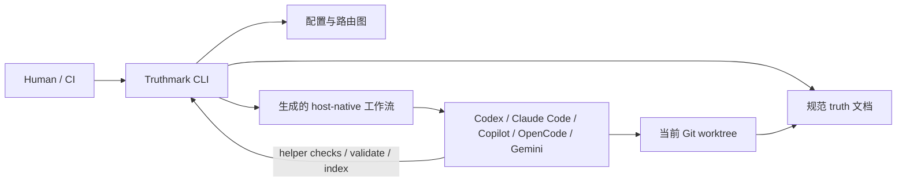

# Truthmark

**你的代理会写代码。Truthmark 维护面向人、可在 Git 中审查的文档。**

[English](README.md) | [Deutsch](README.de.md) | 中文 | [Español](README.es.md) | [Русский](README.ru.md)


AI 编码代理改变仓库的速度，可能比人类对齐文档的速度更快。

Truthmark 修复代码写完后通常会坏掉的那一部分：仓库事实。

它安装一个 Git 原生、按分支生效的工作流层，帮助 AI 编码代理更新正确的文档、尊重所有权边界，并把人类可以审查的普通 diff 留下来。

没有托管服务。

没有数据库。

没有隐藏记忆层。

没有需要运行的额外服务器。

只有随分支移动的仓库事实。

## 问题

AI 编码代理很擅长产出代码。这会制造一种新的失效模式。

实现改变了，但仓库说明开始漂移：

- 行为存在于聊天历史里
- 架构文档落后
- 产品决策在交接后消失
- 审查者看到代码 diff，却看不到相关的事实文档 diff
- 分支悄悄发展出不同版本的“什么是真的”
- 每个代理会话都必须从头重新发现仓库事实

Truthmark 把这种脆弱的仓库事实变成已提交的仓库基础设施。

它不是依赖每个人和每个代理都记住正确的文档习惯，而是把这个习惯安装进仓库。

## 承诺

当代理修改功能代码时，工作不应该只以代码 diff 结束。

Truthmark 的正常路径是：

```text
代理修改功能代码
运行相关测试
Truth Sync 检查已映射的事实文档
需要时更新事实文档
人类审查代码 diff + 事实文档 diff
提交或交接
```

核心价值是：**AI 工作更容易被信任，因为仓库仍然清晰可读。**

## 两个接口，一个事实系统

Truthmark 不只是一个 CLI。

它有两个不同接口，这个区别很重要。

### 1. 面向人的 CLI

CLI 面向维护者、审查者和自动化。

用它来配置仓库、安装或刷新工作流文件、验证事实产物，并生成可选的审查材料。

```bash
truthmark config
truthmark init
truthmark check
```

CLI 会准备并验证仓库环境。

它不是 AI 工作流运行时。

### 2. 面向 AI 的工作流接口

面向 AI 的接口是给编码代理使用的。

Truthmark 会安装宿主原生的技能、提示、命令、受管指令块和受支持的子代理接口，让 AI 代理能在正常编码工具中遵循仓库专属的事实工作流。

示例：

```text
/truthmark-sync
/truthmark-document
/truthmark-structure
/truthmark-realize
/truthmark-preview
/truthmark-check
```

它们看起来像命令，是因为代理宿主通过 slash commands、prompts、skills 或 project commands 暴露工作流。

它们不是 shell 命令。

它们是面向 AI 的工作流入口。

这种拆分正是 Truthmark 的产品边界：

```text
人类拥有仓库契约
Truthmark 把契约安装进 repo
代理在契约内工作
事实更新以 Git diff 出现
人类审查结果
```

## 快速开始

### 要求

- Node.js `>=20`
- npm
- Git 仓库

### 安装 Truthmark

在你想初始化的仓库中运行：

```bash
cd /path/to/your-repo
npm install -g truthmark
```

### 创建仓库事实契约

```bash
truthmark config
```

这会创建：

```text
.truthmark/config.yml
```

继续之前先审查这个文件。它定义仓库中已提交的层级契约。

### 安装工作流接口

```bash
truthmark init
```

这会安装或刷新：

- 路由文件
- 事实文档脚手架
- 受管指令块
- 已配置平台的面向 AI 工作流接口

默认事实文档模板的依据见 [Template Standards](docs/standards/template-standards.md)。该文档说明这些模板如何对齐 ISO/IEC/IEEE 42010、ISO/IEC/IEEE 29148、ISO/IEC/IEEE 12207、ISO/IEC 25010、C4、arc42、OpenAPI、SemVer、Google SRE 和 Diátaxis 等公认软件工程参考。

### 验证设置

```bash
truthmark check
```

然后在提交前审查生成的文件。

具体文件取决于 `.truthmark/config.yml`，但安装形态始终相同：路由、事实文档脚手架、紧凑的受管指令，以及为启用平台生成的宿主原生工作流接口。

## 第一次真实使用

大多数仓库在初始化后需要一次清理。

默认脚手架从一个宽泛的 `repository` 区域开始。真实仓库通常需要更精确的路由。

让你的代理把宽泛路由拆成真实的产品、服务、领域或所有权区域：

```text
/truthmark-structure 将宽泛的 repository 区域拆成 auth、billing 和 notifications
```

如果项目已经有实现好的功能，但事实文档缺失或很弱，请让已安装的 Truth Document 工作流记录一个聚焦范围：

```text
/truthmark-document 记录 src/billing/retry.ts 及相关测试中已实现的 payment retry 行为
```

Truth Document 是既有项目最常用的第一个工作流。它会检查实现、测试、路由和现有文档，然后创建或修复事实文档与路由，不会修改功能代码。

之后就正常使用你的 AI 编码代理。

当代理修改功能代码时，Truth Sync 会作为收尾保护，在交接前检查已映射的事实文档是否需要改变。

## 你会得到什么

| 能力 | 作用 |
| --- | --- |
| Git 原生事实 | 将仓库事实保存在已提交的 Markdown 和配置中。 |
| 按分支生效的文档 | 事实随分支移动，而不是存在于私有会话中。 |
| 面向人的 CLI | 为维护者提供设置、刷新、验证和检查命令。 |
| 面向 AI 的工作流 | 为代理提供宿主原生的同步、文档、结构、预览、实现和审计工作流。 |
| 显式路由 | 将代码区域映射到规范事实文档。 |
| 可审查交接 | 为代码和事实文档都产生普通 Git diff。 |
| 本地优先运行 | 不需要托管服务、守护进程、数据库或 MCP 服务器。 |
| 更安全的写入边界 | 区分 code-first、doc-first、read-only 和 doc-only 工作流。 |
| 验证 | 报告路由、权限边界、frontmatter、链接、生成接口、分支范围、freshness 和覆盖率问题。 |
| 可选 Portal | 在明确启用并请求时，从 Markdown 事实文档生成已提交的静态 HTML 展示站点。 |

## 视觉概览


**功能：** Truthmark 会安装什么，以及工作流接口如何拆分。


**定位：** Truthmark 相对提示词、记忆和规格工作流所处的位置。


**同步流程：** Truth Sync 如何在交接前收束普通代码变更。

## 为什么团队会采用它

Truthmark 面向已经知道 AI 代理能生成代码的团队。

下一个问题是治理。

不是仪式化治理。治理就是一个简单问题：

> 这次 AI 辅助变更之后，仓库仍然准确反映事实吗？

Truthmark 通过已提交文件、显式路由和可审查 diff 帮助团队回答这个问题。

当你需要这些东西时，它会很有用：

- 更少的文档漂移
- 更好的交接
- 按分支生效的产品事实
- 持久的架构和 API 文档
- 文档与代码之间的明确所有权
- 更安全的代理写入边界
- 可审查文档，而不是隐藏记忆层
- 仍然能从已提交 repo 文件运行的 AI 工作流

## Truthmark 适合放在哪里

Truthmark 不替代提示词、记忆、规格、测试或代码审查。

它给这些工作流一个可以落在 Git 里的持久位置。

| 需求 | 更合适的选择 |
| --- | --- |
| 单次代理会话获得更好输出 | 更好的提示词 |
| 个人或会话级连续性 | 记忆工具 |
| plan-first 的功能工作 | 规格工作流 |
| 随代码移动、按分支生效的事实 | Truthmark |
| 验证行为正确性 | 测试和审查 |
| 审查 AI 辅助的文档变更 | Truthmark 加 Git 审查 |

Truthmark 的范围故意很窄：

```text
让仓库事实显式化
把它路由到代码
围绕它安装代理工作流
让结果在 Git 中可审查
```

## Truthmark 如何运行

Truthmark 在本地针对当前 Git worktree 运行。

面向人的 CLI 读取并写入仓库文件，然后退出。

面向 AI 的工作流接口是已提交文件，代理宿主之后可以加载它们。这意味着代理可以从仓库状态遵循已安装工作流，而不依赖后台 Truthmark 进程。

这些层的关系如下：



Agent 不会连接 Truthmark daemon，但工作流需要验证、索引或 helper checks 时，它们可以运行已安装的 Truthmark CLI。

Truthmark 拥有它生成的工作流接口，但关键契约是架构层面的：仓库内配置和路由把 agent 指向规范 truth 文档，host-native 工作流则让每个受支持的 agent 用自己的方式运行同一套 Truthmark 流程。

生成的工作流接口包含 Truthmark 版本标记。升级 Truthmark 后，重新运行：

```bash
truthmark init
```

然后审查生成的 diff。

## 支持的代理平台

默认配置包含所有受支持平台。

从 `.truthmark/config.yml` 中移除你不使用的平台，然后重新运行：

```bash
truthmark init
```

| 平台配置名 | 生成接口 | 调用形式 |
| --- | --- | --- |
| `codex` | Skill packages 和 verifier agents | `/truthmark-*` 或 `$truthmark-*` |
| `claude-code` | Project skills、verifier agents 和受管说明 | `/truthmark-*` |
| `github-copilot` | Agent skills、prompt commands、custom agents 和受管说明 | 支持的 Copilot IDE 中使用 `/truthmark-*`；Copilot CLI 中使用 `@truth-*` custom agents |
| `opencode` | Skill packages 和 verifier agents | `/skill truthmark-*` |
| `gemini-cli` | Agent skills、slash commands、subagents 和受管说明 | `/truthmark:*` |

未知平台名是配置错误。

移除一个平台会停止该平台未来的刷新。它不会删除此前生成的文件。

## 面向 AI 的工作流

这些工作流会安装到受支持的 AI 编码宿主中。

代理或代理宿主会在仓库工作期间使用它们。它们不是顶层 shell 命令。

| 工作流 | 方向 | 何时使用 | 写入边界 |
| --- | --- | --- | --- |
| Truth Structure | topology-first | 默认路由过宽、所有权跨多个区域，或路由文件仍指向占位内容。 | 创建或修复路由和起始事实文档。 |
| Truth Document | implementation-first | 行为已经存在于代码中，但规范事实文档缺失或薄弱。 | 只写事实文档和路由。不能改变功能代码。 |
| Truth Sync | code-first | 功能代码已变更，已映射事实文档可能需要在交接前更新。 | 更新事实文档。Truth Sync 不能重写功能代码。 |
| Truth Preview | read-only | 代理需要在编辑前预览可能的路由。 | 只读。不授权写入。 |
| Truth Realize | doc-first | 产品或架构事实文档在前，代码应更新以匹配它们。 | 只更新代码。代理不能编辑它正在实现的事实文档。 |
| Truth Check | audit-first | 审查者或代理需要审计仓库事实健康状况。 | 审计并报告。 |
| Truthmark Portal | presentation-only | 人类明确要求为仓库事实文档生成可浏览的静态 HTML Portal。 | 只在配置的 Portal 输出目录下写入生成的非规范静态文件。 |

### 重要区别

不要混淆这两个接口：

| 接口 | 使用者 | 示例 | 含义 |
| --- | --- | --- | --- |
| 面向人的 CLI | 人类、脚本、类似 CI 的检查 | `truthmark check` | 从终端验证仓库事实产物。 |
| 面向 AI 的工作流 | 编码代理和代理宿主 | `/truthmark-check` | 请求代理运行已安装的审计工作流。 |

名称有意相关，但接口不同。

## 普通 AI 辅助代码变更

大多数用户不应该每次都手动调用 Truth Sync。

Truth Sync 是为功能代码变更安装的收尾保护。

```text
代理修改功能代码
代理运行或请求相关测试
已安装工作流检测到功能代码变更
Truth Sync 检查已映射事实文档
代理在需要时更新事实文档
人类审查代码 diff + 事实文档 diff
```

直接调用仍然适用于排查问题、强制提前同步，或让交接更明确：

```text
/truthmark-sync 现在同步仓库事实，然后再交接
```

## 已有行为但没有文档

当实现已经存在但仓库事实不完整时，使用 Truth Document。对于代码库已经存在后才接入 Truthmark 的成熟仓库，这是常规路径。

```text
/truthmark-document 记录 src/auth/session.ts、src/auth/middleware.ts 和 tests/auth/session.test.ts 中已实现的 session timeout 行为
```

提供功能名、代码路径、测试路径或目标事实文档区域。在 OpenCode 风格的宿主中，同一个工作流用 `/skill truthmark-document ...` 调用；在 Gemini CLI 中，使用 `/truthmark:doc ...`。

如果大型仓库仍然只有一个宽泛的占位路由，请先运行 Truth Structure，然后每次针对一个有边界的功能或区域调用 Truth Document。

Truth Document 会把实现、测试、路由文件和现有文档作为证据来检查。

它只写事实文档和路由。

它不能改变功能代码。

## Doc-first 变更

当产品或架构决策从文档开始，并且代码应更新以匹配时，使用 Truth Realize。

```text
/truthmark-realize 将 docs/truthmark/product/capabilities/session-timeout.md 实现到代码中
```

Truth Realize 是 doc-first。

事实文档在前。代码跟随。

代理不能编辑它正在实现的事实文档。

## 只读路由预览

当代理需要在变更前理解可能的路由时，使用 Truth Preview。

```text
/truthmark-preview 预览 billing API 变更的可能事实路由
```

Truth Preview 是 read-only。

它是选择器和规划辅助，不是写入授权，也不是 Truth Check 的替代品。

## 仓库事实审计

当你需要面向代理的审计工作流时，使用 Truth Check。

```text
/truthmark-check 在审查前审计路由和事实覆盖
```

当你需要终端验证时，使用面向人的 CLI：

```bash
truthmark check
```

两者都有用。它们不是同一个表面。

## 面向人的 CLI 命令

大多数维护者从三个命令开始。

| 命令 | 用途 |
| --- | --- |
| `truthmark config` | 创建 `.truthmark/config.yml`。除非使用 `--stdout`，否则只写这个文件。 |
| `truthmark init` | 从已审查配置安装或刷新已配置的工作流接口。 |
| `truthmark check` | 验证配置、权限边界、路由、承载决策的文档、frontmatter、内部链接、分支范围、生成接口、freshness 和覆盖率诊断。 |

可选的仓库情报辅助工具会为当前 checkout 生成派生审查材料，例如 RepoIndex、RouteMap、ImpactSet 和紧凑的 WorkflowState/action-context JSON。生成的工作流 skill packages 也可以暴露 helper manifests 和 helper policies，用来调用已安装的 `truthmark validate ... --json` CLI validators；这些 helpers 是加速器，不是打包进仓库的本地脚本，也不是事实来源。独立的 Copilot prompts 和 Gemini commands 在已安装 runner 可用时使用同一 CLI validator contract；不可用时应报告可见的 skipped helper status，并进行 manual validation。

它们不是事实来源。

| 命令 | 用途 |
| --- | --- |
| `truthmark index` | 为当前 checkout 构建 RepoIndex 和 RouteMap JSON。 |
| `truthmark impact --base <ref>` | 将变更文件映射到已路由事实文档、所属路由、附近测试和公开符号。 |
| `truthmark workflow status --workflow <workflow> [--base <ref>] --json` | 返回工作流适用性、写入边界、目标事实文档、检查项、helper commands 和紧凑的受影响测试指引。 |

受支持位置可使用 `--json` 获取结构化输出。

## Truthmark Portal

Truthmark Portal 是一个可选的展示工作流，适合想要基于已提交 truth 文档生成面向人的可读站点的团队。

它有意与核心 truth 工作流分离：

- Markdown truth 文档仍然是规范来源。
- 生成的 Portal HTML 仅用于展示。
- Portal 只能手动运行；它不会作为完成门禁、Truth Sync 步骤、`truthmark check` 步骤或自动 post-change hook 运行。
- 除非用户明确改变范围，Portal 写入必须留在配置的输出目录内。
- 生成页面应使用本地 assets、来源 provenance，并显示 Markdown 规范来源免责声明。

用这个命名空间配置块启用它：

```yaml
truthmark:
  generated:
    portal:
      enabled: true
```

然后重新运行：

```bash
truthmark init
```

启用后，Truthmark 会为已配置平台安装宿主原生 Portal 工作流接口，例如 `/truthmark-portal` 或 `/truthmark:portal`，具体取决于代理宿主。

## 配置

Truthmark 是 config-first。

主配置文件是：

```text
.truthmark/config.yml
```

新仓库应运行：

```bash
truthmark config
```

然后先审查生成的配置，再运行：

```bash
truthmark init
```

重要配置区域包括：

| 配置区域 | 用途 |
| --- | --- |
| `version` | 配置契约版本。 |
| `platforms` | 应接收平台专属生成接口的代理宿主。 |
| `truthmark.workspace` | Truthmark 拥有的工作区，用于路由、事实文档、模板和生成的展示输出。 |
| 固定路由 | 路由固定在 `truthmark.workspace` 内的 `routes/areas.md` 和 `routes/areas/`；默认 area 是 `repository`，委托深度为 `1`。 |
| 固定事实分区 | 产品事实位于 `truthmark.workspace` 内的 `product/`，工程事实位于 `engineering/`。 |
| 固定模板 | 事实文档模板固定在 `truthmark.workspace` 内的 `templates/`。 |
| `truthmark.generated.portal` | 可选手动展示工作流启用设置：`enabled`。 |
| `instruction_targets` | 接收共享受管指令块的文件，例如 `AGENTS.md`。 |
| `frontmatter.required` | 缺失时产生错误诊断的元数据字段。 |
| `frontmatter.recommended` | 缺失时产生审查诊断的元数据字段。 |
| `ignore` | 从相关检查和路由逻辑中排除的 glob 模式。 |

## 仓库事实路由

Truthmark 将代码区域映射到事实文档。

主要路由文件是：

```text
docs/truthmark/routes/areas.md
docs/truthmark/routes/areas/**/*.md
```

路由告诉代理：

- 哪个代码区域属于某个区域
- 哪些事实文档拥有该区域
- 何时应该更新事实
- 涉及哪类事实文档

默认脚手架从宽泛路由开始。现有仓库通常应该把默认路由拆成真实所有权区域。

示例：

```text
/truthmark-structure 将宽泛的 repository 区域拆成 frontend、backend、billing 和 deployment
```

好的路由会给 Truth Sync 精确目标。

坏的路由会让代理猜。

## Truthmark 会安装什么

Truthmark 安装一个紧凑、仓库原生的事实层。

它分为四层安装：

- 用于所有权边界的配置和路由
- 规范事实文档和起始模板
- 用于仓库级代理指令的紧凑受管指令块
- 为配置中启用的平台生成宿主原生的工作流包、命令、prompts 和 verifier agents

Truthmark 会保留受管指令块之外的手写内容。

生成的工作流接口由 Truthmark 管理，可以通过重新运行来刷新：

```bash
truthmark init
```

## 子代理和有边界证据检查

在宿主支持时，Truthmark 可以安装项目级验证代理和一个带租约的 `truth-doc-writer`。

这些有助于让大型事实任务保持有边界：

- route auditors 检查路由所有权
- claim verifiers 检查文档声明是否有证据支持
- doc reviewers 检查事实文档质量
- leased doc writers 处理有边界的事实文档写入分片

父工作流仍然负责最终解释、写入边界、diff 验证和验收。

这一点很重要：子代理帮助完成有边界的证据工作。它们不替代主工作流契约。

## 审查循环

Truthmark 为普通 Git 审查而设计。

一次好的 AI 辅助交接应该展示：

```text
代码 diff
测试证据
必要时的事实文档 diff
必要时的路由变更
代理报告
```

审查者应该能够回答：

- 什么代码变了？
- 哪些事实文档拥有这些代码？
- 这些文档需要更新吗？
- 如果不需要，为什么？
- 代理是否留在工作流写入边界内？
- 是否包含测试或验证证据？

## 示例

### 初始化仓库

```bash
npm install -g truthmark
truthmark config
truthmark init
truthmark check
```

### 移除未使用的代理平台

编辑：

```text
.truthmark/config.yml
```

然后重新运行：

```bash
truthmark init
truthmark check
```

### 拆分宽泛路由

```text
/truthmark-structure 将宽泛的 repository 区域拆成 auth、billing、notifications 和 deployment
```

### 记录已实现行为

```text
/truthmark-document 在 docs/truthmark/engineering/behaviors/authentication 下记录已实现的密码重置流程
```

### 代码变更后同步

```text
/truthmark-sync 现在同步仓库事实，然后再交接
```

### 实现 doc-first 决策

```text
/truthmark-realize 将 docs/truthmark/product/capabilities/invoice-retry-policy.md 实现到代码中
```

### 从终端审计事实健康

```bash
truthmark check
```

### 生成分支影响摘要

```bash
truthmark impact --base main
```

### 查看工作流状态

```bash
truthmark workflow status --workflow truthmark-sync --base main --json
```

### 启用可选 Portal 工作流

```yaml
truthmark:
  generated:
    portal:
      enabled: true
```

```bash
truthmark init
```

当你想生成或刷新静态展示站点时，再明确要求代理宿主运行已安装的 Portal 工作流。

## 项目状态

Truthmark V1 目前提供：

- `truthmark config`
- `truthmark init`
- `truthmark check`
- `truthmark index`
- `truthmark impact`
- `truthmark workflow status`
- 分支范围元数据
- 受管指令块
- 生成的 Truth Structure 工作流接口
- 生成的 Truth Document 工作流接口
- 生成的 Truth Sync 工作流接口
- 生成的 Truth Preview 工作流接口
- 生成的 Truth Realize 工作流接口
- 生成的 Truth Check 工作流接口
- 可选生成的 Truthmark Portal 工作流接口
- 路由、权限边界、决策结构、frontmatter、链接、freshness、生成接口和覆盖率诊断
- 派生的 RepoIndex、RouteMap、ImpactSet 和 WorkflowState 产物
- 面向 Codex、Claude Code、GitHub Copilot、OpenCode 和 Gemini CLI 的宿主专属接口

## 开发

安装依赖：

```bash
npm install
```

运行本地开发 CLI：

```bash
npm run dev -- init
npm run dev -- check
```

运行完整项目检查：

```bash
npm run check
```

常用脚本：

| 脚本 | 用途 |
| --- | --- |
| `npm run dev` | 用 `tsx` 运行 TypeScript CLI 入口。 |
| `npm run build` | 构建包。 |
| `npm run lint` | 运行 ESLint。 |
| `npm run typecheck` | 运行 TypeScript 检查。 |
| `npm run test` | 运行测试。 |
| `npm run check` | 运行 lint、typecheck、测试和 build。 |
| `npm run release:check` | 运行面向发布的验证。 |

修改 Truthmark 本身时，请参阅 [CONTRIBUTING.md](CONTRIBUTING.md)。

## 文档

README 是评估和设置的快速路径。

详细的当前行为位于 `docs/` 下：

- [文档索引](docs/README.md)
- [架构概览](docs/truthmark/engineering/architecture/overview.md)
- [API 和 CLI 契约](docs/truthmark/engineering/contracts/config-route-and-check-contracts.md)
- [Init 和脚手架行为](docs/truthmark/engineering/behaviors/init-and-scaffold.md)
- [Check 诊断](docs/truthmark/engineering/behaviors/check-diagnostics.md)
- [已安装工作流](docs/truthmark/engineering/workflows/installed-workflow-runtime.md)
- [仓库事实维护指南](docs/standards/maintaining-repository-truth.md)

## 设计边界

Truthmark 有意保持小而清晰。

它不是：

- 托管服务
- MCP 服务器
- 向量数据库
- 规范文档网站生成器或托管文档平台
- CI 或 PR 强制执行产品
- 测试、代码审查或技术领导力的替代品
- 自主代码重写引擎
- 模型训练或微调框架
- 隐藏记忆层

这些边界是产品的一部分。

Truthmark 让工作流保持本地、已提交、按分支生效并可审查。

## 安全和审查纪律

Truthmark 帮助仓库保持诚实。它不能证明代码正确。

团队仍然应该：

- 运行相关测试
- 审查功能代码变更
- 审查事实文档变更
- 不把 secrets 放进文档
- 把仓库专属说明保留在受管块之外
- 升级后审查生成工作流接口的 diff
- 保留人类对产品和架构决策的所有权

Truthmark 让面向代理的仓库事实可见。它不替代人类判断。

## 路线图方向

当前未来方向强调：

- 更强的 `truthmark check` 证据报告
- 更清晰的采用示例
- 展示真实 Truth Sync 循环的示例仓库
- 面向已经使用代理说明文件团队的迁移指南
- 生成宿主接口的符合性测试
- 基于路由的 stale truth 提示
- 面向 doc-first 工作的有边界实现清单

重心保持不变：

```text
仓库事实
代理原生工作流
Git 审查
按分支生效的文档
```

## 许可证

MIT。见 [LICENSE](LICENSE)。
