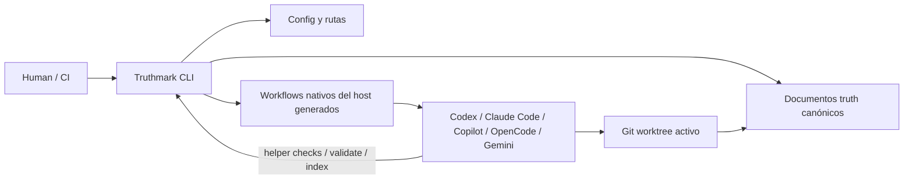

# Truthmark

**Tus agentes escriben código. Truthmark mantiene documentación para personas, versionada y revisable en Git.**

[🇺🇸 English](../README.md) | [🇨🇳 简体中文](README.zh.md) | [🇯🇵 日本語](README.ja.md) | [🇰🇷 한국어](README.ko.md) | [🇩🇪 Deutsch](README.de.md) | [🇫🇷 Français](README.fr.md) | [🇪🇸 Español](README.es.md) | [🇧🇷 Português](README.pt-BR.md) | [🇷🇺 Русский](README.ru.md) | [🇸🇦 العربية](README.ar.md) | [🇮🇹 Italiano](README.it.md) | [🇵🇱 Polski](README.pl.md) | [🇹🇷 Türkçe](README.tr.md) | [🇻🇳 Tiếng Việt](README.vi.md) | [🇮🇩 Bahasa Indonesia](README.id.md) | [🇬🇷 Ελληνικά](README.el.md)


Los agentes de desarrollo con IA pueden cambiar un repositorio más rápido de lo que las personas pueden mantener alineada su documentación.

Truthmark corrige la parte que normalmente se rompe después de escribir el código: la verdad del repositorio.

Instala una capa de flujo de trabajo nativa de Git y acotada a la rama que ayuda a los agentes de desarrollo con IA a actualizar los documentos correctos, respetar los límites de propiedad y dejar a las personas diffs normales que puedan revisar.

Sin servicio alojado.

Sin base de datos.

Sin capa oculta de memoria.

Sin servidor adicional que operar.

Solo verdad del repositorio que se mueve con la rama.

## El problema

Los agentes de desarrollo con IA son buenos produciendo código. Eso crea un nuevo modo de fallo.

La implementación cambia, pero la historia del repositorio se desvía:

- el comportamiento vive en el historial de chat
- los documentos de arquitectura quedan atrás
- las decisiones de producto desaparecen después de la entrega
- quienes revisan ven diffs de código sin los diffs de verdad relacionados
- las ramas desarrollan silenciosamente distintas versiones de “lo que es verdad”
- cada sesión de agente tiene que redescubrir la verdad del repositorio desde cero

Truthmark convierte esa verdad frágil del repositorio en infraestructura versionada en Git.

En lugar de depender de que cada persona y cada agente recuerden el hábito correcto de documentación, Truthmark instala ese hábito en el repositorio.

## La promesa

Cuando un agente cambia código funcional, el trabajo no debería terminar con solo un diff de código.

El camino normal de Truthmark es:

```text
el agente cambia código funcional
se ejecutan pruebas relevantes
Truth Sync revisa los documentos de verdad asignados
los documentos de verdad se actualizan cuando hace falta
una persona revisa el diff de código + el diff de verdad
confirmar o entregar
```

Ese es el valor central: **el trabajo con IA es más fácil de confiar porque el repositorio sigue siendo legible.**

## Dos interfaces, un sistema de verdad

Truthmark no es solo una CLI.

Tiene dos interfaces distintas, y la distinción importa.

### 1. CLI para personas

La CLI es para mantenedores, revisores y automatización.

Úsala para configurar un repositorio, instalar o refrescar archivos de flujo de trabajo, validar artefactos de verdad y generar material opcional para revisión.

```bash
truthmark config
truthmark init
truthmark check
```

La CLI prepara y valida el entorno del repositorio.

No es el entorno de ejecución del flujo de trabajo con IA.

### 2. Interfaces de flujo de trabajo para IA

Las interfaces para IA son para agentes de desarrollo.

Truthmark instala skills, prompts, comandos, bloques de instrucciones administrados e interfaces de subagentes nativas del host para que los agentes de IA puedan seguir flujos de verdad específicos del repositorio dentro de sus herramientas habituales de desarrollo.

Ejemplos:

```text
/truthmark-sync
/truthmark-document
/truthmark-structure
/truthmark-realize
/truthmark-check
```

Parecen comandos porque los hosts de agentes exponen flujos mediante slash commands, prompts, skills o comandos de proyecto.

No son comandos de shell.

Son puntos de entrada de flujo para IA.

La división es el producto:

```text
las personas poseen el contrato del repositorio
Truthmark instala el contrato en el repositorio
los agentes operan dentro de ese contrato
las actualizaciones de verdad aparecen como diffs de Git
las personas revisan el resultado
```

## Inicio rápido

### Requisitos

- Node.js `>=20`
- npm
- un repositorio Git

### Instalar Truthmark

Ejecuta esto dentro del repositorio que quieres inicializar:

```bash
cd /path/to/your-repo
npm install -g truthmark
```

### Crear el contrato de verdad del repositorio

```bash
truthmark config
```

Esto crea:

```text
.truthmark/config.yml
```

Revisa este archivo antes de continuar. Define el contrato de jerarquía confirmado en el repositorio.

### Instalar las interfaces de flujo de trabajo

```bash
truthmark init
```

Esto instala o refresca:

- archivos de rutas
- scaffolding de documentos de verdad
- bloques de instrucciones administrados
- interfaces de flujo de trabajo para IA en las plataformas configuradas

Las plantillas predeterminadas de documentos de verdad se justifican en [Template Standards](standards/template-standards.md), que las mapea a referencias reconocidas de ingeniería de software como ISO/IEC/IEEE 42010, ISO/IEC/IEEE 29148, ISO/IEC/IEEE 12207, ISO/IEC 25010, C4, arc42, OpenAPI, SemVer, Google SRE y Diátaxis.

### Validar la configuración

```bash
truthmark check
```

Después revisa los archivos generados antes de confirmar.

Los archivos exactos dependen de `.truthmark/config.yml`, pero la instalación siempre tiene la misma forma: rutas, scaffolding de documentos de verdad, instrucciones administradas compactas e interfaces de flujo de trabajo nativas del host para las plataformas habilitadas.

## Primer uso real

La mayoría de los repositorios necesita una pasada de limpieza después de la inicialización.

El scaffold predeterminado empieza con un área amplia provisional de arranque `repository`. Antes de sincronizar código real de forma normal, divide esa ruta de arranque en rutas precisas.

Pide a tu agente que divida la ruta amplia en áreas reales de producto, servicio, dominio o propiedad:

```text
/truthmark-structure divide el área amplia repository en auth, billing y notifications
```

Si el proyecto ya tiene funcionalidades implementadas pero faltan documentos de verdad o son débiles, pide al flujo Truth Document instalado que documente un alcance enfocado:

```text
/truthmark-document documenta el comportamiento implementado de payment retry en src/billing/retry.ts y sus tests relacionados
```

Truth Document es el primer flujo más común para proyectos existentes. Inspecciona implementación, pruebas, rutas y documentación existente, y luego crea o repara documentos de verdad y rutas sin cambiar código funcional.

Después usa tu agente de programación con IA normalmente.

Cuando el agente cambia código funcional, Truth Sync actúa como guarda de cierre que revisa si los documentos de verdad asignados deben cambiar antes de la entrega.

## Qué obtienes

| Capacidad | Qué hace |
| --- | --- |
| Verdad nativa de Git | Mantiene la verdad del repositorio en Markdown y config versionados. |
| Documentación acotada a la rama | La verdad se mueve con la rama en lugar de vivir en una sesión privada. |
| CLI para personas | Da a mantenedores comandos de configuración, refresco, validación e inspección. |
| Flujos orientados a IA | Da a los agentes flujos nativos del host para sincronización, documentación, estructura, preview, realización y auditoría. |
| Rutas explícitas | Mapea áreas de código a documentos de verdad canónicos. |
| Entregas revisables | Produce diffs normales de Git para código y documentos de verdad. |
| Operación local-first | No requiere servicio alojado, demonio, base de datos ni servidor MCP. |
| Límites de escritura más seguros | Separa flujos code-first, doc-first, read-only y doc-only. |
| Validación | Reporta problemas de rutas, autoridad, frontmatter, enlaces, interfaces generadas, alcance de rama, vigencia y cobertura. |
| Portal opcional | Genera un sitio HTML estático versionado desde documentos de verdad Markdown cuando se habilita y solicita explícitamente. |

## Resumen visual


**Características:** qué instala Truthmark y cómo se divide la interfaz de flujo de trabajo.


**Posición:** dónde encaja Truthmark frente a prompts, memoria y flujos de especificación.


**Flujo de sync:** cómo Truth Sync cierra cambios normales de código antes de la entrega.

## Por qué los equipos lo adoptan

Truthmark es para equipos que ya saben que los agentes de IA pueden generar código.

El siguiente problema es la gobernanza.

No gobernanza como ceremonia. Gobernanza como una pregunta simple:

> Después de este cambio asistido por IA, ¿el repositorio todavía dice la verdad?

Truthmark ayuda a los equipos a responder con archivos versionados, rutas explícitas y diffs revisables.

Es útil cuando necesitas:

- menos deriva de documentación
- mejores entregas
- verdad de producto específica de cada rama
- documentación duradera de arquitectura y API
- propiedad explícita entre documentos y código
- límites de escritura más seguros para agentes
- documentación revisable en lugar de memoria oculta
- flujos de IA que sigan funcionando desde archivos versionados del repositorio

## Dónde encaja Truthmark

Truthmark no reemplaza prompts, memoria, especificaciones, pruebas ni revisión de código.

Les da a esos flujos un lugar duradero donde aterrizar en Git.

| Necesidad | Mejor opción |
| --- | --- |
| Mejor salida de una sesión de agente | Mejor prompt |
| Continuidad personal o por sesión | Herramienta de memoria |
| Trabajo de funciones plan-first | Flujo de especificación |
| Verdad acotada a la rama que viaja con el código | Truthmark |
| Validar la corrección del comportamiento | Pruebas y revisión |
| Revisar cambios de documentación asistidos por IA | Truthmark más revisión Git |

El carril de Truthmark es estrecho por diseño:

```text
hacer explícita la verdad del repositorio
mapearla al código
instalar flujos de agentes alrededor de ella
mantener el resultado revisable en Git
```

## Cómo se ejecuta Truthmark

Truthmark se ejecuta localmente contra el worktree Git activo.

La CLI para personas lee y escribe archivos del repositorio, y luego termina.

Las interfaces de flujo de trabajo para IA son archivos versionados que los hosts de agentes pueden cargar después. Eso permite que los agentes sigan el flujo instalado desde el estado del repositorio, sin depender de un proceso de Truthmark en segundo plano.

Las capas encajan así:



Los agentes no hablan con un daemon de Truthmark, pero pueden ejecutar la CLI instalada de Truthmark cuando un workflow pide validación, indexación o comprobaciones auxiliares.

Truthmark es dueño de las interfaces de flujo de trabajo que genera, pero el contrato importante es arquitectónico: la config y las rutas del repositorio apuntan a los agentes hacia los documentos de verdad canónicos, mientras que los workflows nativos del host dan a cada agente compatible una forma de ejecutar los mismos procedimientos de Truthmark.

Las interfaces de flujo de trabajo generadas incluyen marcadores de versión de Truthmark. Después de actualizar Truthmark, vuelve a ejecutar:

```bash
truthmark init
```

Luego revisa los diffs generados.

## Plataformas de agentes compatibles

La configuración predeterminada incluye todas las plataformas compatibles.

Elimina de `.truthmark/config.yml` las plataformas que no uses, y luego vuelve a ejecutar:

```bash
truthmark init
```

| Nombre de plataforma en config | Interfaz generada | Forma de invocación |
| --- | --- | --- |
| `codex` | `.agents/skills/truthmark-*/`, `.codex/agents/` | `/truthmark-*` o `$truthmark-*` |
| `claude-code` | `.claude/skills/truthmark-*/`, `.claude/agents/`, `CLAUDE.md` | `/truthmark-*` |
| `github-copilot` | `.github/skills/truthmark-*/`, `.github/prompts/`, `.github/agents/`, `.github/copilot-instructions.md` | `/truthmark-*` en IDEs de Copilot compatibles; agentes personalizados `@truth-*` en Copilot CLI |
| `opencode` | `.opencode/skills/truthmark-*/`, `.opencode/agents/` | `/skill truthmark-*` |
| `gemini-cli` | `.gemini/skills/truthmark-*/`, `.gemini/commands/truthmark/`, `.gemini/agents/`, `GEMINI.md` | `/truthmark:*` |

Los nombres de plataforma desconocidos son errores de configuración.

Eliminar una plataforma detiene futuros refrescos para esa plataforma. No elimina archivos generados previamente.

## Flujos orientados a IA

Estos flujos se instalan en hosts de programación con IA compatibles.

Los usan agentes o hosts de agentes durante el trabajo en el repositorio. No son comandos de shell de nivel superior.

| Flujo | Dirección | Úsalo cuando | Límite de escritura |
| --- | --- | --- | --- |
| Truth Structure | topology-first | La ruta predeterminada es demasiado amplia, la propiedad abarca varias áreas o los archivos de rutas siguen apuntando a placeholders. | Crea o repara rutas y documentos de verdad iniciales. |
| Truth Document | implementation-first | El comportamiento ya existe en código, pero faltan o son débiles los documentos de verdad canónicos. | Escribe solo documentos de verdad y rutas. No debe cambiar código funcional. |
| Truth Sync | code-first | Cambió código funcional y puede que los documentos de verdad asignados deban actualizarse antes de la entrega. | Actualiza documentos de verdad. Truth Sync no debe reescribir código funcional. |
| Truth Realize | doc-first | Documentos de verdad de producto o arquitectura lideran y el código debe actualizarse para coincidir. | Actualiza solo código. El agente no debe editar los documentos de verdad que está realizando. |
| Truth Check | audit-first | Un revisor o agente necesita auditar la salud de la verdad del repositorio. | Audita e informa. |
| Truthmark Portal | presentation-only | Una persona pide explícitamente un Portal HTML estático navegable sobre los documentos de verdad del repositorio. | Escribe solo archivos estáticos generados no canónicos bajo el directorio de salida Portal configurado. |

### Distinción importante

No confundas estas dos interfaces:

| Interfaz | Usada por | Ejemplo | Significado |
| --- | --- | --- | --- |
| CLI para personas | personas, scripts, checks tipo CI | `truthmark check` | Validar artefactos de verdad del repositorio desde la terminal. |
| Flujo orientado a IA | agentes de desarrollo y hosts de agentes | `/truthmark-check` | Pedir a un agente que ejecute el flujo instalado de auditoría. |

Los nombres están relacionados a propósito, pero las interfaces son distintas.

## Cambio normal de código asistido por IA

La mayoría de los usuarios no debería invocar Truth Sync manualmente cada vez.

Truth Sync es la guarda de cierre instalada para cambios de código funcional.

```text
el agente cambia código funcional
el agente ejecuta o pide pruebas relevantes
el flujo instalado detecta que cambió código funcional
Truth Sync revisa los documentos de verdad asignados
el agente actualiza documentos de verdad si hace falta
una persona revisa el diff de código + el diff de verdad
```

La invocación directa sigue siendo útil para depurar, forzar una sincronización temprana o hacer explícita la entrega:

```text
/truthmark-sync sincroniza ahora la verdad del repositorio antes de la entrega
```

## Comportamiento existente sin docs

Usa Truth Document cuando la implementación ya existe pero la verdad del repositorio está incompleta. Esta es la ruta normal para repositorios establecidos que adoptan Truthmark después de que la base de código ya existe.

```text
/truthmark-document documenta el comportamiento implementado de timeout de sesión en src/auth/session.ts, src/auth/middleware.ts y tests/auth/session.test.ts
```

Indica el nombre de la funcionalidad, rutas de código, rutas de pruebas o el área deseada de documentos de verdad. En hosts estilo OpenCode, llama al mismo flujo como `/skill truthmark-document ...`; en Gemini CLI, usa `/truthmark:doc ...`.

Para un repositorio grande que aún tiene una ruta placeholder amplia, ejecuta primero Truth Structure y luego invoca Truth Document para una funcionalidad o un área acotada cada vez.

Truth Document inspecciona implementación, pruebas, archivos de rutas y documentación existente como evidencia.

Escribe solo documentos de verdad y rutas.

No debe cambiar código funcional.

## Cambios doc-first

Usa Truth Realize cuando una decisión de producto o arquitectura empieza en documentos y el código debe actualizarse para coincidir.

```text
/truthmark-realize realiza docs/truthmark/product/capabilities/session-timeout.md como código
```

Truth Realize es doc-first.

Los documentos de verdad lideran. El código sigue.

El agente no debe editar los documentos de verdad que está realizando.

## Preview de rutas de solo lectura

Usa Truth Preview antes de un cambio cuando el agente necesita entender la ruta probable.

```text
/truthmark-preview previsualiza la ruta de verdad probable para cambios en la API de billing (GitHub Copilot)
/truthmark:preview previsualiza la ruta de verdad probable para cambios en la API de billing (Gemini CLI)
```

Truth Preview es read-only.

Es una ayuda de selección y planificación, no una autorización de escritura ni un reemplazo de Truth Check.

## Auditoría de verdad del repositorio

Usa Truth Check cuando quieres un flujo de auditoría orientado a agentes.

```text
/truthmark-check audita rutas y cobertura de verdad antes de la revisión
```

Usa la CLI para personas cuando quieres validación en terminal:

```bash
truthmark check
```

Ambas son útiles. No son la misma interfaz.

## Comandos CLI para personas

La mayoría de los mantenedores empieza con tres comandos.

| Comando | Propósito |
| --- | --- |
| `truthmark config` | Crea `.truthmark/config.yml`. Solo escribe ese archivo, salvo que se use `--stdout`. |
| `truthmark init` | Instala o refresca interfaces de flujo de trabajo configuradas desde la config revisada. |
| `truthmark check` | Valida configuración, autoridad, rutas, documentos con decisiones, frontmatter, enlaces internos, alcance de rama, interfaces generadas, vigencia y diagnósticos de cobertura. |

Los ayudantes opcionales de inteligencia del repositorio generan material derivado para revisión sobre el checkout activo, como RepoIndex, RouteMap, ImpactSet y JSON compacto de WorkflowState/action-context. Los paquetes de skills de flujo generados también pueden exponer manifiestos y políticas de helpers que llaman a validadores CLI `truthmark validate ... --json` instalados; esos helpers son aceleradores, no scripts locales empaquetados en el repo ni fuentes de verdad. Los prompts independientes de Copilot y los comandos de Gemini usan el mismo contrato de validador CLI cuando el runner instalado está disponible; de lo contrario informan un estado visible de helper omitido y hacen validación manual.

No son fuentes de verdad.

| Comando | Propósito |
| --- | --- |
| `truthmark index` | Construye JSON de RepoIndex y RouteMap para el checkout activo. |
| `truthmark impact --base <ref>` | Mapea archivos cambiados a documentos de verdad enrutados, rutas propietarias, pruebas cercanas y símbolos públicos. |
| `truthmark workflow status --workflow <workflow> [--base <ref>] --json` | Devuelve aplicabilidad del flujo, límites de escritura, documentos de verdad objetivo, checks, comandos helper y guía compacta de pruebas afectadas. |

La salida estructurada está disponible con `--json` donde se admite.

## Truthmark Portal

Truthmark Portal es un flujo opcional de presentación para equipos que quieren un sitio legible por personas sobre sus documentos de verdad versionados.

Está separado deliberadamente del flujo central de verdad:

- Los documentos de verdad Markdown siguen siendo canónicos.
- El HTML Portal generado es solo presentación.
- Portal se ejecuta solo manualmente; no se ejecuta como puerta de finalización, paso de Truth Sync, paso de `truthmark check` ni hook automático post-change.
- Las escrituras de Portal permanecen dentro del directorio de salida configurado salvo que la persona cambie el alcance explícitamente.
- Las páginas generadas deben usar assets locales, procedencia de fuentes y un aviso visible de que Markdown es canónico.

Habilítalo con el bloque de configuración con espacio de nombres:

```yaml
truthmark:
  generated:
    portal:
      enabled: true
```

Luego vuelve a ejecutar:

```bash
truthmark init
```

Cuando está habilitado, Truthmark instala interfaces Portal nativas del host para las plataformas configuradas, como `/truthmark-portal` o `/truthmark:portal` según el host de agente.

## Configuración

Truthmark es config-first.

El archivo principal de configuración es:

```text
.truthmark/config.yml
```

Los repositorios nuevos deberían ejecutar:

```bash
truthmark config
```

Luego revisar la config generada antes de ejecutar:

```bash
truthmark init
```

Las áreas importantes de configuración incluyen:

| Área de config | Propósito |
| --- | --- |
| `version` | Versión del contrato de configuración. |
| `platforms` | Hosts de agentes que deben recibir interfaces generadas específicas de plataforma. |
| `truthmark.workspace` | Workspace propiedad de Truthmark para rutas, documentos de verdad, plantillas y salida de presentación generada. |
| Rutas fijas | Las rutas viven en `routes/areas.md` y `routes/areas/` dentro de `truthmark.workspace`; el área predeterminada es `repository` y la profundidad de delegación es `1`. |
| Carriles de verdad fijos | La verdad de producto vive en `product/` y la verdad de ingeniería en `engineering/` dentro de `truthmark.workspace`. |
| Plantillas fijas | Las plantillas de documentos de verdad viven en `templates/` dentro de `truthmark.workspace`. |
| `truthmark.generated.portal` | Activación opcional del flujo manual de presentación: `enabled`. |
| `instruction_targets` | Archivos que reciben bloques de instrucciones administrados compartidos, como `AGENTS.md`. |
| `frontmatter.required` | Campos de metadatos que producen diagnósticos de error cuando faltan. |
| `frontmatter.recommended` | Campos de metadatos que producen diagnósticos de revisión cuando faltan. |
| `ignore` | Patrones glob excluidos de checks relevantes y lógica de rutas. |

## Rutas de verdad del repositorio

Truthmark mapea áreas de código a documentos de verdad.

Los archivos principales de rutas son:

```text
docs/truthmark/routes/areas.md
docs/truthmark/routes/areas/**/*.md
```

Una ruta le dice al agente:

- qué parte del código pertenece a un área
- qué documentos de verdad poseen esa área
- cuándo debe actualizarse la verdad
- qué tipo de documento de verdad participa

El scaffold predeterminado empieza con una ruta amplia provisional de arranque para que un repositorio nuevo sea enrutable. Cuando se toca código real, divide esa ruta de arranque en áreas reales de producto, servicio, dominio o propiedad antes de Truth Sync normal; no conviertas el handoff de arranque en un documento comodín de comportamiento.

Ejemplo:

```text
/truthmark-structure divide el área amplia repository en frontend, backend, billing y deployment
```

Un buen enrutamiento da a Truth Sync destinos precisos.

Un mal enrutamiento hace que los agentes adivinen.

## Qué instala Truthmark

Truthmark instala una capa compacta de verdad nativa del repositorio.

Lo instala en cuatro capas:

- configuración y rutas para límites de propiedad
- documentos de verdad canónicos y plantillas iniciales
- bloques de instrucciones administrados y compactos para instrucciones de agente en todo el repositorio
- paquetes de flujo de trabajo, comandos, prompts y agentes verificadores nativos del host para las plataformas habilitadas en la configuración

Truthmark conserva el contenido manual fuera de los bloques de instrucciones administrados.

Las interfaces de flujo de trabajo generadas son administradas por Truthmark y pueden refrescarse volviendo a ejecutar:

```bash
truthmark init
```

## Subagentes y checks acotados de evidencia

Donde el host lo admite, Truthmark puede instalar agentes verificadores con alcance de proyecto y un `truth-doc-writer` con lease.

Ayudan a mantener acotadas las tareas grandes de verdad:

- route auditors inspeccionan la propiedad de rutas
- claim verifiers revisan si las afirmaciones de docs están respaldadas por evidencia
- doc reviewers inspeccionan la calidad de los documentos de verdad
- leased doc writers manejan fragmentos acotados de escritura de documentos de verdad

El flujo padre sigue siendo dueño de la interpretación final, los límites de escritura, la validación del diff y la aceptación.

Esto es importante: los subagentes ayudan con trabajo acotado de evidencia. No reemplazan el contrato principal del flujo.

## Bucle de revisión

Truthmark está diseñado para revisión normal en Git.

Una buena entrega asistida por IA debería mostrar:

```text
diff de código
evidencia de pruebas
diff de documentos de verdad, si hace falta
cambios de rutas, si hacen falta
informe del agente
```

Quien revisa debería poder responder:

- ¿Qué código cambió?
- ¿Qué documentos de verdad poseen ese código?
- ¿Esos documentos necesitaron actualizaciones?
- Si no, ¿por qué no?
- ¿El agente permaneció dentro del límite de escritura del flujo?
- ¿Se incluye evidencia de pruebas o verificación?

## Ejemplos

### Inicializar un repositorio

```bash
npm install -g truthmark
truthmark config
truthmark init
truthmark check
```

### Quitar plataformas de agentes no usadas

Edita:

```text
.truthmark/config.yml
```

Luego vuelve a ejecutar:

```bash
truthmark init
truthmark check
```

### Dividir una ruta amplia

```text
/truthmark-structure divide el área amplia repository en auth, billing, notifications y deployment
```

### Documentar comportamiento implementado

```text
/truthmark-document documenta el flujo implementado de restablecimiento de contraseña bajo docs/truthmark/engineering/behaviors/authentication
```

### Sincronizar después de cambios de código

```text
/truthmark-sync sincroniza ahora la verdad del repositorio antes de la entrega
```

### Realizar una decisión doc-first

```text
/truthmark-realize realiza docs/truthmark/product/capabilities/invoice-retry-policy.md como código
```

### Auditar la salud de verdad desde la terminal

```bash
truthmark check
```

### Generar resumen de impacto de rama

```bash
truthmark impact --base main
```

### Inspeccionar el estado del workflow

```bash
truthmark workflow status --workflow truthmark-sync --base main --json
```

### Habilitar el flujo Portal opcional

```yaml
truthmark:
  generated:
    portal:
      enabled: true
```

```bash
truthmark init
```

Luego pide explícitamente al host de agente que ejecute el flujo Portal instalado cuando quieras generar o refrescar el sitio estático de presentación.

## Estado del proyecto

The current release provides:

- `truthmark config`
- `truthmark init`
- `truthmark check`
- `truthmark index`
- `truthmark impact`
- `truthmark workflow status`
- metadatos de alcance de rama
- bloques de instrucciones administrados
- interfaces generadas de flujo Truth Structure
- interfaces generadas de flujo Truth Document
- interfaces generadas de flujo Truth Sync
- interfaces generadas de flujo Truth Preview
- interfaces generadas de flujo Truth Realize
- interfaces generadas de flujo Truth Check
- interfaces generadas opcionales de flujo Truthmark Portal
- diagnósticos de rutas, autoridad, estructura de decisiones, frontmatter, enlaces, vigencia, interfaces generadas y cobertura
- artefactos derivados RepoIndex, RouteMap, ImpactSet y WorkflowState
- interfaces específicas de host para Codex, Claude Code, GitHub Copilot, OpenCode y Gemini CLI

## Desarrollo

Instalar dependencias:

```bash
npm install
```

Ejecutar la CLI local de desarrollo:

```bash
npm run dev -- init
npm run dev -- check
```

Ejecutar el check completo del proyecto:

```bash
npm run check
```

Scripts útiles:

| Script | Propósito |
| --- | --- |
| `npm run dev` | Ejecuta el punto de entrada CLI en TypeScript con `tsx`. |
| `npm run build` | Construye el paquete. |
| `npm run lint` | Ejecuta ESLint. |
| `npm run typecheck` | Ejecuta checks de TypeScript. |
| `npm run test` | Ejecuta las pruebas. |
| `npm run check` | Ejecuta lint, typecheck, pruebas y build. |
| `npm run release:check` | Ejecuta validación orientada a release. |

Cuando cambies Truthmark en sí, consulta [CONTRIBUTING.md](../CONTRIBUTING.md).

## Documentación

El README es el camino rápido para evaluación y configuración.

El comportamiento actual detallado vive bajo `docs/`:

- [Índice de documentación](README.md)
- [Resumen de arquitectura](truthmark/engineering/architecture/overview.md)
- [Contratos de API y CLI](truthmark/engineering/contracts/config-route-and-check-contracts.md)
- [Comportamiento de init y scaffold](truthmark/engineering/behaviors/init-and-scaffold.md)
- [Diagnósticos de check](truthmark/engineering/behaviors/check-diagnostics.md)
- [Flujos instalados](truthmark/engineering/workflows/installed-workflow-runtime.md)
- [Guía para mantener la verdad del repositorio](standards/maintaining-repository-truth.md)

## Límites de diseño

Truthmark es intencionalmente pequeño.

No es:

- un servicio alojado
- un servidor MCP
- una base de datos vectorial
- un generador canónico de sitios de documentación o plataforma de docs alojada
- un producto de enforcement para CI o PR
- un reemplazo de pruebas, revisión de código o liderazgo técnico
- un motor autónomo de reescritura de código
- un framework de entrenamiento o fine-tuning de modelos
- una capa oculta de memoria

Esos límites son parte del producto.

Truthmark mantiene el flujo local, versionado, acotado a la rama y revisable.

## Seguridad y disciplina de revisión

Truthmark ayuda a que el repositorio se mantenga honesto. No prueba que el código sea correcto.

Los equipos deberían seguir:

- ejecutando pruebas relevantes
- revisando cambios de código funcional
- revisando cambios de documentos de verdad
- manteniendo secretos fuera de la documentación
- manteniendo instrucciones específicas del repositorio fuera de bloques administrados
- revisando diffs de interfaces de flujo de trabajo generadas después de las actualizaciones
- conservando propiedad humana sobre decisiones de producto y arquitectura

Truthmark hace visible la verdad del repositorio orientada al agente. No reemplaza el juicio humano.

## Dirección de la hoja de ruta

La dirección futura actual enfatiza:

- reportes de evidencia más fuertes en `truthmark check`
- ejemplos de adopción más claros
- repositorios de ejemplo que muestren ciclos reales de Truth Sync
- guías de migración para equipos que ya usan archivos de instrucciones para agentes
- pruebas de conformidad para interfaces generadas de host
- avisos de verdad obsoleta basados en rutas
- listas de verificación acotadas de implementación para trabajo doc-first

El centro de gravedad se mantiene igual:

```text
verdad del repositorio
flujos nativos para agentes
revisión en Git
documentación acotada a la rama
```

## Licencia

MIT. Consulta [LICENSE](../LICENSE).
