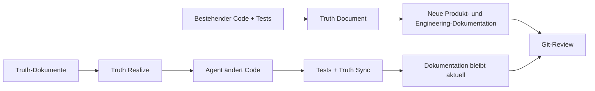

# Truthmark

**Deine Agenten schreiben Code. Truthmark pflegt die menschenlesbare Dokumentation, die du direkt in Git prüfen kannst.**

Truthmark installiert Git-native Workflows, mit denen KI-Coding-Agenten aus bestehendem Code und Tests neue Produkt- und Engineering-Dokumentation erstellen, sie nach jeder Codeänderung aktuell halten und dir gewöhnliche Markdown-Diffs zur Prüfung vorlegen.

[](https://www.npmjs.com/package/truthmark)
[](https://github.com/merlinhu1/truthmark/actions/workflows/ci.yml)
[](../../LICENSE)
[](../../package.json)

[Jetzt starten](#schnellstart-dein-erstes-truth-dokument-erstellen) · [Website](https://merlinhu1.github.io/truthmark/) · [Benutzerhandbuch](https://github.com/merlinhu1/truthmark/blob/main/docs/user-guide.md) · [GitHub](https://github.com/merlinhu1/truthmark)

<details>
<summary>Dieses README in 16 Sprachen lesen</summary>

[🇺🇸 English](../../README.md) | [🇨🇳 简体中文](README.zh.md) | [🇯🇵 日本語](README.ja.md) | [🇰🇷 한국어](README.ko.md) | [🇩🇪 Deutsch](README.de.md) | [🇫🇷 Français](README.fr.md) | [🇪🇸 Español](README.es.md) | [🇧🇷 Português](README.pt.md) | [🇷🇺 Русский](README.ru.md) | [🇸🇦 العربية](README.ar.md) | [🇮🇹 Italiano](README.it.md) | [🇵🇱 Polski](README.pl.md) | [🇹🇷 Türkçe](README.tr.md) | [🇻🇳 Tiếng Việt](README.vi.md) | [🇮🇩 Bahasa Indonesia](README.id.md) | [🇬🇷 Ελληνικά](README.el.md)

</details>

## Erstelle die ersten Dokumente und halte sie wahr

Die meisten Dokumentationswerkzeuge enden bei der Generierung. Truthmark gibt Agenten einen vollständigen Dokumentationslebenszyklus direkt in deinem Repository:

- **Neue Dokumentation aus funktionierender Software erstellen.** Truth Document liest Code und Tests und erstellt daraus klar abgegrenzte Produkt- oder Engineering-Dokumentation.
- **Dokumentation automatisch auf Kurs halten.** Truth Sync läuft nach Änderungen an funktionalem Code bei der Agentenübergabe und aktualisiert die Repository-Wahrheit, bevor die Arbeit abgeschlossen ist.
- **Dokumentation wieder in Code verwandeln.** Truth Realize setzt freigegebene Truth-Dokumente um und wahrt dabei einen sauberen Doc-first-Workflow.
- **Ownership mit dem Codebestand weiterentwickeln.** Truth Structure erstellt klar abgegrenzte Routen und Startdokumente für neue oder überlastete Bereiche.
- **Alles in Git prüfen.** Code, Entscheidungen, Verträge, Architektur, Betrieb und Verhalten reisen gemeinsam mit dem Branch.

Keine gehostete Wissensdatenbank. Kein privates Agentengedächtnis. Keine Dokumentation, die in Chatverläufen gefangen bleibt.

## Schnellstart: dein erstes Truth-Dokument erstellen

**Voraussetzungen:** Node.js 24 oder neuer, ein Git-Repository und ein unterstützter KI-Coding-Host für Agenten-Workflows.

Führe Folgendes in dem Repository aus, das Truthmark verwalten soll:

```bash
cd /path/to/your-repo
npm install -g truthmark
truthmark init
```

Mit `truthmark init` kannst du Codex, Claude Code, GitHub Copilot, OpenCode, Antigravity, Cursor oder eine host-neutrale Einrichtung der Befehlszeilenschnittstelle auswählen.

Bitte nun deinen konfigurierten Agenten, ein echtes Verhalten zu dokumentieren:

```text
/truthmark-document document the implemented session timeout behavior across src/auth/session.ts and tests/auth/session.test.ts
```

Truth Document erstellt ein neues, klar abgegrenztes Truth-Dokument, wenn noch keines vorhanden ist, aktualisiert andernfalls das bestehende zuständige Dokument und passt bei Bedarf das Routing an. Funktionalen Code ändert es nicht.

Prüfe das Ergebnis:

```bash
truthmark check
git status --short --untracked-files=all
git diff
```

Nun solltest du Folgendes haben:

```text
docs/truthmark/engineering/behaviors/session-timeout.md
docs/truthmark/routes/areas/authentication.md
```

Die genauen Pfade folgen der Ownership-Struktur deines Repositories. Neue Dateien erscheinen in `git status`; Änderungen an verfolgten Dateien erscheinen in `git diff`.

Der Aufruf unterscheidet sich je nach Host. OpenCode verwendet `/skill truthmark-document`, Antigravity verwendet `@truthmark-document`, und andere unterstützte Hosts nutzen ihre native Skill- oder Slash-Command-Oberfläche. Die genauen Befehle findest du in der [Plattformtabelle](https://github.com/merlinhu1/truthmark/blob/main/docs/user-guide.md#supported-agent-platforms).

Übergib die ausgewählten Plattformen für Skripte und Continuous Integration ausdrücklich:

```bash
truthmark init --platform codex --platform cursor
truthmark init --json
```

Wähle interaktiv `none` oder führe `truthmark init --clear-platforms` für ein host-neutrales Repository aus. Agentenplattformen kannst du später hinzufügen, indem du `truthmark init` erneut ausführst.

Übergib für Branch-relative Aktualitätsdiagnosen eine Git-Basis:

```bash
truthmark check --base <base-ref>
```

## So funktioniert Truthmark



Die Truthmark-Befehlszeilenschnittstelle installiert und validiert den Repository-Vertrag. Dein Coding-Agent prüft die Evidenz und erledigt die Dokumentationsarbeit über die installierten host-nativen Workflows.

Eine normale Codeänderung folgt einer einfachen Schleife:

1. Der Agent ändert funktionalen Code.
2. Relevante Tests werden ausgeführt.
3. Truth Sync prüft die zugeordnete Dokumentation.
4. Wenn sich die Repository-Wahrheit geändert hat, erstellt oder aktualisiert der Agent Dokumentation und Routing.
5. Du prüfst Code-Diff und Truth-Diff gemeinsam.

## Workflows

| Workflow             | Einsatzzeitpunkt                                                                | Ergebnis                                                                           |
| -------------------- | ------------------------------------------------------------------------------- | ---------------------------------------------------------------------------------- |
| **Truth Document**   | Bestehender Code benötigt Dokumentation                                         | Erstellt oder aktualisiert evidenzgestützte Produkt- und Engineering-Dokumentation |
| **Truth Sync**       | Funktionaler Code wurde geändert                                                | Hält zugeordnete Dokumentation und Routing vor der Übergabe synchron               |
| **Truth Structure**  | Ein neuer Bereich benötigt Ownership oder vorhandene Dokumentation ist zu breit | Erstellt klar abgegrenzte Routen und skelettartige Startdokumente                  |
| **Truth Realize**    | Ein freigegebenes Truth-Dokument soll funktionierende Software werden           | Aktualisiert funktionalen Code anhand der Dokumentation                            |
| **Truth Check**      | Die Repository-Wahrheit muss auditiert werden                                   | Meldet Probleme mit Routing, Ownership, Evidenz und Dokumentation                  |
| **Truthmark Portal** | Das Team wünscht eine durchsuchbare Dokumentationswebsite                       | Erzeugt aus Markdown-Truth-Dokumenten eine committete statische HTML-Präsentation  |

Truthmark installiert diese Workflows als native Repository-Oberflächen für Codex, Claude Code, GitHub Copilot, OpenCode, Antigravity und Cursor.

## Das erhältst du

### Dokumentation, die von der Realität ausgeht

Truthmark kann Produktfunktionen, Implementierungsverhalten, Programmierschnittstellen, Architektur, Workflows, Betrieb und Tests dokumentieren. Code und Tests liefern die Evidenz; klar abgegrenzte Markdown-Dokumente bewahren das Ergebnis.

### Dokumentation, die die nächste Änderung übersteht

Routen verbinden Codebereiche mit kanonischer Dokumentation. Wenn Agenten Verhalten ändern, weiß Truth Sync, wohin die zugehörige Wahrheit gehört, und hält die Übergabe überprüfbar.

### Produkt- und Engineering-Wahrheit in getrennten Bahnen

Produktwahrheit erfasst nutzerorientierte Versprechen, Grenzen, Entscheidungen und Akzeptanzkriterien. Engineering-Wahrheit erfasst aktuelles Verhalten, Verträge, Architektur, Workflows, Betrieb und Testverhalten.

### Git-native Zusammenarbeit

Alles Wichtige lebt in committeten Repository-Dateien. Die Wahrheit folgt dem Branch, funktioniert mit gewöhnlichen Pull Requests und bleibt für alle Maintainer und Coding-Agenten sichtbar.

### Local-first-Betrieb

Truthmark benötigt keinen gehosteten Dienst, Daemon, keine Datenbank, keinen Vektorspeicher und keinen Model Context Protocol Server. Das Repository bringt seinen eigenen Dokumentations-Workflow mit.

## Wo Truthmark passt

| Bedarf                                                | Beste Lösung               |
| ----------------------------------------------------- | -------------------------- |
| Bessere Ergebnisse aus einer einzelnen Agentensitzung | Besserer Prompt            |
| Persönliche oder sitzungsbezogene Kontinuität         | Memory-Tool                |
| Plan-first-Feature-Arbeit                             | Spezifikations-Workflow    |
| Branch-bezogene Dokumentation, die mit dem Code reist | **Truthmark**              |
| Korrektes Verhalten                                   | Tests und Code-Review      |
| Überprüfbare KI-gestützte Dokumentation               | **Truthmark + Git-Review** |

Truthmark ist für Maintainer und Engineering-Teams konzipiert, die bereits KI-Coding-Agenten einsetzen und möchten, dass ihr Repository so schnell die Wahrheit weiterschreibt, wie sich der Code ändert.

## Unterstützte Hosts und Befehlszeile

Unterstützte Agenten-Hosts:

- Codex
- Claude Code
- GitHub Copilot
- OpenCode
- Antigravity
- Cursor

<details>
<summary>Befehlszeilenreferenz</summary>

| Befehl                                                            | Zweck                                                                                        |
| ----------------------------------------------------------------- | -------------------------------------------------------------------------------------------- |
| `truthmark init`                                                  | Konfiguration, Routing, Vorlagen und ausgewählte Host-Workflows erstellen oder aktualisieren |
| `truthmark check [--base <ref>]`                                  | Repository-Wahrheit validieren und optional Branch-Aktualitätsdiagnosen ausführen            |
| `truthmark index --json`                                          | Abgeleitete Repository- und Routing-Metadaten prüfen                                         |
| `truthmark impact --base <ref> --json`                            | Geänderte Dateien Dokumentation, Verantwortlichen und nahen Tests zuordnen                   |
| `truthmark workflow status --workflow <id> [--base <ref>] --json` | Anwendbarkeit und Ziele eines Workflows prüfen                                               |
| `truthmark validate ...`                                          | Workflow-Berichte und Schreib-Leases validieren                                              |
| `truthmark uninstall --dry-run` / `truthmark uninstall --apply`   | Generierte Host-Oberflächen anzeigen oder entfernen und verfasste Wahrheit bewahren          |

Strukturierte JSON-Ausgabe ist in der gesamten Befehlszeilenschnittstelle für Skripte und Continuous Integration verfügbar.

</details>

## Mehr erfahren

- [Truthmark-Benutzerhandbuch](https://github.com/merlinhu1/truthmark/blob/main/docs/user-guide.md)
- [Dokumentationsindex](https://github.com/merlinhu1/truthmark/blob/main/docs/README.md)
- [Architekturüberblick](https://github.com/merlinhu1/truthmark/blob/main/docs/truthmark/engineering/architecture/overview.md)
- [Konfigurations-, Routing- und Befehlsverträge](https://github.com/merlinhu1/truthmark/blob/main/docs/truthmark/engineering/contracts/config-route-and-check-contracts.md)
- [Repository-Wahrheit pflegen](https://github.com/merlinhu1/truthmark/blob/main/docs/standards/maintaining-repository-truth.md)
- [Mitwirken](https://github.com/merlinhu1/truthmark/blob/main/CONTRIBUTING.md)

**Installiere Truthmark, wähle deinen Coding-Host und verwandle noch heute ein echtes Verhalten in Dokumentation.**

## Lizenz

MIT. Siehe [LICENSE](../../LICENSE).
