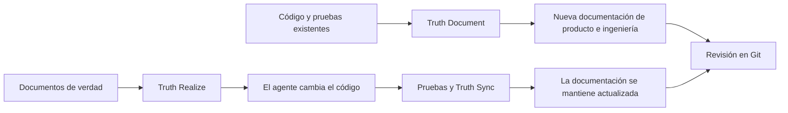

# Truthmark

**Tus agentes escriben código. Truthmark mantiene la documentación orientada a las personas y revisable en Git.**

Truthmark instala flujos de trabajo nativos de Git que permiten a los agentes de programación con IA crear nueva documentación de producto e ingeniería a partir del código y las pruebas existentes, mantenerla actualizada después de cada cambio de código y ofrecerte diffs de Markdown convencionales para su revisión.

[](https://www.npmjs.com/package/truthmark)
[](https://github.com/merlinhu1/truthmark/actions/workflows/ci.yml)
[](../../LICENSE)
[](../../package.json)

[Comenzar](#inicio-rápido-crea-tu-primer-documento-de-verdad) · [Sitio web](https://merlinhu1.github.io/truthmark/) · [Guía de usuario](https://github.com/merlinhu1/truthmark/blob/main/docs/user-guide.md) · [GitHub](https://github.com/merlinhu1/truthmark)

<details>
<summary>Lee este README en 16 idiomas</summary>

[🇺🇸 English](../../README.md) | [🇨🇳 简体中文](README.zh.md) | [🇯🇵 日本語](README.ja.md) | [🇰🇷 한국어](README.ko.md) | [🇩🇪 Deutsch](README.de.md) | [🇫🇷 Français](README.fr.md) | [🇪🇸 Español](README.es.md) | [🇧🇷 Português](README.pt.md) | [🇷🇺 Русский](README.ru.md) | [🇸🇦 العربية](README.ar.md) | [🇮🇹 Italiano](README.it.md) | [🇵🇱 Polski](README.pl.md) | [🇹🇷 Türkçe](README.tr.md) | [🇻🇳 Tiếng Việt](README.vi.md) | [🇮🇩 Bahasa Indonesia](README.id.md) | [🇬🇷 Ελληνικά](README.el.md)

</details>

## Crea los primeros documentos. Mantenlos fieles a la realidad.

La mayoría de las herramientas de documentación se detienen después de generar contenido. Truthmark proporciona a los agentes un ciclo de vida completo para la documentación dentro de tu repositorio:

- **Crea documentación nueva a partir de software funcional.** Truth Document lee el código y las pruebas y, a continuación, crea documentación acotada de producto o ingeniería.
- **Mantén la documentación alineada automáticamente.** Truth Sync se ejecuta durante la entrega del agente después de cambios funcionales en el código y actualiza la verdad del repositorio antes de que finalice el trabajo.
- **Convierte la documentación de nuevo en código.** Truth Realize implementa documentos de verdad aprobados y conserva un flujo de trabajo limpio que parte de la documentación.
- **Repara la propiedad a medida que crece el código base.** Truth Structure crea rutas acotadas y documentos iniciales para áreas nuevas o sobrecargadas.
- **Revísalo todo en Git.** El código, las decisiones, los contratos, la arquitectura, las operaciones y el comportamiento viajan juntos en la rama.

Sin bases de conocimiento alojadas. Sin memoria privada de los agentes. Sin documentación atrapada en el historial del chat.

## Inicio rápido: crea tu primer documento de verdad

**Requisitos:** Node.js 24 o posterior, un repositorio Git y un host de programación con IA compatible con flujos de trabajo de agentes.

Ejecuta lo siguiente dentro del repositorio que quieres que gestione Truthmark:

```bash
cd /path/to/your-repo
npm install -g truthmark
truthmark init
```

`truthmark init` te permite seleccionar Codex, Claude Code, GitHub Copilot, OpenCode, Antigravity, Cursor o una configuración de interfaz de línea de comandos neutral respecto al host.

Ahora pide al agente configurado que documente un comportamiento real:

```text
/truthmark-document document the implemented session timeout behavior across src/auth/session.ts and tests/auth/session.test.ts
```

Truth Document crea un nuevo documento de verdad acotado cuando no existe ninguno, actualiza al propietario existente cuando ya lo hay y actualiza el enrutamiento cuando es necesario. No modifica el código funcional.

Revisa el resultado:

```bash
truthmark check
git status --short --untracked-files=all
git diff
```

Ahora deberías tener:

```text
docs/truthmark/engineering/behaviors/session-timeout.md
docs/truthmark/routes/areas/authentication.md
```

Las rutas exactas siguen la estructura de propiedad de tu repositorio. Los archivos nuevos aparecen en `git status`; los cambios en archivos con seguimiento aparecen en `git diff`.

La invocación varía según el host. OpenCode utiliza `/skill truthmark-document`, Antigravity utiliza `@truthmark-document` y los demás hosts compatibles emplean su superficie nativa de habilidades o comandos con barra. Consulta la [tabla de plataformas](https://github.com/merlinhu1/truthmark/blob/main/docs/user-guide.md#supported-agent-platforms) para conocer los comandos exactos.

Para scripts e integración continua, pasa explícitamente las plataformas seleccionadas:

```bash
truthmark init --platform codex --platform cursor
truthmark init --json
```

Elige `none` de forma interactiva o ejecuta `truthmark init --clear-platforms` para obtener un repositorio neutral respecto al host. Puedes añadir plataformas de agentes más adelante volviendo a ejecutar `truthmark init`.

Para diagnósticos de vigencia relativos a la rama, pasa una base de Git:

```bash
truthmark check --base <base-ref>
```

## Cómo funciona Truthmark



La interfaz de línea de comandos de Truthmark instala y valida el contrato del repositorio. Tu agente de programación realiza la revisión de evidencias y el trabajo de documentación mediante los flujos de trabajo nativos del host instalados.

Un cambio de código normal sigue un ciclo sencillo:

1. El agente modifica el código funcional.
2. Se ejecutan las pruebas pertinentes.
3. Truth Sync comprueba la documentación asociada.
4. El agente crea o actualiza la documentación y el enrutamiento cuando cambia la verdad del repositorio.
5. Revisas juntos el diff de código y el diff de verdad.

## Flujos de trabajo

| Flujo de trabajo     | Cuándo usarlo                                                                     | Resultado                                                                                       |
| -------------------- | --------------------------------------------------------------------------------- | ----------------------------------------------------------------------------------------------- |
| **Truth Document**   | El código existente necesita documentación                                        | Crea o actualiza documentación de producto e ingeniería respaldada por evidencias               |
| **Truth Sync**       | Ha cambiado el código funcional                                                   | Mantiene alineados la documentación asociada y el enrutamiento antes de la entrega              |
| **Truth Structure**  | Un área nueva necesita propiedad o la documentación existente es demasiado amplia | Crea rutas acotadas y documentos iniciales básicos                                              |
| **Truth Realize**    | Un documento de verdad aprobado debe convertirse en software funcional            | Actualiza el código funcional a partir de la documentación                                      |
| **Truth Check**      | La verdad del repositorio necesita una auditoría                                  | Informa de problemas de enrutamiento, propiedad, evidencias y documentación                     |
| **Truthmark Portal** | El equipo quiere un sitio de documentación navegable                              | Genera una presentación HTML estática y versionada a partir de documentos de verdad en Markdown |

Truthmark instala estos flujos de trabajo como superficies nativas del repositorio para Codex, Claude Code, GitHub Copilot, OpenCode, Antigravity y Cursor.

## Lo que obtienes

### Documentación que parte de la realidad

Truthmark puede crear documentación sobre capacidades del producto, comportamiento de la implementación, interfaces de programación de aplicaciones, arquitectura, flujos de trabajo, operaciones y pruebas. El código y las pruebas aportan las evidencias; los documentos Markdown acotados conservan el resultado.

### Documentación que sobrevive al siguiente cambio

Las rutas conectan áreas del código con documentos canónicos. Cuando los agentes cambian el comportamiento, Truth Sync sabe dónde debe quedar registrada la verdad correspondiente y mantiene la entrega lista para revisión.

### La verdad de producto e ingeniería en carriles separados

La verdad de producto recoge promesas orientadas al usuario, límites, decisiones y criterios de aceptación. La verdad de ingeniería recoge el comportamiento actual, los contratos, la arquitectura, los flujos de trabajo, las operaciones y el comportamiento de las pruebas.

### Colaboración nativa de Git

Todo lo importante reside en archivos versionados del repositorio. La verdad sigue a la rama, funciona con solicitudes de incorporación de cambios convencionales y permanece visible para cada mantenedor y agente de programación.

### Operación local primero

Truthmark no necesita servicios alojados, demonios, bases de datos, almacenes vectoriales ni servidores del Protocolo de Contexto de Modelo. El repositorio contiene su propio flujo de trabajo de documentación.

## Dónde encaja Truthmark

| Necesidad                                               | Mejor opción                          |
| ------------------------------------------------------- | ------------------------------------- |
| Mejor resultado de una sesión de agente                 | Un prompt mejor                       |
| Continuidad personal o a nivel de sesión                | Una herramienta de memoria            |
| Desarrollo de funcionalidades partiendo de un plan      | Un flujo de trabajo de especificación |
| Documentación acotada a la rama que viaja con el código | **Truthmark**                         |
| Corrección del comportamiento                           | Pruebas y revisión de código          |
| Documentación asistida por IA y revisable               | **Truthmark + revisión en Git**       |

Truthmark está diseñado para mantenedores y equipos de ingeniería que ya utilizan agentes de programación con IA y quieren que el repositorio siga diciendo la verdad con la misma rapidez con la que cambia el código.

## Hosts compatibles y línea de comandos

Hosts de agentes compatibles:

- Codex
- Claude Code
- GitHub Copilot
- OpenCode
- Antigravity
- Cursor

<details>
<summary>Referencia de la línea de comandos</summary>

| Comando                                                           | Propósito                                                                                                             |
| ----------------------------------------------------------------- | --------------------------------------------------------------------------------------------------------------------- |
| `truthmark init`                                                  | Crea o actualiza la configuración, el enrutamiento, las plantillas y los flujos de trabajo de los hosts seleccionados |
| `truthmark check [--base <ref>]`                                  | Valida la verdad del repositorio y, opcionalmente, ejecuta diagnósticos de vigencia de la rama                        |
| `truthmark index --json`                                          | Inspecciona los metadatos derivados del repositorio y del enrutamiento                                                |
| `truthmark impact --base <ref> --json`                            | Asocia los archivos modificados con la documentación, los propietarios y las pruebas cercanas                         |
| `truthmark workflow status --workflow <id> [--base <ref>] --json` | Inspecciona la aplicabilidad y los objetivos del flujo de trabajo                                                     |
| `truthmark validate ...`                                          | Valida los informes de los flujos de trabajo y las concesiones de escritura                                           |
| `truthmark uninstall --dry-run` / `truthmark uninstall --apply`   | Previsualiza o elimina las superficies de host generadas sin alterar la verdad creada                                 |

La salida JSON estructurada está disponible en toda la interfaz de línea de comandos para scripts e integración continua.

</details>

## Más información

- [Guía de usuario de Truthmark](https://github.com/merlinhu1/truthmark/blob/main/docs/user-guide.md)
- [Índice de documentación](https://github.com/merlinhu1/truthmark/blob/main/docs/README.md)
- [Descripción general de la arquitectura](https://github.com/merlinhu1/truthmark/blob/main/docs/truthmark/engineering/architecture/overview.md)
- [Contratos de configuración, enrutamiento y comandos](https://github.com/merlinhu1/truthmark/blob/main/docs/truthmark/engineering/contracts/config-route-and-check-contracts.md)
- [Mantenimiento de la verdad del repositorio](https://github.com/merlinhu1/truthmark/blob/main/docs/standards/maintaining-repository-truth.md)
- [Contribuir](https://github.com/merlinhu1/truthmark/blob/main/CONTRIBUTING.md)

**Instala Truthmark, selecciona tu host de programación y convierte hoy un comportamiento real en documentación.**

## Licencia

MIT. Consulta [LICENSE](../../LICENSE).
