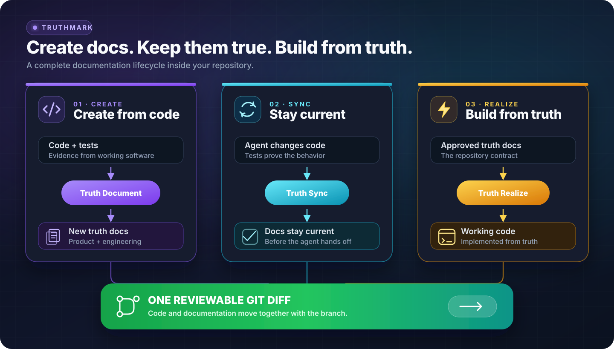

# Truthmark

**Vos agents écrivent du code. Truthmark maintient une documentation destinée aux humains et vérifiable dans Git.**

Truthmark installe des workflows natifs de Git qui permettent aux agents de codage IA de créer de nouveaux documents produit et d’ingénierie à partir du code et des tests existants, de les maintenir à jour après chaque changement de code et de vous remettre des diffs Markdown ordinaires à examiner.

[](https://www.npmjs.com/package/truthmark)
[](https://github.com/merlinhu1/truthmark/actions/workflows/ci.yml)
[](../../LICENSE)
[](../../package.json)

[Commencer](#démarrage-rapide-créez-votre-premier-document-de-vérité) · [Site web](https://merlinhu1.github.io/truthmark/) · [Guide d’utilisation](https://github.com/merlinhu1/truthmark/blob/main/docs/user-guide.md) · [GitHub](https://github.com/merlinhu1/truthmark)

<details>
<summary>Lire ce README en 16 langues</summary>

[🇺🇸 English](../../README.md) | [🇨🇳 简体中文](README.zh.md) | [🇯🇵 日本語](README.ja.md) | [🇰🇷 한국어](README.ko.md) | [🇩🇪 Deutsch](README.de.md) | [🇫🇷 Français](README.fr.md) | [🇪🇸 Español](README.es.md) | [🇧🇷 Português](README.pt.md) | [🇷🇺 Русский](README.ru.md) | [🇸🇦 العربية](README.ar.md) | [🇮🇹 Italiano](README.it.md) | [🇵🇱 Polski](README.pl.md) | [🇹🇷 Türkçe](README.tr.md) | [🇻🇳 Tiếng Việt](README.vi.md) | [🇮🇩 Bahasa Indonesia](README.id.md) | [🇬🇷 Ελληνικά](README.el.md)

</details>

## Créez les premiers documents et gardez-les vrais

La plupart des outils de documentation s’arrêtent après la génération. Truthmark offre aux agents un cycle de vie documentaire complet au sein de votre dépôt :

- **Créer de nouveaux documents à partir d’un logiciel fonctionnel.** Truth Document lit le code et les tests, puis crée une documentation produit ou d’ingénierie au périmètre clairement défini.
- **Maintenir automatiquement l’alignement des documents.** Truth Sync s’exécute lors de la remise de l’agent après les changements de code fonctionnel et actualise la vérité du dépôt avant la fin du travail.
- **Transformer les documents en code.** Truth Realize implémente les documents de vérité approuvés tout en préservant un workflow propre, axé d’abord sur la documentation.
- **Réparer la propriété à mesure que le code grandit.** Truth Structure crée des routes au périmètre clair et des documents de démarrage pour les zones nouvelles ou surchargées.
- **Tout examiner dans Git.** Le code, les décisions, les contrats, l’architecture, les opérations et le comportement voyagent ensemble avec la branche.

Aucune base de connaissances hébergée. Aucune mémoire d’agent privée. Aucune documentation prisonnière de l’historique des discussions.

## Démarrage rapide : créez votre premier document de vérité

**Prérequis :** Node.js 24 ou version ultérieure, un dépôt Git et un hôte de codage IA compatible avec les workflows d’agents.

Exécutez ces commandes dans le dépôt que Truthmark doit gérer :

```bash
cd /path/to/your-repo
npm install -g truthmark
truthmark init
```

`truthmark init` vous permet de sélectionner Codex, Claude Code, GitHub Copilot, OpenCode, Antigravity, Cursor ou une configuration de l’interface en ligne de commande indépendante de l’hôte.

Demandez maintenant à votre agent configuré de documenter un comportement réel :

```text
/truthmark-document document the implemented session timeout behavior across src/auth/session.ts and tests/auth/session.test.ts
```

Truth Document crée un nouveau document de vérité au périmètre clair s’il n’en existe pas, actualise le document propriétaire existant dans le cas contraire et met à jour le routage si nécessaire. Il ne modifie pas le code fonctionnel.

Examinez le résultat :

```bash
truthmark check
git status --short --untracked-files=all
git diff
```

Vous devriez maintenant disposer de :

```text
docs/truthmark/engineering/behaviors/session-timeout.md
docs/truthmark/routes/areas/authentication.md
```

Les chemins exacts suivent la structure de propriété de votre dépôt. Les nouveaux fichiers apparaissent dans `git status` ; les modifications apportées aux fichiers suivis apparaissent dans `git diff`.

L’invocation varie selon l’hôte. OpenCode utilise `/skill truthmark-document`, Antigravity utilise `@truthmark-document`, et les autres hôtes compatibles utilisent leur surface native de skill ou de commande slash. Consultez le [tableau des plateformes](https://github.com/merlinhu1/truthmark/blob/main/docs/user-guide.md#supported-agent-platforms) pour connaître les commandes exactes.

Pour les scripts et l’intégration continue, transmettez explicitement les plateformes sélectionnées :

```bash
truthmark init --platform codex --platform cursor
truthmark init --json
```

Choisissez `none` en mode interactif ou exécutez `truthmark init --clear-platforms` pour obtenir un dépôt indépendant de l’hôte. Vous pourrez ajouter des plateformes d’agents plus tard en relançant `truthmark init`.

Pour les diagnostics de fraîcheur relatifs à une branche, transmettez une base Git :

```bash
truthmark check --base <base-ref>
```

## Fonctionnement de Truthmark

<picture>
  <source media="(max-width: 700px)" srcset="../assets/truthmark-workflow-mobile.svg">
  
</picture>

L’interface en ligne de commande Truthmark installe et valide le contrat du dépôt. Votre agent de codage effectue l’examen des preuves et le travail documentaire via les workflows natifs de l’hôte qui ont été installés.

Un changement de code normal suit une boucle simple :

1. L’agent modifie le code fonctionnel.
2. Les tests pertinents sont exécutés.
3. Truth Sync vérifie la documentation mappée.
4. Lorsque la vérité du dépôt a changé, l’agent crée ou actualise les documents et le routage.
5. Vous examinez ensemble le diff de code et le diff de vérité.

## Workflows

| Workflow             | Quand l’utiliser                                                                         | Résultat                                                                                 |
| -------------------- | ---------------------------------------------------------------------------------------- | ---------------------------------------------------------------------------------------- |
| **Truth Document**   | Du code existant doit être documenté                                                     | Crée ou actualise des documents produit et d’ingénierie fondés sur des preuves           |
| **Truth Sync**       | Du code fonctionnel a changé                                                             | Maintient l’alignement des documents mappés et du routage avant la remise                |
| **Truth Structure**  | Une nouvelle zone doit avoir un propriétaire ou les documents existants sont trop larges | Crée des routes au périmètre clair et des documents de démarrage sous forme de structure |
| **Truth Realize**    | Un document de vérité approuvé doit devenir un logiciel fonctionnel                      | Actualise le code fonctionnel à partir de la documentation                               |
| **Truth Check**      | La vérité du dépôt doit être auditée                                                     | Signale les problèmes de routage, de propriété, de preuves et de documentation           |
| **Truthmark Portal** | L’équipe veut un site documentaire consultable                                           | Génère une présentation HTML statique commitée à partir des documents de vérité Markdown |

Truthmark installe ces workflows sous forme de surfaces natives au dépôt pour Codex, Claude Code, GitHub Copilot, OpenCode, Antigravity et Cursor.

## Ce que vous obtenez

### Une documentation qui part de la réalité

Truthmark peut créer de la documentation pour les capacités produit, le comportement de l’implémentation, les interfaces de programmation d’applications, l’architecture, les workflows, les opérations et les tests. Le code et les tests fournissent les preuves ; des documents Markdown au périmètre clair préservent le résultat.

### Une documentation qui survit au prochain changement

Les routes relient les zones de code aux documents canoniques. Lorsque les agents modifient un comportement, Truth Sync sait où placer la vérité correspondante et maintient une remise vérifiable.

### La vérité produit et la vérité d’ingénierie dans des voies distinctes

La vérité produit consigne les promesses destinées aux utilisateurs, les limites, les décisions et les critères d’acceptation. La vérité d’ingénierie consigne le comportement actuel, les contrats, l’architecture, les workflows, les opérations et le comportement des tests.

### Collaboration native de Git

Tout ce qui compte réside dans des fichiers commités dans le dépôt. La vérité suit la branche, fonctionne avec les pull requests ordinaires et reste visible pour chaque mainteneur et chaque agent de codage.

### Fonctionnement local d’abord

Truthmark ne nécessite ni service hébergé, ni démon, ni base de données, ni magasin vectoriel, ni serveur Model Context Protocol. Le dépôt transporte son propre workflow documentaire.

## La place de Truthmark

| Besoin                                                     | Meilleur choix            |
| ---------------------------------------------------------- | ------------------------- |
| Obtenir un meilleur résultat d’une seule session d’agent   | Meilleur prompt           |
| Continuité personnelle ou au niveau de la session          | Outil de mémoire          |
| Travail fonctionnel axé d’abord sur la planification       | Workflow de spécification |
| Documentation limitée à la branche qui voyage avec le code | **Truthmark**             |
| Exactitude du comportement                                 | Tests et revue de code    |
| Documentation assistée par l’IA et vérifiable              | **Truthmark + revue Git** |

Truthmark est conçu pour les mainteneurs et les équipes d’ingénierie qui utilisent déjà des agents de codage IA et veulent que le dépôt continue à dire la vérité aussi vite que le code évolue.

## Hôtes compatibles et ligne de commande

Hôtes d’agents compatibles :

- Codex
- Claude Code
- GitHub Copilot
- OpenCode
- Antigravity
- Cursor

<details>
<summary>Référence de la ligne de commande</summary>

| Commande                                                          | Objectif                                                                                              |
| ----------------------------------------------------------------- | ----------------------------------------------------------------------------------------------------- |
| `truthmark init`                                                  | Créer ou actualiser la configuration, le routage, les modèles et les workflows des hôtes sélectionnés |
| `truthmark check [--base <ref>]`                                  | Valider la vérité du dépôt et, facultativement, exécuter les diagnostics de fraîcheur de la branche   |
| `truthmark index --json`                                          | Examiner les métadonnées dérivées du dépôt et du routage                                              |
| `truthmark impact --base <ref> --json`                            | Mapper les fichiers modifiés vers les documents, les propriétaires et les tests proches               |
| `truthmark workflow status --workflow <id> [--base <ref>] --json` | Examiner l’applicabilité et les cibles du workflow                                                    |
| `truthmark validate ...`                                          | Valider les rapports de workflow et les baux d’écriture                                               |
| `truthmark uninstall --dry-run` / `truthmark uninstall --apply`   | Prévisualiser ou supprimer les surfaces d’hôtes générées tout en préservant la vérité rédigée         |

Une sortie JSON structurée est disponible dans toute l’interface en ligne de commande pour les scripts et l’intégration continue.

</details>

## En savoir plus

- [Guide d’utilisation de Truthmark](https://github.com/merlinhu1/truthmark/blob/main/docs/user-guide.md)
- [Index de la documentation](https://github.com/merlinhu1/truthmark/blob/main/docs/README.md)
- [Vue d’ensemble de l’architecture](https://github.com/merlinhu1/truthmark/blob/main/docs/truthmark/engineering/architecture/overview.md)
- [Contrats de configuration, de routage et de commande](https://github.com/merlinhu1/truthmark/blob/main/docs/truthmark/engineering/contracts/config-route-and-check-contracts.md)
- [Contribuer](https://github.com/merlinhu1/truthmark/blob/main/CONTRIBUTING.md)

**Installez Truthmark, sélectionnez votre hôte de codage et transformez dès aujourd’hui un comportement réel en documentation.**

## Licence

MIT. Voir [LICENSE](../../LICENSE).
