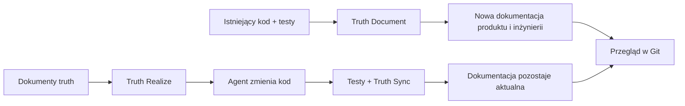

# Truthmark

**Twoi agenci piszą kod. Truthmark dba o dokumentację dla ludzi, gotową do przeglądu w Git.**

Truthmark instaluje natywne dla Git przepływy pracy, dzięki którym agenci programistyczni AI tworzą nową dokumentację produktu i inżynierii na podstawie istniejącego kodu i testów, aktualizują ją po każdej zmianie kodu oraz przekazują Ci zwykłe diffy Markdown do przeglądu.

[](https://www.npmjs.com/package/truthmark)
[](https://github.com/merlinhu1/truthmark/actions/workflows/ci.yml)
[](../../LICENSE)
[](../../package.json)

[Zacznij](#szybki-start-utwórz-swój-pierwszy-dokument-truth) · [Strona internetowa](https://merlinhu1.github.io/truthmark/) · [Przewodnik użytkownika](https://github.com/merlinhu1/truthmark/blob/main/docs/user-guide.md) · [GitHub](https://github.com/merlinhu1/truthmark)

<details>
<summary>Przeczytaj ten plik README w jednym z 16 języków</summary>

[🇺🇸 English](../../README.md) | [🇨🇳 简体中文](README.zh.md) | [🇯🇵 日本語](README.ja.md) | [🇰🇷 한국어](README.ko.md) | [🇩🇪 Deutsch](README.de.md) | [🇫🇷 Français](README.fr.md) | [🇪🇸 Español](README.es.md) | [🇧🇷 Português](README.pt.md) | [🇷🇺 Русский](README.ru.md) | [🇸🇦 العربية](README.ar.md) | [🇮🇹 Italiano](README.it.md) | [🇵🇱 Polski](README.pl.md) | [🇹🇷 Türkçe](README.tr.md) | [🇻🇳 Tiếng Việt](README.vi.md) | [🇮🇩 Bahasa Indonesia](README.id.md) | [🇬🇷 Ελληνικά](README.el.md)

</details>

## Twórz dokumentację od podstaw. Dbaj, by pozostawała prawdziwa.

Większość narzędzi do dokumentacji kończy pracę po jej wygenerowaniu. Truthmark zapewnia agentom pełny cykl życia dokumentacji wewnątrz repozytorium:

- **Twórz nową dokumentację na podstawie działającego oprogramowania.** Truth Document odczytuje kod i testy, a następnie tworzy precyzyjnie ograniczoną dokumentację produktu lub inżynierii.
- **Automatycznie utrzymuj zgodność dokumentacji.** Truth Sync uruchamia się przy przekazaniu pracy przez agenta po zmianach kodu funkcjonalnego i aktualizuje prawdę repozytorium przed zakończeniem zadania.
- **Zamieniaj dokumentację z powrotem w kod.** Truth Realize implementuje zatwierdzone dokumenty truth, zachowując przejrzysty przepływ pracy doc-first.
- **Naprawiaj własność wraz z rozwojem bazy kodu.** Truth Structure tworzy precyzyjne trasy i dokumenty startowe dla nowych lub przeciążonych obszarów.
- **Przeglądaj wszystko w Git.** Kod, decyzje, kontrakty, architektura, operacje i zachowanie podążają razem z gałęzią.

Bez hostowanej bazy wiedzy. Bez prywatnej pamięci agenta. Bez dokumentacji uwięzionej w historii czatu.

## Szybki start: utwórz swój pierwszy dokument truth

**Wymagania:** Node.js 24 lub nowszy, repozytorium Git oraz obsługiwany host programistyczny AI do przepływów pracy agentów.

Uruchom poniższe polecenia w repozytorium, którym ma zarządzać Truthmark:

```bash
cd /path/to/your-repo
npm install -g truthmark
truthmark init
```

`truthmark init` pozwala wybrać Codex, Claude Code, GitHub Copilot, OpenCode, Antigravity, Cursor albo konfigurację interfejsu wiersza poleceń niezależną od hosta.

Teraz poproś skonfigurowanego agenta o udokumentowanie jednego rzeczywistego zachowania:

```text
/truthmark-document document the implemented session timeout behavior across src/auth/session.ts and tests/auth/session.test.ts
```

Truth Document tworzy nowy, precyzyjnie ograniczony dokument truth, jeśli taki jeszcze nie istnieje, aktualizuje istniejącego właściciela, gdy już istnieje, i w razie potrzeby aktualizuje routing. Nie zmienia kodu funkcjonalnego.

Przejrzyj rezultat:

```bash
truthmark check
git status --short --untracked-files=all
git diff
```

Powinny teraz istnieć:

```text
docs/truthmark/engineering/behaviors/session-timeout.md
docs/truthmark/routes/areas/authentication.md
```

Dokładne ścieżki wynikają ze struktury własności w Twoim repozytorium. Nowe pliki pojawiają się w `git status`, a zmiany w śledzonych plikach — w `git diff`.

Sposób wywołania zależy od hosta. OpenCode używa `/skill truthmark-document`, Antigravity używa `@truthmark-document`, a pozostałe obsługiwane hosty korzystają ze swoich natywnych umiejętności lub poleceń z ukośnikiem. Dokładne polecenia znajdziesz w [tabeli platform](https://github.com/merlinhu1/truthmark/blob/main/docs/user-guide.md#supported-agent-platforms).

W skryptach i ciągłej integracji jawnie przekaż wybrane platformy:

```bash
truthmark init --platform codex --platform cursor
truthmark init --json
```

Wybierz interaktywnie `none` albo uruchom `truthmark init --clear-platforms`, aby uzyskać repozytorium niezależne od hosta. Platformy agentów możesz dodać później, ponownie uruchamiając `truthmark init`.

Aby uzyskać diagnostykę aktualności względem gałęzi, przekaż bazę Git:

```bash
truthmark check --base <base-ref>
```

## Jak działa Truthmark



Interfejs wiersza poleceń Truthmark instaluje i sprawdza kontrakt repozytorium. Twój agent programistyczny analizuje dowody i wykonuje pracę dokumentacyjną za pomocą zainstalowanych, natywnych dla hosta przepływów pracy.

Typowa zmiana kodu przebiega w jednej prostej pętli:

1. Agent zmienia kod funkcjonalny.
2. Uruchamiane są odpowiednie testy.
3. Truth Sync sprawdza zmapowaną dokumentację.
4. Gdy prawda repozytorium się zmieniła, agent tworzy lub aktualizuje dokumentację oraz routing.
5. Wspólnie przeglądasz diff kodu i diff dokumentów truth.

## Przepływy pracy

| Przepływ pracy       | Kiedy go używać                                                                   | Rezultat                                                                       |
| -------------------- | --------------------------------------------------------------------------------- | ------------------------------------------------------------------------------ |
| **Truth Document**   | Istniejący kod wymaga dokumentacji                                                | Tworzy lub aktualizuje opartą na dowodach dokumentację produktu i inżynierii   |
| **Truth Sync**       | Zmienił się kod funkcjonalny                                                      | Przed przekazaniem pracy utrzymuje zgodność zmapowanej dokumentacji i routingu |
| **Truth Structure**  | Nowy obszar potrzebuje właściciela albo istniejąca dokumentacja jest zbyt szeroka | Tworzy precyzyjne trasy i szkieletowe dokumenty startowe                       |
| **Truth Realize**    | Zatwierdzony dokument truth powinien stać się działającym oprogramowaniem         | Aktualizuje kod funkcjonalny na podstawie dokumentacji                         |
| **Truth Check**      | Prawda repozytorium wymaga audytu                                                 | Zgłasza problemy z routingiem, własnością, dowodami i dokumentacją             |
| **Truthmark Portal** | Zespół potrzebuje witryny z dokumentacją do wygodnego przeglądania                | Generuje zatwierdzoną statyczną prezentację HTML z dokumentów truth w Markdown |

Truthmark instaluje te przepływy pracy jako natywne powierzchnie repozytorium dla Codex, Claude Code, GitHub Copilot, OpenCode, Antigravity i Cursor.

## Co otrzymujesz

### Dokumentację, która zaczyna od rzeczywistości

Truthmark potrafi tworzyć dokumentację możliwości produktu, zachowania implementacji, interfejsów programistycznych aplikacji, architektury, przepływów pracy, operacji i testów. Kod i testy dostarczają dowodów, a precyzyjnie ograniczone dokumenty Markdown utrwalają wynik.

### Dokumentację, która przetrwa kolejną zmianę

Trasy łączą obszary kodu z kanonicznymi dokumentami. Kiedy agenci zmieniają zachowanie, Truth Sync wie, gdzie należy zapisać odpowiadającą mu prawdę, i utrzymuje przekazanie pracy w formie gotowej do przeglądu.

### Prawdę produktu i inżynierii w osobnych obszarach

Prawda produktu obejmuje obietnice dla użytkowników, granice, decyzje i kryteria akceptacji. Prawda inżynierii obejmuje bieżące zachowanie, kontrakty, architekturę, przepływy pracy, operacje oraz zachowanie testów.

### Współpracę natywną dla Git

Wszystko, co ważne, znajduje się w zatwierdzonych plikach repozytorium. Prawda podąża za gałęzią, współpracuje ze zwykłymi pull requestami i pozostaje widoczna dla każdego opiekuna oraz agenta programistycznego.

### Działanie local-first

Truthmark nie potrzebuje hostowanej usługi, demona, bazy danych, magazynu wektorowego ani serwera Model Context Protocol. Repozytorium zawiera własny przepływ pracy dokumentacyjnej.

## Gdzie pasuje Truthmark

| Potrzeba                                              | Najlepsze rozwiązanie          |
| ----------------------------------------------------- | ------------------------------ |
| Lepszy wynik z jednej sesji agenta                    | Lepszy prompt                  |
| Ciągłość osobista lub na poziomie sesji               | Narzędzie pamięci              |
| Praca nad funkcją rozpoczynana od planu               | Przepływ pracy specyfikacji    |
| Dokumentacja w zakresie gałęzi, która podąża za kodem | **Truthmark**                  |
| Poprawność zachowania                                 | Testy i przegląd kodu          |
| Dokumentacja wspierana przez AI i gotowa do przeglądu | **Truthmark + przegląd w Git** |

Truthmark powstał dla opiekunów i zespołów inżynierskich, które już korzystają z agentów programistycznych AI i chcą, aby repozytorium nadążało z prawdą za każdą zmianą kodu.

## Obsługiwane hosty i wiersz poleceń

Obsługiwane hosty agentów:

- Codex
- Claude Code
- GitHub Copilot
- OpenCode
- Antigravity
- Cursor

<details>
<summary>Dokumentacja wiersza poleceń</summary>

| Polecenie                                                         | Zastosowanie                                                                                      |
| ----------------------------------------------------------------- | ------------------------------------------------------------------------------------------------- |
| `truthmark init`                                                  | Tworzy lub odświeża konfigurację, routing, szablony i przepływy pracy wybranych hostów            |
| `truthmark check [--base <ref>]`                                  | Sprawdza prawdę repozytorium i opcjonalnie uruchamia diagnostykę aktualności gałęzi               |
| `truthmark index --json`                                          | Wyświetla pochodne metadane repozytorium i routingu                                               |
| `truthmark impact --base <ref> --json`                            | Mapuje zmienione pliki na dokumentację, właścicieli i pobliskie testy                             |
| `truthmark workflow status --workflow <id> [--base <ref>] --json` | Wyświetla zastosowanie przepływu pracy i jego cele                                                |
| `truthmark validate ...`                                          | Sprawdza raporty przepływów pracy i dzierżawy zapisu                                              |
| `truthmark uninstall --dry-run\|--apply`                          | Wyświetla podgląd lub usuwa wygenerowane powierzchnie hosta, zachowując utworzone dokumenty truth |

Strukturyzowane dane wyjściowe JSON są dostępne w całym interfejsie wiersza poleceń na potrzeby skryptów i ciągłej integracji.

</details>

## Dowiedz się więcej

- [Przewodnik użytkownika Truthmark](https://github.com/merlinhu1/truthmark/blob/main/docs/user-guide.md)
- [Indeks dokumentacji](https://github.com/merlinhu1/truthmark/blob/main/docs/README.md)
- [Przegląd architektury](https://github.com/merlinhu1/truthmark/blob/main/docs/truthmark/engineering/architecture/overview.md)
- [Kontrakty konfiguracji, routingu i poleceń](https://github.com/merlinhu1/truthmark/blob/main/docs/truthmark/engineering/contracts/config-route-and-check-contracts.md)
- [Utrzymywanie prawdy repozytorium](https://github.com/merlinhu1/truthmark/blob/main/docs/standards/maintaining-repository-truth.md)
- [Współtworzenie](https://github.com/merlinhu1/truthmark/blob/main/CONTRIBUTING.md)

**Zainstaluj Truthmark, wybierz host programistyczny i już dziś zamień jedno rzeczywiste zachowanie w dokumentację.**

## Licencja

MIT. Zobacz [LICENSE](../../LICENSE).
