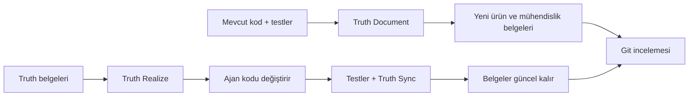

# Truthmark

**Ajanlarınız kod yazar. Truthmark, insanlara yönelik ve Git üzerinden incelenebilir belgeleri güncel tutar.**

Truthmark, AI kodlama ajanlarının mevcut kod ve testlerden yeni ürün ve mühendislik belgeleri oluşturmasını, her kod değişikliğinden sonra bunları güncel tutmasını ve incelemeniz için sıradan Markdown farkları sunmasını sağlayan Git'e özgü iş akışlarını kurar.

[](https://www.npmjs.com/package/truthmark)
[](https://github.com/merlinhu1/truthmark/actions/workflows/ci.yml)
[](../../LICENSE)
[](../../package.json)

[Başlayın](#hızlı-başlangıç-ilk-truth-belgenizi-oluşturun) · [Web sitesi](https://merlinhu1.github.io/truthmark/) · [Kullanıcı kılavuzu](https://github.com/merlinhu1/truthmark/blob/main/docs/user-guide.md) · [GitHub](https://github.com/merlinhu1/truthmark)

<details>
<summary>Bu README'yi 16 dilden birinde okuyun</summary>

[🇺🇸 English](../../README.md) | [🇨🇳 简体中文](README.zh.md) | [🇯🇵 日本語](README.ja.md) | [🇰🇷 한국어](README.ko.md) | [🇩🇪 Deutsch](README.de.md) | [🇫🇷 Français](README.fr.md) | [🇪🇸 Español](README.es.md) | [🇧🇷 Português](README.pt.md) | [🇷🇺 Русский](README.ru.md) | [🇸🇦 العربية](README.ar.md) | [🇮🇹 Italiano](README.it.md) | [🇵🇱 Polski](README.pl.md) | [🇹🇷 Türkçe](README.tr.md) | [🇻🇳 Tiếng Việt](README.vi.md) | [🇮🇩 Bahasa Indonesia](README.id.md) | [🇬🇷 Ελληνικά](README.el.md)

</details>

## İlk belgeleri oluşturun. Doğru kalmalarını sağlayın.

Çoğu dokümantasyon aracı üretimden sonra durur. Truthmark, ajanlara doğrudan deponuzun içinde eksiksiz bir dokümantasyon yaşam döngüsü sunar:

- **Çalışan yazılımdan yeni belgeler oluşturun.** Truth Document kodu ve testleri okur, ardından sınırları belirli ürün veya mühendislik belgeleri oluşturur.
- **Belgeleri otomatik olarak uyumlu tutun.** Truth Sync, işlevsel kod değişikliklerinden sonra ajan tesliminde çalışır ve iş tamamlanmadan önce depo gerçeğini günceller.
- **Belgeleri yeniden koda dönüştürün.** Truth Realize, temiz bir doc-first iş akışını korurken onaylanmış truth belgelerini uygular.
- **Kod tabanı büyürken sahipliği onarın.** Truth Structure, yeni veya aşırı yüklenmiş alanlar için sınırları belirli rotalar ve başlangıç belgeleri oluşturur.
- **Her şeyi Git'te inceleyin.** Kod, kararlar, sözleşmeler, mimari, operasyonlar ve davranış aynı dalla birlikte ilerler.

Barındırılan bilgi tabanı yok. Özel ajan belleği yok. Sohbet geçmişine hapsolmuş dokümantasyon yok.

## Hızlı başlangıç: ilk truth belgenizi oluşturun

**Gereksinimler:** Node.js 24 veya daha yenisi, bir Git deposu ve ajan iş akışları için desteklenen bir AI kodlama ana bilgisayarı.

Aşağıdaki komutları Truthmark'ın yönetmesini istediğiniz deponun içinde çalıştırın:

```bash
cd /path/to/your-repo
npm install -g truthmark
truthmark init
```

`truthmark init`; Codex, Claude Code, GitHub Copilot, OpenCode, Antigravity, Cursor veya ana bilgisayardan bağımsız bir komut satırı arayüzü kurulumu seçmenizi sağlar.

Şimdi yapılandırılmış ajanınızdan gerçek bir davranışı belgelemesini isteyin:

```text
/truthmark-document document the implemented session timeout behavior across src/auth/session.ts and tests/auth/session.test.ts
```

Truth Document, henüz yoksa sınırları belirli yeni bir truth belgesi oluşturur; varsa mevcut sahibini günceller ve gerektiğinde yönlendirmeyi yeniler. İşlevsel kodu değiştirmez.

Sonucu inceleyin:

```bash
truthmark check
git status --short --untracked-files=all
git diff
```

Artık şunlara sahip olmalısınız:

```text
docs/truthmark/engineering/behaviors/session-timeout.md
docs/truthmark/routes/areas/authentication.md
```

Kesin yollar, deponuzun sahiplik yapısını izler. Yeni dosyalar `git status` içinde, izlenen dosyalardaki değişiklikler ise `git diff` içinde görünür.

Çağırma biçimi ana bilgisayara göre değişir. OpenCode `/skill truthmark-document`, Antigravity `@truthmark-document` kullanır; desteklenen diğer ana bilgisayarlar ise kendi yerel beceri veya eğik çizgi komutu yüzeylerini kullanır. Kesin komutlar için [platform tablosuna](https://github.com/merlinhu1/truthmark/blob/main/docs/user-guide.md#supported-agent-platforms) bakın.

Betikler ve sürekli entegrasyon için seçilen platformları açıkça iletin:

```bash
truthmark init --platform codex --platform cursor
truthmark init --json
```

Ana bilgisayardan bağımsız bir depo için etkileşimli olarak `none` seçin veya `truthmark init --clear-platforms` çalıştırın. Daha sonra `truthmark init` komutunu yeniden çalıştırarak ajan platformları ekleyebilirsiniz.

Dala göre güncellik tanılaması için bir Git tabanı iletin:

```bash
truthmark check --base <base-ref>
```

## Truthmark nasıl çalışır



Truthmark komut satırı arayüzü depo sözleşmesini kurar ve doğrular. Kodlama ajanınız, kurulu ve ana bilgisayara özgü iş akışları üzerinden kanıt incelemesini ve dokümantasyon çalışmasını gerçekleştirir.

Normal bir kod değişikliği tek ve basit bir döngü izler:

1. Ajan işlevsel kodu değiştirir.
2. İlgili testler çalıştırılır.
3. Truth Sync, eşlenen belgeleri kontrol eder.
4. Depo gerçeği değiştiğinde ajan belgeleri ve yönlendirmeyi oluşturur veya günceller.
5. Kod farkını ve truth farkını birlikte incelersiniz.

## İş akışları

| İş akışı             | Ne zaman kullanılır                                                           | Sonuç                                                                     |
| -------------------- | ----------------------------------------------------------------------------- | ------------------------------------------------------------------------- |
| **Truth Document**   | Mevcut kodun belgelenmesi gerekir                                             | Kanıta dayalı ürün ve mühendislik belgeleri oluşturur veya günceller      |
| **Truth Sync**       | İşlevsel kod değişmiştir                                                      | Teslimden önce eşlenen belgeleri ve yönlendirmeyi uyumlu tutar            |
| **Truth Structure**  | Yeni bir alanın sahipliğe ihtiyacı vardır veya mevcut belgeler fazla geniştir | Sınırları belirli rotalar ve iskelet başlangıç belgeleri oluşturur        |
| **Truth Realize**    | Onaylanmış bir truth belgesi çalışan yazılıma dönüşmelidir                    | İşlevsel kodu dokümantasyondan günceller                                  |
| **Truth Check**      | Depo gerçeğinin denetlenmesi gerekir                                          | Yönlendirme, sahiplik, kanıt ve dokümantasyon sorunlarını bildirir        |
| **Truthmark Portal** | Ekip, göz atılabilir bir dokümantasyon sitesi ister                           | Markdown truth belgelerinden commit edilmiş statik bir HTML sunumu üretir |

Truthmark bu iş akışlarını Codex, Claude Code, GitHub Copilot, OpenCode, Antigravity ve Cursor için yerel depo yüzeyleri olarak kurar.

## Neler elde edersiniz

### Gerçeklikten başlayan dokümantasyon

Truthmark; ürün yetenekleri, uygulama davranışı, uygulama programlama arayüzleri, mimari, iş akışları, operasyonlar ve testler için belgeler oluşturabilir. Kod ve testler kanıtı sağlar; sınırları belirli Markdown belgeleri sonucu kalıcılaştırır.

### Bir sonraki değişiklikten sağ çıkan dokümantasyon

Rotalar, kod alanlarını kanonik belgelere bağlar. Ajanlar davranışı değiştirdiğinde Truth Sync, ilgili gerçeğin nereye ait olduğunu bilir ve teslimi incelenebilir tutar.

### Ayrı kulvarlarda ürün ve mühendislik gerçeği

Ürün gerçeği; kullanıcıya dönük vaatleri, sınırları, kararları ve kabul kriterlerini kapsar. Mühendislik gerçeği; mevcut davranışı, sözleşmeleri, mimariyi, iş akışlarını, operasyonları ve test davranışını kapsar.

### Git'e özgü iş birliği

Önemli olan her şey commit edilmiş depo dosyalarında yaşar. Gerçek dalla birlikte ilerler, sıradan pull request'lerle çalışır ve her bakımcı ile kodlama ajanına görünür kalır.

### Yerel öncelikli çalışma

Truthmark barındırılan hizmet, daemon, veritabanı, vektör deposu veya Model Context Protocol sunucusu gerektirmez. Depo kendi dokümantasyon iş akışını taşır.

## Truthmark nerede yer alır

| İhtiyaç                                              | En iyi seçenek                 |
| ---------------------------------------------------- | ------------------------------ |
| Tek bir ajan oturumundan daha iyi çıktı              | Daha iyi prompt                |
| Kişisel veya oturum düzeyinde süreklilik             | Bellek aracı                   |
| Plan öncelikli özellik çalışması                     | Spesifikasyon iş akışı         |
| Kodla birlikte ilerleyen, dal kapsamlı dokümantasyon | **Truthmark**                  |
| Davranış doğruluğu                                   | Testler ve kod incelemesi      |
| İncelenebilir, AI destekli dokümantasyon             | **Truthmark + Git incelemesi** |

Truthmark, AI kodlama ajanlarını zaten kullanan ve depo gerçeğinin kod kadar hızlı güncellenmesini isteyen bakımcılar ile mühendislik ekipleri için tasarlanmıştır.

## Desteklenen ana bilgisayarlar ve komut satırı

Desteklenen ajan ana bilgisayarları:

- Codex
- Claude Code
- GitHub Copilot
- OpenCode
- Antigravity
- Cursor

<details>
<summary>Komut satırı başvurusu</summary>

| Komut                                                             | Amaç                                                                                                     |
| ----------------------------------------------------------------- | -------------------------------------------------------------------------------------------------------- |
| `truthmark init`                                                  | Yapılandırmayı, yönlendirmeyi, şablonları ve seçilen ana bilgisayar iş akışlarını oluşturur veya yeniler |
| `truthmark check [--base <ref>]`                                  | Depo gerçeğini doğrular ve isteğe bağlı olarak dal güncelliği tanılamasını çalıştırır                    |
| `truthmark index --json`                                          | Türetilmiş depo ve yönlendirme meta verilerini inceler                                                   |
| `truthmark impact --base <ref> --json`                            | Değişen dosyaları belgelere, sahiplerine ve yakındaki testlere eşler                                     |
| `truthmark workflow status --workflow <id> [--base <ref>] --json` | İş akışının uygulanabilirliğini ve hedeflerini inceler                                                   |
| `truthmark validate ...`                                          | İş akışı raporlarını ve yazma kiralarını doğrular                                                        |
| `truthmark uninstall --dry-run\|--apply`                          | Yazılmış truth belgelerini koruyarak oluşturulan ana bilgisayar yüzeylerini önizler veya kaldırır        |

Betikler ve sürekli entegrasyon için komut satırı arayüzünün tamamında yapılandırılmış JSON çıktısı bulunur.

</details>

## Daha fazlasını öğrenin

- [Truthmark kullanıcı kılavuzu](https://github.com/merlinhu1/truthmark/blob/main/docs/user-guide.md)
- [Dokümantasyon dizini](https://github.com/merlinhu1/truthmark/blob/main/docs/README.md)
- [Mimariye genel bakış](https://github.com/merlinhu1/truthmark/blob/main/docs/truthmark/engineering/architecture/overview.md)
- [Yapılandırma, yönlendirme ve komut sözleşmeleri](https://github.com/merlinhu1/truthmark/blob/main/docs/truthmark/engineering/contracts/config-route-and-check-contracts.md)
- [Depo gerçeğini koruma](https://github.com/merlinhu1/truthmark/blob/main/docs/standards/maintaining-repository-truth.md)
- [Katkıda bulunma](https://github.com/merlinhu1/truthmark/blob/main/CONTRIBUTING.md)

**Truthmark'ı kurun, kodlama ana bilgisayarınızı seçin ve gerçek bir davranışı bugün belgeye dönüştürün.**

## Lisans

MIT. Bkz. [LICENSE](../../LICENSE).
