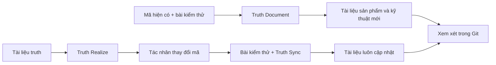

# Truthmark

**Các tác nhân của bạn viết mã. Truthmark duy trì tài liệu dành cho con người và sẵn sàng để xem xét trong Git.**

Truthmark cài đặt các quy trình làm việc gốc Git, giúp tác nhân lập trình AI tạo tài liệu sản phẩm và kỹ thuật mới từ mã cùng các bài kiểm thử hiện có, giữ tài liệu luôn cập nhật sau mỗi thay đổi mã và cung cấp cho bạn các diff Markdown thông thường để xem xét.

[](https://www.npmjs.com/package/truthmark)
[](https://github.com/merlinhu1/truthmark/actions/workflows/ci.yml)
[](../../LICENSE)
[](../../package.json)

[Bắt đầu](#bắt-đầu-nhanh-tạo-tài-liệu-truth-đầu-tiên) · [Trang web](https://merlinhu1.github.io/truthmark/) · [Hướng dẫn người dùng](https://github.com/merlinhu1/truthmark/blob/main/docs/user-guide.md) · [GitHub](https://github.com/merlinhu1/truthmark)

<details>
<summary>Đọc README này bằng một trong 16 ngôn ngữ</summary>

[🇺🇸 English](../../README.md) | [🇨🇳 简体中文](README.zh.md) | [🇯🇵 日本語](README.ja.md) | [🇰🇷 한국어](README.ko.md) | [🇩🇪 Deutsch](README.de.md) | [🇫🇷 Français](README.fr.md) | [🇪🇸 Español](README.es.md) | [🇧🇷 Português](README.pt.md) | [🇷🇺 Русский](README.ru.md) | [🇸🇦 العربية](README.ar.md) | [🇮🇹 Italiano](README.it.md) | [🇵🇱 Polski](README.pl.md) | [🇹🇷 Türkçe](README.tr.md) | [🇻🇳 Tiếng Việt](README.vi.md) | [🇮🇩 Bahasa Indonesia](README.id.md) | [🇬🇷 Ελληνικά](README.el.md)

</details>

## Tạo tài liệu đầu tiên. Giữ tài liệu luôn đúng.

Hầu hết công cụ tài liệu dừng lại sau khi tạo nội dung. Truthmark mang đến cho tác nhân một vòng đời tài liệu hoàn chỉnh ngay trong kho mã của bạn:

- **Tạo tài liệu mới từ phần mềm đang hoạt động.** Truth Document đọc mã và các bài kiểm thử, sau đó tạo tài liệu sản phẩm hoặc kỹ thuật có phạm vi rõ ràng.
- **Tự động giữ tài liệu luôn đồng bộ.** Truth Sync chạy khi tác nhân bàn giao sau các thay đổi mã chức năng và cập nhật sự thật của kho trước khi công việc hoàn tất.
- **Biến tài liệu trở lại thành mã.** Truth Realize triển khai các tài liệu truth đã được phê duyệt mà vẫn duy trì quy trình doc-first rõ ràng.
- **Sửa quyền sở hữu khi cơ sở mã phát triển.** Truth Structure tạo các tuyến có phạm vi rõ ràng và tài liệu khởi đầu cho khu vực mới hoặc quá tải.
- **Xem xét mọi thứ trong Git.** Mã, quyết định, hợp đồng, kiến trúc, vận hành và hành vi cùng di chuyển với nhánh.

Không cơ sở tri thức được lưu trữ trên máy chủ. Không bộ nhớ tác nhân riêng tư. Không tài liệu bị mắc kẹt trong lịch sử trò chuyện.

## Bắt đầu nhanh: tạo tài liệu truth đầu tiên

**Yêu cầu:** Node.js 24 trở lên, một kho Git và một host lập trình AI được hỗ trợ cho quy trình làm việc của tác nhân.

Chạy các lệnh sau trong kho mà bạn muốn Truthmark quản lý:

```bash
cd /path/to/your-repo
npm install -g truthmark
truthmark init
```

`truthmark init` cho phép bạn chọn Codex, Claude Code, GitHub Copilot, OpenCode, Antigravity, Cursor hoặc thiết lập giao diện dòng lệnh trung lập với host.

Bây giờ, hãy yêu cầu tác nhân đã cấu hình ghi tài liệu cho một hành vi thực tế:

```text
/truthmark-document document the implemented session timeout behavior across src/auth/session.ts and tests/auth/session.test.ts
```

Truth Document tạo một tài liệu truth mới có phạm vi rõ ràng khi chưa có tài liệu nào, cập nhật tài liệu sở hữu hiện có khi đã có và cập nhật định tuyến khi cần. Quy trình này không thay đổi mã chức năng.

Xem xét kết quả:

```bash
truthmark check
git status --short --untracked-files=all
git diff
```

Giờ đây bạn sẽ có:

```text
docs/truthmark/engineering/behaviors/session-timeout.md
docs/truthmark/routes/areas/authentication.md
```

Đường dẫn chính xác tuân theo cấu trúc quyền sở hữu của kho. Tệp mới xuất hiện trong `git status`; thay đổi đối với tệp được theo dõi xuất hiện trong `git diff`.

Cách gọi khác nhau tùy theo host. OpenCode dùng `/skill truthmark-document`, Antigravity dùng `@truthmark-document`, còn các host được hỗ trợ khác dùng bề mặt skill hoặc lệnh gạch chéo gốc của mình. Xem [bảng nền tảng](https://github.com/merlinhu1/truthmark/blob/main/docs/user-guide.md#supported-agent-platforms) để biết chính xác các lệnh.

Đối với script và tích hợp liên tục, hãy truyền rõ các nền tảng đã chọn:

```bash
truthmark init --platform codex --platform cursor
truthmark init --json
```

Chọn `none` trong chế độ tương tác hoặc chạy `truthmark init --clear-platforms` để có một kho trung lập với host. Bạn có thể thêm nền tảng tác nhân sau bằng cách chạy lại `truthmark init`.

Để chẩn đoán độ mới theo nhánh, hãy truyền một mốc Git cơ sở:

```bash
truthmark check --base <base-ref>
```

## Cách Truthmark hoạt động



Giao diện dòng lệnh Truthmark cài đặt và xác thực hợp đồng của kho. Tác nhân lập trình của bạn thực hiện việc xem xét bằng chứng và viết tài liệu thông qua các quy trình gốc của host đã được cài đặt.

Một thay đổi mã thông thường đi theo một vòng lặp đơn giản:

1. Tác nhân thay đổi mã chức năng.
2. Các bài kiểm thử liên quan được chạy.
3. Truth Sync kiểm tra tài liệu đã được ánh xạ.
4. Tác nhân tạo hoặc cập nhật tài liệu và định tuyến khi sự thật của kho đã thay đổi.
5. Bạn xem xét diff mã và diff truth cùng nhau.

## Quy trình làm việc

| Quy trình            | Dùng khi                                                         | Kết quả                                                                |
| -------------------- | ---------------------------------------------------------------- | ---------------------------------------------------------------------- |
| **Truth Document**   | Mã hiện có cần được ghi tài liệu                                 | Tạo hoặc cập nhật tài liệu sản phẩm và kỹ thuật dựa trên bằng chứng    |
| **Truth Sync**       | Mã chức năng đã thay đổi                                         | Giữ tài liệu đã ánh xạ và định tuyến đồng bộ trước khi bàn giao        |
| **Truth Structure**  | Khu vực mới cần quyền sở hữu hoặc tài liệu hiện có quá rộng      | Tạo các tuyến có phạm vi rõ ràng và tài liệu khởi đầu dạng khung       |
| **Truth Realize**    | Một tài liệu truth đã phê duyệt cần trở thành phần mềm hoạt động | Cập nhật mã chức năng từ tài liệu                                      |
| **Truth Check**      | Sự thật của kho cần được kiểm tra                                | Báo cáo vấn đề về định tuyến, quyền sở hữu, bằng chứng và tài liệu     |
| **Truthmark Portal** | Nhóm muốn có một trang tài liệu dễ duyệt                         | Tạo bản trình bày HTML tĩnh được commit từ các tài liệu truth Markdown |

Truthmark cài đặt các quy trình này dưới dạng bề mặt gốc của kho cho Codex, Claude Code, GitHub Copilot, OpenCode, Antigravity và Cursor.

## Những gì bạn nhận được

### Tài liệu bắt đầu từ thực tế

Truthmark có thể tạo tài liệu cho năng lực sản phẩm, hành vi triển khai, giao diện lập trình ứng dụng, kiến trúc, quy trình làm việc, vận hành và kiểm thử. Mã cùng các bài kiểm thử cung cấp bằng chứng; tài liệu Markdown có phạm vi rõ ràng lưu giữ kết quả.

### Tài liệu vẫn bền vững qua thay đổi tiếp theo

Các tuyến kết nối khu vực mã với tài liệu chuẩn. Khi tác nhân thay đổi hành vi, Truth Sync biết sự thật tương ứng thuộc về đâu và giữ cho phần bàn giao luôn sẵn sàng để xem xét.

### Sự thật sản phẩm và kỹ thuật trên các luồng riêng biệt

Sự thật sản phẩm ghi lại cam kết hướng tới người dùng, ranh giới, quyết định và tiêu chí chấp nhận. Sự thật kỹ thuật ghi lại hành vi hiện tại, hợp đồng, kiến trúc, quy trình làm việc, vận hành và hành vi kiểm thử.

### Cộng tác gốc Git

Mọi thứ quan trọng đều nằm trong các tệp kho đã commit. Sự thật đi theo nhánh, hoạt động với pull request thông thường và luôn hiển thị với mọi người bảo trì cùng tác nhân lập trình.

### Vận hành ưu tiên cục bộ

Truthmark không cần dịch vụ lưu trữ, daemon, cơ sở dữ liệu, kho vector hay máy chủ Model Context Protocol. Kho tự mang theo quy trình tài liệu của mình.

## Truthmark phù hợp ở đâu

| Nhu cầu                                  | Phù hợp nhất                      |
| ---------------------------------------- | --------------------------------- |
| Đầu ra tốt hơn từ một phiên tác nhân     | Prompt tốt hơn                    |
| Tính liên tục cá nhân hoặc theo phiên    | Công cụ bộ nhớ                    |
| Phát triển tính năng theo kế hoạch trước | Quy trình đặc tả                  |
| Tài liệu theo phạm vi nhánh đi cùng mã   | **Truthmark**                     |
| Tính đúng đắn của hành vi                | Kiểm thử và xem xét mã            |
| Tài liệu có AI hỗ trợ và có thể xem xét  | **Truthmark + xem xét trong Git** |

Truthmark được xây dựng cho người bảo trì và các nhóm kỹ thuật đã dùng tác nhân lập trình AI, đồng thời muốn kho luôn nói đúng sự thật nhanh như tốc độ thay đổi của mã.

## Host được hỗ trợ và dòng lệnh

Các host tác nhân được hỗ trợ:

- Codex
- Claude Code
- GitHub Copilot
- OpenCode
- Antigravity
- Cursor

<details>
<summary>Tham chiếu dòng lệnh</summary>

| Lệnh                                                              | Mục đích                                                                                      |
| ----------------------------------------------------------------- | --------------------------------------------------------------------------------------------- |
| `truthmark init`                                                  | Tạo hoặc làm mới cấu hình, định tuyến, mẫu và quy trình của các host đã chọn                  |
| `truthmark check [--base <ref>]`                                  | Xác thực sự thật của kho và tùy chọn chạy chẩn đoán độ mới theo nhánh                         |
| `truthmark index --json`                                          | Kiểm tra siêu dữ liệu dẫn xuất về kho và định tuyến                                           |
| `truthmark impact --base <ref> --json`                            | Ánh xạ tệp đã thay đổi tới tài liệu, chủ sở hữu và các bài kiểm thử lân cận                   |
| `truthmark workflow status --workflow <id> [--base <ref>] --json` | Kiểm tra khả năng áp dụng và mục tiêu của quy trình                                           |
| `truthmark validate ...`                                          | Xác thực báo cáo quy trình và quyền thuê ghi                                                  |
| `truthmark uninstall --dry-run\|--apply`                          | Xem trước hoặc xóa các bề mặt host đã tạo trong khi vẫn giữ tài liệu truth do người dùng viết |

Đầu ra JSON có cấu trúc được cung cấp trên toàn bộ giao diện dòng lệnh cho script và tích hợp liên tục.

</details>

## Tìm hiểu thêm

- [Hướng dẫn người dùng Truthmark](https://github.com/merlinhu1/truthmark/blob/main/docs/user-guide.md)
- [Chỉ mục tài liệu](https://github.com/merlinhu1/truthmark/blob/main/docs/README.md)
- [Tổng quan kiến trúc](https://github.com/merlinhu1/truthmark/blob/main/docs/truthmark/engineering/architecture/overview.md)
- [Hợp đồng cấu hình, định tuyến và lệnh](https://github.com/merlinhu1/truthmark/blob/main/docs/truthmark/engineering/contracts/config-route-and-check-contracts.md)
- [Duy trì sự thật của kho](https://github.com/merlinhu1/truthmark/blob/main/docs/standards/maintaining-repository-truth.md)
- [Đóng góp](https://github.com/merlinhu1/truthmark/blob/main/CONTRIBUTING.md)

**Cài đặt Truthmark, chọn host lập trình và biến một hành vi thực tế thành tài liệu ngay hôm nay.**

## Giấy phép

MIT. Xem [LICENSE](../../LICENSE).
