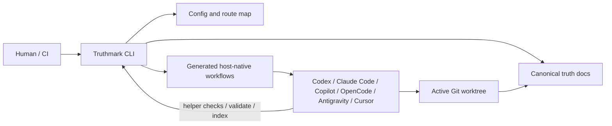

# Truthmark User Guide

This guide is the detailed companion to the root [README](../README.md).

Use the README for the fast evaluation path: what Truthmark is, why it matters, and how to get started. Use this guide when you want command-by-command details, supported platform surfaces, workflow boundaries, configuration, routing, Portal, and examples.

## How Truthmark runs

Truthmark runs locally against the active Git worktree.

The human-facing CLI reads and writes repository files, then exits.

The agent-run workflow surfaces are committed files that agent hosts can load later. That means agents can follow the installed workflow from repository state instead of depending on a background Truthmark process.

The layers fit together like this:



Agents do not talk to a Truthmark daemon, but they can run the installed Truthmark CLI when a workflow asks for validation, indexing, or helper checks.

Truthmark owns the generated workflow surfaces it creates, but the important contract is architectural: repo-local config and routing point agents at canonical truth docs, while host-native workflows give each supported agent a way to run the same Truthmark procedures.

Generated workflow surfaces use non-versioned refresh guidance. After upgrading Truthmark or changing workflow configuration, rerun:

```bash
truthmark init
```

Then review the generated diffs.

## Supported agent platforms

Fresh configs omit host platforms by default. Add the platforms you use to `.truthmark/config.yml`, then rerun:

```bash
truthmark init
```

| Platform config name | Generated surface | Invocation shape |
| --- | --- | --- |
| `codex` | Skill packages and verifier agents | `/truthmark-*` or `$truthmark-*` |
| `claude-code` | Project skills, verifier agents, and managed instructions | `/truthmark-*` |
| `github-copilot` | Agent skills, prompt commands, custom agents, and managed instructions | `/truthmark-*` in supported Copilot IDEs; `@truth-*` custom agents in Copilot CLI |
| `opencode` | Skill packages and verifier agents | `/skill truthmark-*` |
| `antigravity` | Project rule files for Truthmark workflows | `@truthmark-*` |
| `cursor` | Agent Skill project packages under `.cursor/skills` | selected by description or invoked with `/` in Cursor Agent chat |

Unknown platform names are config errors.

Removing a platform stops rendering that platform's host-specific surfaces on future refreshes. `truthmark init` also removes known retired managed artifacts, but review generated-surface diffs intentionally.

## Workflow commands

These workflows are installed into supported AI coding hosts. They are not top-level shell commands.

Human-only means user-invoked, not agent-automatic. Sync is the normal automatic finish-time workflow after functional code changes. Structure may also run inside Document or Sync when routing blocks the requested work.

| Workflow | Starts when | Use it when | Writes |
| --- | --- | --- | --- |
| Truth Document | User asks | Existing behavior needs truth docs. | Truth docs and routing only. |
| Truth Realize | User asks | Docs should be realized into code. | Functional code only. |
| Truth Check | User or reviewer asks | Truth health needs review. | Reports only. |
| Truthmark Portal | User asks | A browsable static Portal is needed. | Generated Portal files only. |
| Truth Sync | Agent finish-time, or user asks explicitly | Functional code changed. | Truth docs and routing only. |
| Truth Structure | User asks, or Document/Sync needs routing repair | Routing or ownership needs repair. | Routing and starter truth docs. |

## Surface comparison

Do not confuse these two surfaces:

| Surface | Used by | Example | Meaning |
| --- | --- | --- | --- |
| Human CLI | humans, scripts, CI-like checks | `truthmark check` | Validate repository truth artifacts from the terminal. |
| Workflow command | humans using an agent host | `/truthmark-check` | Ask the agent to run the installed audit workflow. |

The names are intentionally related, but the surfaces are different.

## Normal AI-assisted code change

Users should not treat Truth Sync as the normal command they call to start work.

Truth Sync is the installed finish-time review that the agent follows after functional code changes.

```text
user asks agent for a code change
agent changes functional code
agent runs or asks for relevant tests
installed repository instructions require Sync review before handoff
Truth Sync checks mapped truth docs
agent updates truth docs if needed
human reviews code diff + truth diff
```

Manual Sync invocation is mainly for troubleshooting or explicit maintainer review, not the standard onboarding or day-to-day start path.

## Existing behavior without docs

Use Truth Document when the implementation already exists but the repository truth is incomplete. This is the normal path for established repositories adopting Truthmark after the codebase already exists.

```text
/truthmark-document document the implemented session timeout behavior across src/auth/session.ts, src/auth/middleware.ts, and tests/auth/session.test.ts
```

Give it the feature name, code paths, test paths, or desired truth-doc area. On OpenCode-style hosts, call the same workflow as `/skill truthmark-document ...`; on Antigravity, use `@truthmark-document ...`; in Cursor, use `/truthmark-document ...` or let the Agent Skill be selected by description.

Start with Truth Document for one bounded feature or area at a time.

Truth Document inspects implementation, tests, route files, and existing docs as evidence.

It writes truth docs and routing only.

It must not change functional code.

## Doc-first changes

Use Truth Realize when a product or architecture decision starts in docs and code should be updated to match.

```text
/truthmark-realize realize docs/truthmark/product/capabilities/session-timeout.md into code
```

Truth Realize is doc-first.

The truth docs lead. The code follows.

The agent must not edit the truth docs it is realizing.

## Repository truth audit

Use Truth Check when you want an agent-facing audit workflow.

```text
/truthmark-check audit routing and truth coverage before review
```

Use the human-facing CLI when you want terminal validation:

```bash
truthmark check
```

Both are useful. They are not the same surface.

## Command deep dive

Most maintainers start with three commands.

| Command | Purpose |
| --- | --- |
| `truthmark config` | Create `.truthmark/config.yml`. Writes only that file unless `--stdout` is used. |
| `truthmark init` | Install or refresh configured workflow surfaces from the reviewed config. |
| `truthmark check` | Validate configuration, authority, routing, decision-bearing docs, frontmatter, internal links, branch scope, generated surfaces, freshness, and coverage diagnostics. |

Optional repository-intelligence helpers generate derived review material for the active checkout, such as RepoIndex, RouteMap, ImpactSet, and compact WorkflowState/action-context JSON. Validation helpers are exposed as optional workflow metadata and explicit `truthmark validate ... --json` commands; they are accelerators, not bundled repo-local helper manifest or policy files and not sources of truth. Standalone Copilot prompts, Antigravity rules, and Cursor Agent Skills use the same CLI validator contract when the installed runner is available, and otherwise report a visible skipped helper status with manual validation.

They are not sources of truth.

| Command | Purpose |
| --- | --- |
| `truthmark index` | Build RepoIndex and RouteMap JSON for the active checkout. |
| `truthmark impact --base <ref>` | Map changed files to routed truth docs, owning routes, and nearby tests. |
| `truthmark workflow status --workflow <workflow> [--base <ref>] --json` | Return workflow applicability, write boundaries, target truth docs, checks, helper commands, and compact affected-test guidance. |

Structured output is available with `--json` where supported.

## Truthmark Portal

Truthmark Portal is an optional presentation workflow for teams that want a human-readable site over their committed truth docs.

It is deliberately separate from the core truth workflow:

- Markdown truth docs remain canonical.
- Generated Portal HTML is presentation only.
- Portal is manual-only; it does not run as a completion review, Truth Sync step, `truthmark check` step, or automatic post-change hook.
- Portal writes stay inside the fixed Truthmark-derived output directory.
- Generated pages should use local assets, source provenance, and a visible Markdown-canonical disclaimer.

Enable it with the namespaced config block:

```yaml
truthmark:
  generated:
    portal:
      enabled: true
```

Then rerun:

```bash
truthmark init
```

When enabled, Truthmark installs host-native Portal workflow surfaces for the configured platforms, such as `/truthmark-portal` or `/truthmark:portal` depending on the agent host.

## Configuration

Truthmark is config-first.

The main config file is:

```text
.truthmark/config.yml
```

New repositories should run:

```bash
truthmark config
```

Then review the generated config before running:

```bash
truthmark init
```

Important config areas include:

| Config area | Purpose |
| --- | --- |
| `version` | Config contract version. |
| `platforms` | Agent hosts that should receive platform-specific generated surfaces. |
| `truthmark.workspace` | Truthmark-owned workspace for routes, truth docs, templates, and generated presentation output. |
| Fixed routes | Routes live under `routes/areas.md` and `routes/areas/` inside `truthmark.workspace`; the default area is `repository` and delegation depth is `1`. |
| Fixed truth lanes | Product truth lives under `product/` and engineering truth under `engineering/` inside `truthmark.workspace`. |
| Fixed templates | Truth-doc templates live under `templates/` inside `truthmark.workspace`. |
| `truthmark.generated.portal` | Optional manual presentation workflow enablement: `enabled`. |
| `instruction_targets` | Files that receive shared managed instruction blocks, such as `AGENTS.md`. |
| `frontmatter.required` | Metadata fields that produce error diagnostics when missing. |
| `frontmatter.recommended` | Metadata fields that produce review diagnostics when missing. |
| `ignore` | Glob patterns excluded from relevant checks and routing logic. |

## Repository truth routing

Truthmark maps code surfaces to truth docs.

The main routing files are:

```text
docs/truthmark/routes/areas.md
docs/truthmark/routes/areas/**/*.md
```

A route tells the agent:

- which code surface belongs to an area
- which truth docs own that area
- when truth should be updated
- what kind of truth doc is involved

The default scaffold starts with a provisional broad bootstrap route so a fresh repository is routeable. When real code is touched, split that bootstrap route into real product, service, domain, or ownership areas before normal Truth Sync; do not turn the bootstrap handoff into a catch-all behavior doc.

Example:

```text
/truthmark-structure split the broad repository area into frontend, backend, billing, and deployment
```

Good routing gives Truth Sync precise destinations.

Bad routing makes agents guess.

## What Truthmark installs

Truthmark installs a compact repository-native truth layer.

It does this in four layers:

- configuration and routing for ownership boundaries
- canonical truth docs and starter templates
- compact managed instruction blocks for repository-wide agent instructions
- host-native workflow packages, commands, prompts, and verifier agents for the platforms enabled in config

Truthmark preserves manual content outside managed instruction blocks.

Generated workflow surfaces are managed by Truthmark and may be refreshed by rerunning:

```bash
truthmark init
```

## Subagents and bounded evidence checks

Where supported by the host, Truthmark can install project-scoped verifier agents and a leased `truth-doc-writer`.

These help keep large truth tasks bounded:

- route auditors inspect route ownership
- claim verifiers check whether doc claims are supported by evidence
- doc reviewers inspect truth-doc quality
- leased doc writers handle bounded truth-doc writing shards

The parent workflow still owns final interpretation, write boundaries, diff validation, and acceptance.

This is important: subagents help with bounded evidence work. They do not replace the main workflow contract.

## Review loop

Truthmark is designed for ordinary Git review.

A good AI-assisted handoff should show:

```text
code diff
test evidence
truth-doc diff, if needed
routing changes, if needed
agent report
```

The reviewer should be able to answer:

- What code changed?
- Which truth docs own that code?
- Did those docs need updates?
- If not, why not?
- Did the agent stay inside the workflow write boundary?
- Are tests or verification evidence included?

## Examples

### Initialize a repository

```bash
npm install -g truthmark
truthmark config
truthmark init
truthmark check
```

### Remove unused agent platforms

Edit:

```text
.truthmark/config.yml
```

Then rerun:

```bash
truthmark init
truthmark check
```

### Split broad routing

```text
/truthmark-structure split the broad repository area into auth, billing, notifications, and deployment
```

### Document implemented behavior

```text
/truthmark-document document the implemented password reset flow under docs/truthmark/engineering/behaviors/authentication
```

### Normal code-change handoff

Do not start normal work by calling Truth Sync yourself. Ask the agent for the code change; the installed repository instructions tell it to run relevant tests and perform Sync review before handoff.

### Realize a doc-first decision

```text
/truthmark-realize realize docs/truthmark/product/capabilities/invoice-retry-policy.md into code
```

### Audit truth health from the terminal

```bash
truthmark check
```

### Generate branch-impact summary

```bash
truthmark impact --base main
```

### Inspect workflow status

```bash
truthmark workflow status --workflow truthmark-sync --base main --json
```

### Enable the optional Portal workflow

```yaml
truthmark:
  generated:
    portal:
      enabled: true
```

```bash
truthmark init
```

Then explicitly ask the agent host to run the installed Portal workflow when you want the static presentation site generated or refreshed.

## Project status

The current release provides:

- `truthmark config`
- `truthmark init`
- `truthmark check`
- `truthmark index`
- `truthmark impact`
- `truthmark workflow status`
- branch-scope metadata
- managed instruction blocks
- generated Truth Structure workflow surfaces
- generated Truth Document workflow surfaces
- generated Truth Sync workflow surfaces
- generated Truth Realize workflow surfaces
- generated Truth Check workflow surfaces
- optional generated Truthmark Portal workflow surfaces
- route, authority, decision-structure, frontmatter, link, freshness, generated-surface, and coverage diagnostics
- derived RepoIndex, RouteMap, ImpactSet, and WorkflowState artifacts
- host-specific surfaces for Codex, Claude Code, GitHub Copilot, OpenCode, Antigravity, and Cursor

## Development

Install dependencies:

```bash
npm install
```

Run the local development CLI:

```bash
npm run dev -- init
npm run dev -- check
```

Run the full project check:

```bash
npm run check
```

Useful scripts:

| Script | Purpose |
| --- | --- |
| `npm run dev` | Run the TypeScript CLI entry point with `tsx`. |
| `npm run build` | Build the package. |
| `npm run lint` | Run ESLint. |
| `npm run typecheck` | Run TypeScript checks. |
| `npm run test` | Run tests. |
| `npm run check` | Run lint, typecheck, tests, and build. |
| `npm run release:check` | Run release-oriented validation. |

When changing Truthmark itself, see [CONTRIBUTING.md](../CONTRIBUTING.md).

## Documentation

The README is the fast path for evaluation and setup.

Detailed current behavior lives under `docs/`:

- [Docs index](README.md)
- [Architecture overview](truthmark/engineering/architecture/overview.md)
- [API and CLI contracts](truthmark/engineering/contracts/config-route-and-check-contracts.md)
- [Init and scaffold behavior](truthmark/engineering/behaviors/init-and-scaffold.md)
- [Check diagnostics](truthmark/engineering/behaviors/check-diagnostics.md)
- [Installed workflows](truthmark/engineering/workflows/installed-workflow-runtime.md)
- [Repository truth maintenance guide](standards/maintaining-repository-truth.md)

## Design boundaries

Truthmark is intentionally small.

It is not:

- a hosted service
- an MCP server
- a vector database
- a canonical documentation website generator or hosted docs platform
- a CI or PR enforcement product
- a replacement for tests, code review, or technical leadership
- an autonomous code rewrite engine
- a model-training or fine-tuning framework
- a hidden memory layer

Those boundaries are part of the product.

Truthmark keeps the workflow local, committed, branch-scoped, and reviewable.

## Safety and review discipline

Truthmark helps the repository stay honest. It does not prove the code is correct.

Teams should still:

- run relevant tests
- review functional code changes
- review truth-doc changes
- keep secrets out of docs
- keep repository-specific instructions outside managed blocks
- review generated workflow-surface diffs after upgrades
- keep human ownership over product and architecture decisions

Truthmark makes agent-facing repository truth visible. It does not replace human judgment.

## Roadmap direction

The current future direction emphasizes:

- stronger `truthmark check` evidence reporting
- clearer adoption examples
- example repositories showing real Truth Sync cycles
- migration guides for teams already using agent instruction files
- conformance tests for generated host surfaces
- route-aware stale-truth hints
- bounded implementation checklists for doc-first work

The center of gravity stays the same:

```text
repository truth
agent-native workflows
Git review
branch-scoped documentation
```

## License

MIT. See [LICENSE](../LICENSE).
